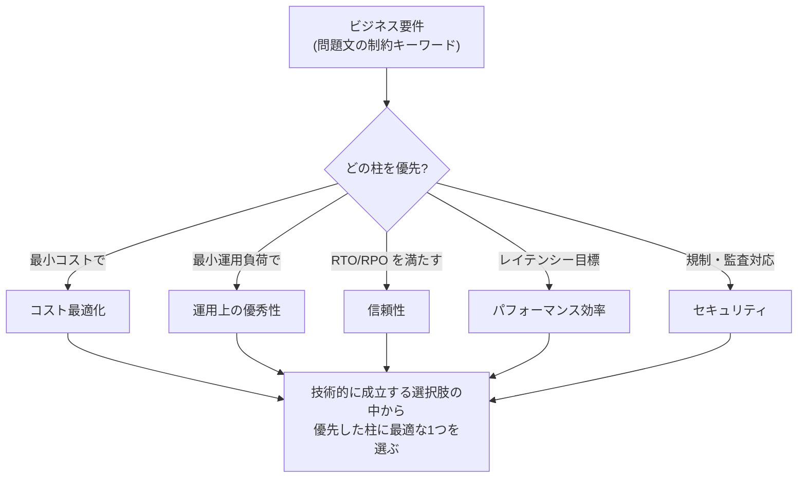

# AWS Well-Architected Framework — SAP 学習の背骨

SAP-C02 の公式試験ガイドは、この試験を「**AWS Well-Architected Framework に基づいて AWS ソリューションを最適化する高度な技術スキルを検証する**」と定義しています。つまり Well-Architected Framework(以下 W-A)は数ある参考資料のひとつではなく、**出題の判断基準そのもの**です。SAP の問題は「技術的に動く選択肢」を複数並べたうえで「W-A 的に最も適切なもの」を選ばせる構造になっているため、W-A の考え方を身につけることは、個別サービスの知識を暗記することと同じくらい得点に直結します。

このノートでは、W-A の全体像と6本の柱を解説し、それぞれが SAP 試験でどう問われるかを整理します。**各ドメインノートを読む前に、まずこのノートを一読してください。** 以降のすべてのノートは、ここで説明する柱と設計原則を判断軸として書かれています。

## Well-Architected Framework とは何か

W-A は、AWS が何十万という顧客のアーキテクチャレビューから抽出した「クラウドでシステムを設計・運用するときの普遍的な判断基準」を体系化したものです。フレームワークは次の要素で構成されます。

- **6本の柱 (Pillars)**: 運用上の優秀性、セキュリティ、信頼性、パフォーマンス効率、コスト最適化、持続可能性。アーキテクチャを評価する6つの観点
- **設計原則 (Design Principles)**: 各柱に紐づく、クラウドならではの設計の指針(例:「キャパシティを推測しない」「復旧手順をテストする」)
- **ベストプラクティス**: 柱ごとの具体的な質問(「どのようにして障害から復旧しますか?」など)と推奨プラクティス
- **AWS Well-Architected Tool**: マネジメントコンソール上で自分のワークロードを W-A の質問に沿ってセルフレビューし、高リスク項目 (HRI) を特定できる無料のサービス
- **レンズ (Lens)**: サーバーレス、SaaS、機械学習など特定ドメイン向けの追加観点

重要なのは、W-A が「全部の柱を最大化せよ」とは言っていない点です。柱はしばしば**互いにトレードオフ**の関係にあります(信頼性を上げればコストが上がる、セキュリティを厳しくすれば運用が重くなる)。W-A が求めるのは「**ビジネス要件に照らして、意識的にトレードオフを選択すること**」であり、SAP の問題文に必ず入っている「MOST cost-effective」「LEAST operational overhead」といった制約キーワードは、まさに「今回はどの柱を優先するか」の指定なのです。

---

## 柱 1: 運用上の優秀性 (Operational Excellence)

### この柱が扱う問題

システムは「作って終わり」ではなく、日々の運用(デプロイ、監視、障害対応、改善)の中で価値を生み続けます。この柱は「**運用をどれだけ自動化・標準化・改善し続けられるか**」を問います。オンプレミス時代の運用は「手順書を人が実行する」ものでしたが、クラウドでは運用作業そのものをコード化できるため、期待される水準が根本的に変わっています。

### 設計原則

| 原則 | 意味 |
|---|---|
| **運用をコードとして実行する** | 手順書ではなく IaC・Runbook(SSM Automation)・パイプラインで運用を自動化する。人手の作業はミスの温床 |
| **小さく、可逆的な変更を頻繁に行う** | 大きな一括リリースより、失敗してもすぐ戻せる小さな変更を繰り返す(Blue/Green・Canary の思想的根拠) |
| **運用手順を継続的に改善する** | ゲームデーや振り返りで手順自体を進化させる |
| **障害を予測する** | 「障害は起きるもの」として事前にテストする(FIS によるカオスエンジニアリング、DR 訓練) |
| **運用上の失敗すべてから学ぶ** | インシデントを非難でなく学習の機会にする(ポストモーテム) |

### SAP での問われ方

「手動で行っている○○を自動化したい」「運用チームの負荷を減らしたい」という形で最頻出します。**「LEAST operational overhead(最小の運用負荷)」というキーワードが出たら、この柱を優先せよという指示**です。具体的には、セルフマネージド(EC2 上に自前構築)よりマネージドサービス、マネージドよりサーバーレス、という方向の選択肢が正解になりやすくなります。

- 主な関連サービス: Systems Manager 一式、CloudFormation/StackSets、EventBridge、CloudWatch、X-Ray、Config
- 対応ノート: [3-1 運用上の優秀性](../03-continuous-improvement/3-1-operational-excellence.md)、[2-1 デプロイ戦略](../02-new-solutions/2-1-deployment-strategy.md)

---

## 柱 2: セキュリティ (Security)

### この柱が扱う問題

データと システムを保護しながらビジネス価値を提供する方法を問います。クラウドのセキュリティは**責任共有モデル**が前提です。AWS が「クラウド**の**セキュリティ」(物理設備、ハイパーバイザー)を担い、利用者が「クラウド**内の**セキュリティ」(IAM 設計、暗号化設定、ネットワーク制御)を担います。SAP で問われるのはもっぱら後者、しかも**複数アカウント・組織規模**での設計です。

### 設計原則

| 原則 | 意味 |
|---|---|
| **強力なアイデンティティ基盤を実装する** | 最小権限、職務分離、長期認証情報の排除(IAM ロール・Identity Center・一時認証情報) |
| **トレーサビリティを実現する** | すべての操作を記録・監視し、自動的に対応する(CloudTrail・Config・GuardDuty) |
| **全レイヤーにセキュリティを適用する** | 境界1枚で守らず、エッジ・VPC・サブネット・インスタンス・アプリ・データの多層防御 |
| **セキュリティのベストプラクティスを自動化する** | 人が気をつけるのではなく、仕組みで強制する(SCP・Block Public Access・自動修復) |
| **転送中および保管中のデータを保護する** | 暗号化・トークン化・アクセス制御を既定にする |
| **データに人の手を触れさせない** | 手作業でのデータアクセスを排除し、ツール経由に限定する |
| **セキュリティイベントに備える** | インシデント対応をシミュレーションし、検知→調査→復旧を自動化する |

### SAP での問われ方

「規制要件(PCI DSS、HIPAA 相当)を満たせ」「監査人がログの完全性を要求している」「組織全体で○○を強制したい」という形で出ます。特に SAP らしいのは「**予防的統制(SCP、Block Public Access)と発見的統制(Config、GuardDuty)の使い分け**」と「**組織全体への一括適用**(Organizations、Firewall Manager、Security Hub)」です。単一アカウントの IAM 設計は SAA レベル、**組織レベルの統制設計が SAP レベル**と覚えてください。

- 主な関連サービス: IAM、Organizations (SCP)、KMS、GuardDuty、Security Hub、Config、CloudTrail、WAF、Network Firewall
- 対応ノート: [1-2 セキュリティ統制](../01-organizational-complexity/1-2-security-controls.md)、[2-3 セキュリティ統制の決定](../02-new-solutions/2-3-security-controls.md)、[3-2 セキュリティ改善](../03-continuous-improvement/3-2-security.md)

---

## 柱 3: 信頼性 (Reliability)

### この柱が扱う問題

ワークロードが「期待どおりに機能し続け、障害から迅速に回復できる」ことを問います。オンプレミスでは「壊れないように高価なハードウェアを買う」のが信頼性でしたが、クラウドの信頼性は発想が逆です。**個々のコンポーネントは壊れる前提で、システム全体として回復する**設計にします。「Everything fails, all the time(すべてのものは常に壊れる)」という Werner Vogels(Amazon CTO)の言葉がこの柱の出発点です。

### 設計原則

| 原則 | 意味 |
|---|---|
| **障害から自動的に復旧する** | KPI を監視し、閾値超過で自動対応(ASG の自己復旧、Multi-AZ の自動フェイルオーバー) |
| **復旧手順をテストする** | 「バックアップがある」ではなく「復元できることを確認済み」が信頼性(DR 訓練、FIS、AWS Backup の復元テスト) |
| **水平方向にスケールして全体の可用性を高める** | 大きな1台(スケールアップ)より小さな多数(スケールアウト)。1台の障害の影響を小さくする |
| **キャパシティを推測しない** | 需要を測定し、自動スケールで追従する。過小・過大プロビジョニングを両方避ける |
| **自動化で変更を管理する** | インフラ変更は手作業でなく自動化されたプロセスで行う |

### SAP での問われ方

**RTO(目標復旧時間)と RPO(目標復旧時点)の数値が問題文に出たら、この柱の問題**です。数値から DR 戦略(Backup & Restore / Pilot Light / Warm Standby / Active-Active)を選ばせる問題は SAP の看板問題と言えます。ほかに「単一障害点を特定して排除する」「AZ 障害/リージョン障害に耐える」「疎結合化で障害の伝播を防ぐ」という形でも問われます。信頼性はコストと最も鋭くトレードオフする柱であり、「要件を満たす**最も安い**信頼性」を選ぶのがコツです(過剰な Active-Active は不正解になります)。

- 主な関連サービス: Route 53、ELB、Auto Scaling、SQS/SNS、Aurora/DynamoDB のグローバル機能、AWS Backup、Elastic Disaster Recovery、Resilience Hub
- 対応ノート: [2-2 事業継続性](../02-new-solutions/2-2-business-continuity.md)、[2-4 信頼性](../02-new-solutions/2-4-reliability.md)、[1-3 信頼性と回復性](../01-organizational-complexity/1-3-reliable-resilient.md)、[3-4 信頼性改善](../03-continuous-improvement/3-4-reliability.md)

---

## 柱 4: パフォーマンス効率 (Performance Efficiency)

### この柱が扱う問題

「コンピューティングリソースを要件に対して効率的に使えているか」を問います。ポイントは「速ければよい」ではなく「**要件に合った道具を、要件に合ったサイズで**」です。リレーショナル DB にすべてを押し込むオンプレ的発想から、ワークロード特性ごとに最適なサービスを選ぶ(パーパスビルト)発想への転換がこの柱の核心です。

### 設計原則

| 原則 | 意味 |
|---|---|
| **高度なテクノロジーを民主化する** | ML や分析などの高度な技術は自前構築せず、マネージドサービスとして消費する |
| **数分でグローバル展開する** | 複数リージョン・エッジ(CloudFront)への展開を低コストで行い、ユーザーの近くで処理する |
| **サーバーレスアーキテクチャを使用する** | サーバー管理をなくし、使った分だけ払う構成を優先する |
| **より頻繁に実験する** | クラウドなら構成比較のテストが安価にできる。試して測って選ぶ |
| **メカニカルシンパシーを考慮する** | 技術の内部特性を理解して使う(例: DynamoDB のパーティション分散、EBS と インスタンスストアの違い) |

### SAP での問われ方

「レイテンシーを改善せよ」「グローバルユーザーへの応答を速くせよ」「スループットが足りない」という形で出ます。解法はほぼ毎回、①**計測してボトルネックを特定**(X-Ray、Performance Insights)→ ②**キャッシュを手前に置く**(CloudFront、ElastiCache、DAX)または**適材適所のサービスに置換**、という流れです。「いきなりインスタンスを大きくする」選択肢は、計測を飛ばしている点で W-A 的に不正解になりやすい、という試験上の癖も覚えておいてください。

- 主な関連サービス: CloudFront、Global Accelerator、ElastiCache、DAX、各種 DB、EBS/インスタンスストア、FSx、Lambda/Fargate
- 対応ノート: [2-5 パフォーマンス](../02-new-solutions/2-5-performance.md)、[3-3 パフォーマンス改善](../03-continuous-improvement/3-3-performance.md)

---

## 柱 5: コスト最適化 (Cost Optimization)

### この柱が扱う問題

「不要なコストを避けながらビジネス価値を提供する」ことを問います。クラウドのコストはオンプレの「先行投資して償却する」モデルと違い、**従量課金で、日々の設計判断がそのまま請求額になる**のが特徴です。だからこそ「見える化 → 帰属(誰のコストか)→ 削減 → 継続的な最適化」というサイクル、いわゆるクラウド財務管理 (Cloud Financial Management) が必要になります。

### 設計原則

| 原則 | 意味 |
|---|---|
| **クラウド財務管理を実装する** | コストに責任を持つ体制・仕組みを作る(タグ戦略、Budgets、部門への可視化) |
| **消費モデルを導入する** | 使う分だけ確保し、使わないときは止める(開発環境の夜間停止、サーバーレス化) |
| **全体的な効率を測定する** | 「ビジネス成果あたりのコスト」で測る |
| **差別化につながらない重労働への支出をやめる** | DC 運用・パッチ・DB 管理などは AWS に任せ、自社の価値創出に集中する(マネージド化の根拠) |
| **支出を分析し、帰属させる** | 誰が・何に・いくら使ったかを特定できるようにする(コスト配分タグ、CUR) |

### SAP での問われ方

**「MOST cost-effective」は SAP で最も頻繁に登場する制約キーワード**です。ただし「一番安いものを選ぶ」のではなく「**他の要件をすべて満たしたうえで最も安いもの**」を選ぶ点に注意してください(RTO 要件を満たさない Backup & Restore は、いくら安くても不正解)。組織レベルでは一括請求・RI/Savings Plans 共有・タグ戦略、ワークロードレベルでは購入オプション・ストレージ階層・データ転送削減が頻出です。

- 主な関連サービス: Cost Explorer、CUR、Budgets、Savings Plans、Spot、S3 ストレージクラス、Compute Optimizer、Trusted Advisor
- 対応ノート: [1-5 コスト最適化と可視化](../01-organizational-complexity/1-5-cost-optimization.md)、[2-6 コスト目標を満たす設計](../02-new-solutions/2-6-cost-optimization.md)、[3-5 コスト最適化の機会](../03-continuous-improvement/3-5-cost.md)

---

## 柱 6: 持続可能性 (Sustainability)

### この柱が扱う問題

2021年に追加された6本目の柱で、「ワークロードの環境負荷(主にエネルギー消費)を最小化する」ことを問います。持続可能性にも責任共有モデルがあり、AWS がデータセンターの再エネ化を担い、利用者は「**リソース使用率の最大化=無駄な計算・保管をしない**」ことで貢献します。

### 設計原則(要点)

- 影響を理解し、目標を設定する
- **使用率を最大化する**(アイドルリソースをなくす — 結果的にコスト最適化と同じ施策になることが多い)
- 効率の高い新しいハードウェア・ソフトウェアを採用する(**Graviton**、効率的なストレージ階層)
- マネージドサービスを使用する(集約により全体効率が上がる)
- ダウンストリームの影響(利用者側のデバイス負荷など)を減らす

### SAP での問われ方

出題比重は他の柱より小さいものの、「環境負荷を減らしたい」「サステナビリティ目標がある」というキーワードが出たら、**使用率を上げる系の選択肢**(ライトサイジング、サーバーレス化、Graviton 移行、不要データの削除・アーカイブ)を選びます。施策の中身はコスト最適化とほぼ重なるため、追加で覚えることは多くありません。

---

## 柱と学習ノートの対応マップ

| 柱 | 主な対応ノート |
|---|---|
| 運用上の優秀性 | 3-1(中心)、2-1、1-4 |
| セキュリティ | 1-2、2-3、3-2 |
| 信頼性 | 2-2、2-4、1-3、3-4 |
| パフォーマンス効率 | 2-5、3-3 |
| コスト最適化 | 1-5、2-6、3-5 |
| 持続可能性 | 3-5(使用率向上の文脈で) |

ドメイン(出題領域)と柱は直交する関係です。たとえば Domain 3「継続的改善」は5つの柱をそのままタスク(3-1〜3-5)に割り当てた構成になっており、Domain 2「新規設計」も柱ごとの設計を問うタスクで構成されています。**ドメイン=シチュエーション(組織の複雑さ/新規/改善/移行)、柱=評価軸**、という整理で頭に入れると全体像が掴めます。

## 試験でのトレードオフの読み方(実践)

SAP の問題文には、ほぼ必ず「優先すべき柱」を指定するキーワードが埋め込まれています。読んだ瞬間に柱へ変換する練習をしてください。

| 問題文のキーワード | 優先する柱 | 選択肢の傾向 |
|---|---|---|
| MOST cost-effective / minimize cost | コスト最適化 | 要件を満たす最安構成。Spot、S3 階層、サーバーレス |
| LEAST operational overhead / minimal management | 運用上の優秀性 | マネージド > セルフ管理。Fargate、Aurora Serverless、EventBridge |
| minimize downtime / RTO・RPO 指定 | 信頼性 | DR 4パターンの対応付け、Multi-AZ/マルチリージョン |
| improve performance / reduce latency | パフォーマンス効率 | 計測 → キャッシュ → 適材適所の置換 |
| comply with / audit / 規制名 | セキュリティ | 予防的統制、暗号化、証跡の改ざん防止 |
| LEAST amount of change / minimal application changes | (制約条件) | アプリ改修不要のインフラ側解決策に絞る |

2つのキーワードが同時に出る場合(例:「ダウンタイムなしで、最もコスト効率よく」)は、**まず絶対条件(ダウンタイムなし)で選択肢をふるい落とし、残った中で相対条件(最安)を選ぶ**、という2段階で処理します。

## 参考資料

- AWS Well-Architected 公式ページ(6本の柱のホワイトペーパーへのリンクあり): https://aws.amazon.com/architecture/well-architected/
- AWS Well-Architected Tool(無料・コンソールから利用可)
- 各柱のホワイトペーパーは長大なので、まず本ノート → 各ドメインノート → 余裕があれば原典、の順を推奨
