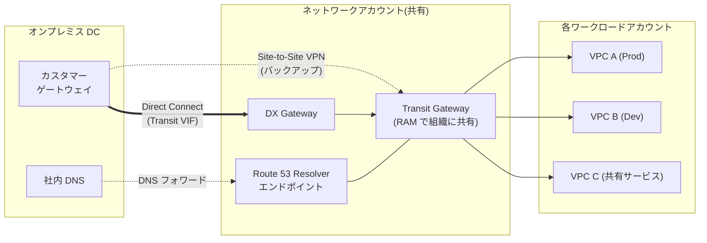
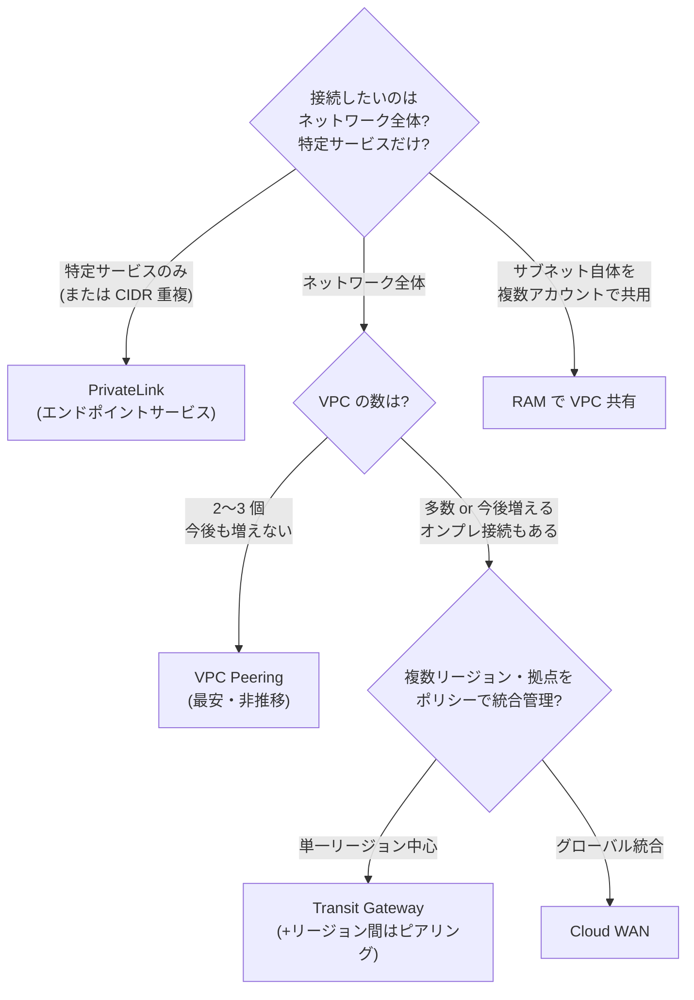
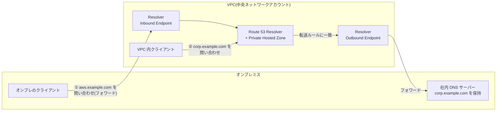

# 1.1 ネットワーク接続戦略の設計

## このテーマの背景 — なぜ「組織のネットワーク」は難しいのか

企業が AWS を使い始めた当初は、VPC は1つか2つで、オンプレミスとの接続も VPN が1本あれば足りました。しかし利用が組織全体に広がると、状況は一変します。事業部ごと・環境ごと(本番/開発)・ワークロードごとにアカウントと VPC が増殖し、気づけば **数十〜数百の VPC が相互に通信し、しかもオンプレミスのデータセンターとも常時つながっていなければならない** 状態になります。

このとき問題になるのが、VPC 同士を1対1でつなぐ素朴な方法(VPC Peering)の限界です。n 個の VPC をフルメッシュでつなぐには n(n-1)/2 本のピアリングが必要で、10 VPC で45本、50 VPC なら1,225本。しかも Peering は**推移的にルーティングしない**(A-B、B-C をつないでも A-C は通れない)ため、管理は指数的に破綻します。SAP の Domain 1 でネットワークが最重要トピックになっているのは、この「規模による設計の質的転換」を理解しているかを試したいからです。

もうひとつの軸がオンプレミスとの接続です。「今すぐ安く」なら VPN、「安定した大容量」なら Direct Connect という2択に見えますが、実際の設計では帯域・冗長性・暗号化・開通リードタイム・コストの5要素が絡み、さらに「どの VPC に、どのアカウントに、どうやって配るか」という組織的な問題が重なります。このノートでは、これらを**「何と何をつなぐか」「どんな要件でつなぐか」の2軸**で整理していきます。

## 関連する Well-Architected の柱

- **信頼性**: 接続の冗長化(DX + VPN バックアップ、デュアル DX)は「障害から自動的に復旧する」の実践。単一の VPN トンネル・単一の DX ロケーションは接続の単一障害点
- **パフォーマンス効率**: 帯域・レイテンシー要件から接続方式を選ぶ。「キャパシティを推測しない」— VPN の 1.25 Gbps 上限のような制約値を知った上で設計する
- **コスト最適化**: TGW の処理料金、AZ 間・リージョン間転送費、DX のポート料金。「少数 VPC なら Peering が最安」のような損益分岐の判断
- **運用上の優秀性**: ネットワークを中央アカウントに集約し RAM で共有する構成は、設定の重複と管理負荷を減らす「運用をコードとして実行する」ための土台

## オンプレミスとの接続 — VPN と Direct Connect

### Site-to-Site VPN: 「今すぐ・安く・暗号化つき」

Site-to-Site VPN は、オンプレミスのルーター(カスタマーゲートウェイ)と AWS 側(Virtual Private Gateway または Transit Gateway)の間に **IPsec トンネルをインターネット経由で** 張るサービスです。申し込みから数時間で開通でき、月額も安価です。1接続につきトンネルが2本(AWS 側の異なるエンドポイントに終端)自動で用意され、片方の障害に備えます。

弱点は2つあります。第一に**インターネット経由**であること。暗号化はされていますが、経路は公衆網なのでレイテンシーとスループットが安定しません。第二に**帯域上限**です。1トンネルあたり最大 1.25 Gbps で、これを超えたい場合は後述の ECMP で複数トンネルを束ねる必要があります。

### Direct Connect (DX): 「安定・大容量・ただし遅くて高い」

Direct Connect は、オンプレミスと AWS の間に**専用の物理回線**を敷くサービスです。DX ロケーション(相互接続拠点)で自社ネットワークと AWS ネットワークを物理的に接続するため、帯域(専用線で 1/10/100/400 Gbps)とレイテンシーが安定し、大量データ転送の単価も安くなります。パートナー経由の「ホスト接続」なら 50 Mbps からの小容量も選べます。

ただし物理工事を伴うため**開通に数週間〜数か月**かかります。試験では「来週までに接続が必要」とあれば DX は自動的に除外され、VPN(または DX 開通までのつなぎとして VPN)が正解になります。

もうひとつ、見落としやすい重要な性質があります。**DX はデフォルトでは暗号化されません**。専用線だから安全、と思いがちですが、規制要件で「転送中の暗号化」が明示されたら対策が必要です。選択肢は2つ: **DX の上に VPN を張る**(Public VIF 経由で VGW/TGW への IPsec トンネルを通す)か、対応する接続なら **MACsec**(L2 暗号化、10/100 Gbps 専用接続)を使うかです。

### DX を構成する部品 — VIF と DX Gateway

DX の物理接続の上には、用途別の論理接続(**Virtual Interface, VIF**)を作ります。この3種類の使い分けは頻出です。

| VIF の種類 | つなぐ先 | 用途 |
|---|---|---|
| **Private VIF** | VGW(特定 VPC)または DX Gateway | VPC 内のプライベートリソースへ |
| **Public VIF** | AWS のパブリックサービス全般 | S3、DynamoDB 等にパブリック IP でアクセス(インターネットを通らずに) |
| **Transit VIF** | DX Gateway 経由で **Transit Gateway** | 多数の VPC へまとめて接続(現代の標準構成) |

**DX Gateway** は「1本の DX から複数リージョンの VGW/TGW へつなぐためのグローバルなハブ」です。ただし決定的な制約があります: **DX Gateway は VPC 間の通信を中継しません**。DX Gateway に VPC A と VPC B をぶら下げても、A と B は互いに通信できず、通れるのは「オンプレ ⇔ 各 VPC」だけです。VPC 間通信のハブが欲しければ Transit Gateway を使います。この違いはひっかけの定番です。

### 冗長構成の選び方

接続はビジネスの生命線なので、単一障害点にしないのが原則(信頼性の柱)です。要求水準とコストに応じて段階があります。

1. **DX 1本 + VPN バックアップ**: 最もよく出る構成。通常時は DX、DX 障害時は VPN に自動フェイルオーバー(BGP の経路優先で制御)。VPN は帯域が細いので「縮退運転を許容できる」ことが前提
2. **DX 2本(同一ロケーション)**: デバイス障害には耐えるが、ロケーション自体の被災に弱い
3. **DX 2本(別ロケーション)**: 最高水準。SLA を最重視する金融系シナリオで正解になる
4. 障害検知の高速化には **BFD (Bidirectional Forwarding Detection)** を有効化する

### VPN の帯域をスケールさせる — ECMP

「VPN で 1.25 Gbps を超えたい(でも DX はまだ引けない)」という要求には、**Transit Gateway + ECMP (Equal-Cost Multi-Path)** が答えです。TGW は複数の VPN トンネルへ同一宛先のトラフィックを分散できるため、トンネルを増やすほど合計帯域が伸びます。VGW は ECMP に対応していないので、この要件が出たら TGW 前提の構成になります。

**判断基準のまとめ**: 「今すぐ・安く」→ VPN。「安定帯域・大容量・低レイテンシー」→ DX。「DX の障害に備えつつ安価に」→ DX + VPN フェイルオーバー。「暗号化必須の DX」→ DX 上に VPN(または MACsec)。「VPN で帯域が足りない」→ TGW + ECMP。

### 定番構成図: ハブ&スポーク型ハイブリッドネットワーク

以上を組み合わせた、SAP で暗黙の前提とされる標準構成がこれです。ネットワーク専用アカウントに接続系リソースを集約し、各ワークロードアカウントの VPC は TGW にぶら下がります。

この構成が支持される理由は、接続(DX/VPN)・ルーティング(TGW)・名前解決(Resolver)という「全アカウントが必要とするが、各アカウントに持たせると重複と設定ミスの温床になるもの」を一箇所に集め、**AWS RAM (Resource Access Manager) で組織内に共有する**からです。各チームはネットワークの心配をせずワークロードに集中でき、ネットワークチームは一箇所を守ればよい。運用上の優秀性とセキュリティの両方に効きます。

## VPC 間の接続 — Peering、TGW、PrivateLink の本質的な違い

VPC 間接続の3方式は「どれも VPC をつなぐもの」と見ると混乱しますが、**つなぐ範囲がまったく違う**と理解すると整理できます。

- **VPC Peering** は「**2つの VPC のネットワーク全体**を1対1でつなぐ」
- **Transit Gateway** は「**多数の VPC・オンプレのネットワーク全体**をハブでつなぐ」
- **PrivateLink** は「ネットワークはつながず、**特定のサービス(エンドポイント)だけ**を一方向に公開する」

### VPC Peering — 少数なら最良、増えると破綻

Peering は2 VPC 間の直接接続です。追加料金は転送費のみで帯域制限もなく、ホップも増えないため、**関係する VPC が2〜3個で今後も増えない**なら最も安く速い選択です。しかし冒頭で述べたとおり推移的ルーティングがなく、フルメッシュの本数が爆発するため、規模が見えているなら最初から TGW を選びます。試験では「Peering を多数運用していて管理が破綻しつつある」という現状描写が、TGW への移行を正解とする合図です。

### Transit Gateway — 推移的ルーティングを持つリージョナルハブ

TGW は数千 VPC を収容できるハブで、**アタッチメント**(VPC / VPN / Transit VIF 経由の DX / 他リージョンの TGW とのピアリング / SD-WAN 連携の Connect)を差し込む構造です。Peering と違い推移的にルーティングするため、TGW につないだもの同士は(許可すれば)相互に通信できます。

TGW の設計で最も重要なのは、**TGW ルートテーブルによるセグメンテーション**です。アタッチメントごとに「どのルートテーブルに関連付けるか(association)」「どのルートテーブルに経路を伝播するか(propagation)」を制御でき、これにより「本番 VPC と開発 VPC は同じ TGW につながっているが相互通信はできない。ただし共有サービス VPC へは両方から到達できる」といったポリシーをルーティングレイヤーで実現できます。ファイアウォールを介さずに通信可否を構造的に決められるのが強みです。

その他の試験ポイント:

- TGW は**リージョナル**リソース。リージョン間は **TGW ピアリング**で接続する(このピアリングは**静的ルートのみ**で経路伝播しない、という細かい制約も出る)
- **アプライアンスモード**: 検査用 VPC(Network Firewall やサードパーティ IPS)を経由させる構成で、行きと帰りのトラフィックを同じ AZ のアプライアンスに通す(対称ルーティングの保証)ための設定
- 処理量に応じた**データ処理料金**がかかる。少数 VPC なら Peering の方が安い、というコスト比較の根拠
- 他アカウントへの共有は **RAM** 経由(組織内共有が定番)

### PrivateLink — 「ネットワークをつなげたくない」ときの答え

PrivateLink は発想が異なります。サービス提供側が NLB(+ALB)の背後にサービスを置いて「エンドポイントサービス」として公開し、利用側は自分の VPC 内に **Interface Endpoint(ENI)** を生やしてそこへアクセスします。ルートテーブルは交換されず、利用側から提供側へ**単方向**にしか通信できません。

この性質が2つの難題を解決します。第一に **CIDR の重複**。Peering や TGW は IP アドレス帯が重複する VPC 同士をつなげませんが、PrivateLink は ENI 経由なので**重複していても問題ありません**。企業買収で IP 設計がぶつかった、というシナリオの定番解です。第二に**最小権限の公開**。「取引先に自社 API だけ使わせたい。ネットワーク全体は見せたくない」という要件は、Peering では実現できず PrivateLink 一択です。SaaS ベンダーが数千の顧客 VPC にサービスを届ける構成もこれです。

### 比較表と決定木

| 方式 | スケール | 特徴 |
|---|---|---|
| **VPC Peering** | 2 VPC 間(フルメッシュは n(n-1)/2) | 非推移的。低コスト・低レイテンシー・帯域制限なし。**少数 VPC なら最安** |
| **Transit Gateway** | 数千 VPC | **ハブ&スポーク・推移的ルーティング**。ルートテーブルでセグメンテーション。リージョナル。処理料金あり |
| **PrivateLink** | 1サービス単位 | **単方向・特定サービスのみ公開**。**CIDR 重複 OK**。NLB の背後にサービスを置く |
| **VPC Lattice** | アプリ層 | サービス間通信を L7 で接続・認可(サービスメッシュ的) |
| **Cloud WAN** | グローバル | 複数リージョン・拠点をポリシーベースで統合管理 |
| **RAM の VPC 共有** | 1 VPC を複数アカウントで | 「接続」ではなく「同居」。サブネットを他アカウントに貸す |

## ハイブリッド DNS — Route 53 Resolver

ネットワークがつながっても、名前解決ができなければアプリは動きません。ハイブリッド環境の DNS は「**オンプレのホスト名を AWS から引けるか**」「**AWS のプライベートホスト名をオンプレから引けるか**」という双方向の問題で、Route 53 Resolver のエンドポイントがこれを解決します。向きの理解が全てです。

- **Inbound Endpoint**: オンプレ**から来る**クエリを受け付ける口。オンプレの DNS サーバーに「`aws.example.com` はこの IP(Inbound Endpoint)へフォワードせよ」と設定することで、オンプレから Private Hosted Zone のレコードを解決できる
- **Outbound Endpoint + 転送ルール**: AWS **から出ていく**クエリの口。「`corp.example.com` はオンプレ DNS へ転送せよ」というルールを設定することで、VPC 内から社内ホスト名を解決できる。転送ルールは **RAM で他アカウントへ共有できる**

組織構成では、ここでも中央集約が定番です: **ネットワークアカウントに Resolver エンドポイントを1組だけ作り、転送ルールを RAM で全アカウントへ共有**します。アカウントごとにエンドポイントを作るとコストも管理も無駄に増えるためです。Private Hosted Zone を複数 VPC から使いたい場合は PHZ を各 VPC に関連付けます(クロスアカウントの関連付けは CLI/API での承認手順が必要)。

## IP アドレス設計 — 重複への対処と IPAM

組織が大きくなると必ず起きるのが CIDR の衝突です。対処の考え方は「**そもそも重複させない(予防)**」と「**重複してしまった後の接続(対症)**」に分かれます。

- 予防: **Amazon VPC IPAM** で組織全体の CIDR プールを一元管理し、割り当てと重複検出を自動化する。アドレス枯渇には VPC への**セカンダリ CIDR 追加**で対応
- 対症: 重複 CIDR 同士は Peering/TGW では接続不可。「重複したまま特定サービスだけ使いたい」なら **PrivateLink**、全面接続が必要ならリナンバー(作り直し)か NAT を挟む多段構成しかない。試験では PrivateLink が正解になることがほとんど
- IPv6: アウトバウンド専用の IPv6 通信には **Egress-only Internet Gateway**(NAT GW の IPv6 版に相当)

## VPC エンドポイント — 「インターネットに出ない」ための部品

セキュリティ要件「S3 へのアクセスをインターネット経由にしない」に応えるのが VPC エンドポイントです。2種類の違いはコストとスコープに直結します。

- **Gateway 型**(S3 / DynamoDB のみ): ルートテーブルに経路を追加する方式。**無料**。ただし**その VPC の中からしか使えない**(オンプレや Peering 先からは不可)
- **Interface 型 (PrivateLink)**(ほぼ全サービス): ENI を配置する方式。時間+転送課金があるが、**DX/VPN 経由でオンプレからも利用できる**

したがって「オンプレから DX 経由で S3 にプライベートアクセス」という頻出要件の答えは、Public VIF か **Interface Endpoint(PrivateLink for S3)** であり、Gateway Endpoint は使えません。また、どちらのエンドポイントにも**エンドポイントポリシー**を付けられ、「このエンドポイント経由では自組織のバケットにしかアクセスさせない」といったデータ境界の統制(1-2 参照)に使います。

## トラブルシュートの道具

- **VPC Flow Logs**: ACCEPT/REJECT の記録。「SG か NACL のどちらが落としているか」の切り分けに(ペイロードは見えない)
- **Reachability Analyzer**: 実際にパケットを流さず、構成情報から「A から B に届くか・どこで止まるか」を静的解析
- **Network Access Analyzer**: 意図しない到達経路(インターネットからの到達可能性など)の検出

## ケーススタディ

**シナリオ**: ある企業は 60 の AWS アカウントを持ち、それぞれに VPC がある。オンプレミスのデータセンターとは 10 Gbps の Direct Connect で接続したい。全 VPC はオンプレと通信でき、かつ本番系 VPC 群と開発系 VPC 群は相互に通信できてはならない。運用負荷を最小にしたい。どう設計するか。

**解き方**: まず規模(60 VPC)で Peering は即除外。オンプレ接続も必要なので **Transit Gateway** をハブにする。DX からは **Transit VIF + DX Gateway** で TGW へ接続。本番/開発の分離は、TGW に**ルートテーブルを2つ**作り、本番系アタッチメントと開発系アタッチメントを別のルートテーブルに関連付け、互いの経路を伝播させない(オンプレへの経路は両方に伝播)ことで実現する。TGW はネットワークアカウントに置き、**RAM で組織共有**すれば、各アカウントでの作業は「アタッチメントを作る」だけになり運用負荷が最小になる。— セキュリティグループや NACL で 60 VPC 分の拒否ルールを管理する選択肢は、技術的には可能でも「運用負荷最小」に反するため不正解。

**シナリオ2**: 買収した子会社の VPC (10.0.0.0/16) と自社の VPC (10.0.0.0/16) の CIDR が完全に重複している。子会社の経理 API(HTTPS)だけを自社システムから利用したい。

**解き方**: CIDR 重複の時点で Peering / TGW は不可能。要件も「特定 API だけ」なので、子会社側で API の前段に **NLB を置き、エンドポイントサービスとして公開**、自社 VPC に **Interface Endpoint** を作る **PrivateLink** 構成が正解。リナンバー(VPC 再作成)は要件に対して過剰。

## 試験直前の要点(理由つき)

- **VPC Peering は推移しない** — Peering はルートテーブルを交換するだけで、中継機能を持たないため。「A-B、B-C ありで A-C 通信」が出たら TGW への移行が答え
- **DX Gateway は VPC 間通信を中継しない** — あくまで「オンプレ ⇔ 複数 VPC」の扇の要。VPC 間のハブは TGW の役割
- **VPN 単一トンネルは 1.25 Gbps が上限** — 超えたい場合は TGW + ECMP。VGW は ECMP 不可、という点でも TGW が要件になる
- **DX は暗号化されない** — 「専用線=安全」という直感を突くひっかけ。暗号化要件があれば DX 上の VPN か MACsec
- **Gateway Endpoint はオンプレから使えない** — ルートテーブル方式のため VPC 内限定。オンプレから S3 へは Interface Endpoint (PrivateLink) か Public VIF
- **TGW ピアリングは静的ルートのみ** — リージョン間で経路の自動伝播はされない。設定漏れによる疎通不良シナリオで問われる
- **Resolver の Inbound/Outbound は「クエリがどちらから来るか」で覚える** — Inbound = オンプレから来るクエリを受ける、Outbound = VPC から出すクエリを転送する
