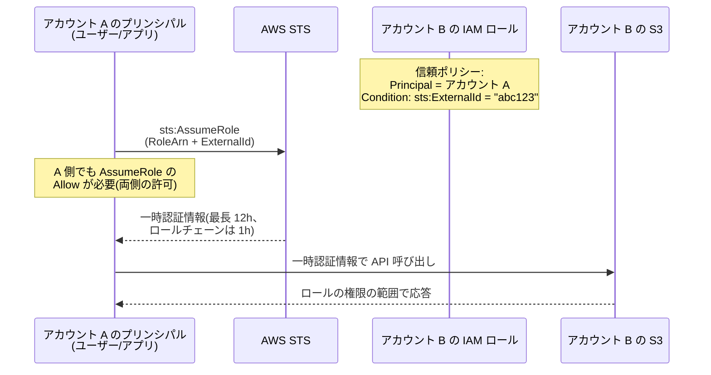
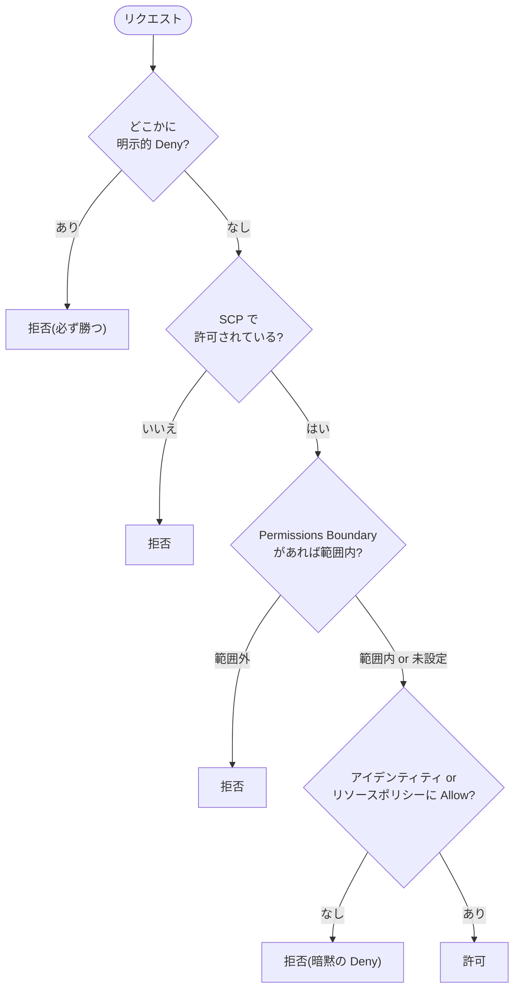
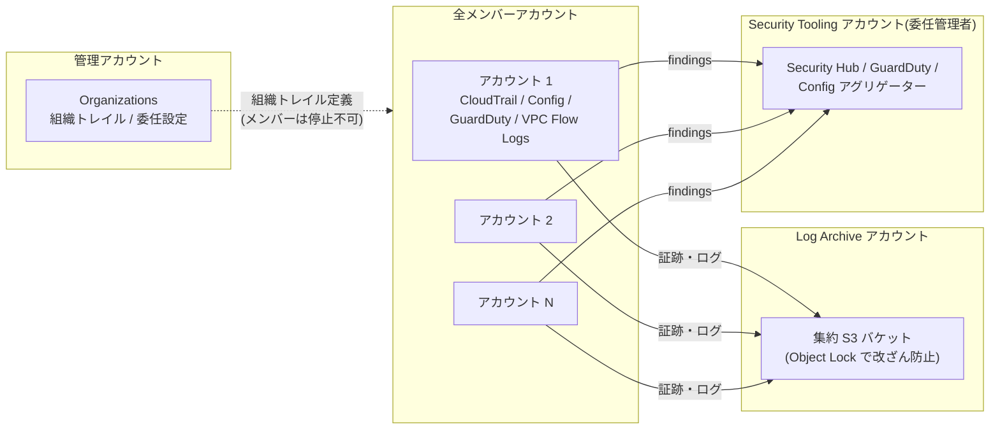

# 1.2 セキュリティ統制の規定(組織レベル)

## 試験で問われる観点

- クロスアカウントアクセスの設計(IAM ロール、リソースベースポリシー)
- 企業 ID 基盤(AD / 外部 IdP)とのフェデレーション
- 組織全体のログ・脅威検知の集中管理
- ポリシー評価ロジック(SCP / Permissions Boundary / セッションポリシー)

## クロスアカウントアクセス

| 方法 | 使いどころ |
|---|---|
| **IAM ロールの Assume(sts:AssumeRole)** | 人・アプリの一時アクセス。信頼ポリシー + 相手側の許可の両方が必要 |
| **リソースベースポリシー**(S3, KMS, SQS, SNS, Lambda, ECR 等) | ロール切替なしで直接アクセス(呼び出し元のコンテキスト維持) |
| **RAM (Resource Access Manager)** | サブネット, TGW, Resolver ルール, License 等の**リソース自体の共有** |
| S3 アクセスポイント / マルチリージョンアクセスポイント | 大規模バケットの用途別アクセス制御 |

- **ExternalId**: サードパーティに Assume させる際の**混乱した代理 (confused deputy) 対策** — 頻出
- ロールチェーンは最大1時間。コンソールのクロスアカウントスイッチロールも同じ仕組み
- **IAM Access Analyzer**: 外部プリンシパルからアクセス可能なリソースを検出(組織をゾーンオブトラストに)

### シーケンス: クロスアカウント AssumeRole(ExternalId 付き)



## ポリシー評価ロジック(暗記必須)

```
明示的 Deny > SCP(上限)> Permissions Boundary(上限)> セッションポリシー > アイデンティティ/リソースベースの Allow
```

- デフォルトは暗黙の Deny。**どこかの明示的 Deny は常に勝つ**
- **SCP**: アカウント内の**最大権限**を制限(root にも効く)。権限は付与しない。管理アカウントには効かない
- **Permissions Boundary**: 特定 IAM ユーザー/ロールの最大権限。「開発者に IAM ロール作成を許可しつつ、作れる権限の上限を設定」→ Permissions Boundary — 頻出
- リソースベースポリシーは同一アカウント内ならアイデンティティポリシーと OR 評価、クロスアカウントは**両方必要**



## フェデレーション(企業 ID 連携)

| シナリオ | 選択 |
|---|---|
| **組織の複数アカウントへの SSO(標準解)** | **IAM Identity Center**(旧 AWS SSO)。外部 IdP (Entra ID/Okta) と SAML/SCIM 連携、権限セットで一括管理 |
| オンプレ AD をそのまま使う | **AD Connector**(プロキシ、AWS 側にディレクトリを持たない)or **AWS Managed Microsoft AD**(信頼関係を構築、Windows ワークロードにも対応) |
| 個別アカウントへの SAML 連携(レガシー) | IAM SAML IdP + AssumeRoleWithSAML |
| Web/モバイルアプリのユーザー | **Cognito**(User Pool で認証、Identity Pool で AWS 認証情報) |
| 外部 IdP を使う CI/CD・ワークロード | IAM OIDC フェデレーション(GitHub Actions 等)、**IAM Roles Anywhere**(オンプレサーバーに X.509 証明書で一時認証情報) |

**判断基準**: 「マルチアカウント + 既存 IdP + SSO」→ IAM Identity Center が現行の既定解。「オンプレ AD のユーザーで AWS 管理コンソールへ」→ AD Connector + Identity Center。「EC2 上の Windows アプリがドメイン参加」→ Managed Microsoft AD。

## ログ・脅威検知の集中管理(定番アーキテクチャ)

- **CloudTrail 組織トレイル**: 管理アカウント(または委任管理者)で作成し、全アカウントの証跡を**ログアーカイブアカウントの S3** へ集約
- **AWS Config アグリゲーター**: 組織全体の構成・コンプライアンス状況を集約
- **GuardDuty / Security Hub / Detective / Macie / Inspector**: **委任管理者 (delegated administrator)** パターンでセキュリティアカウントに集約 — 「管理アカウントで直接運用しない」がベストプラクティス
- **CloudWatch Logs の集中化**: サブスクリプションフィルタ → Kinesis Data Firehose(クロスアカウント)→ 集約 S3
- VPC Flow Logs / DNS クエリログも集約バケットへ

**定番の3アカウント**: Log Archive(改ざん防止の証跡保管)/ Security Tooling(GuardDuty 等の委任管理者)/ Audit。Control Tower はこれを自動セットアップする。



## データ境界 (Data Perimeter)

- SCP + リソースポリシー + VPC エンドポイントポリシーの組み合わせで「信頼されたアイデンティティ・リソース・ネットワークのみ」を強制
- 条件キー: `aws:PrincipalOrgID`(組織内プリンシパルのみ許可 — S3 バケットポリシーで頻出)、`aws:SourceVpce`、`aws:SourceIp`、`aws:ResourceOrgID`

## 頻出のひっかけポイント

- SCP は**権限を与えない**。「SCP で許可したのにアクセスできない」→ IAM ポリシー側の Allow が必要
- SCP は**管理アカウントには適用されない**/ サービスにリンクされたロールには効かない
- サードパーティベンダーへのロール付与 → **ExternalId** を必ず絡める
- 「S3 バケットを組織内の全アカウントからのみアクセス可能に」→ バケットポリシーで `aws:PrincipalOrgID`(アカウント列挙は不正解)
- AD Connector は**ディレクトリ情報を AWS にキャッシュ/保存しない**プロキシ。MFA は RADIUS 連携
- IAM Identity Center の「権限セット」は各アカウントに IAM ロールとして展開される
