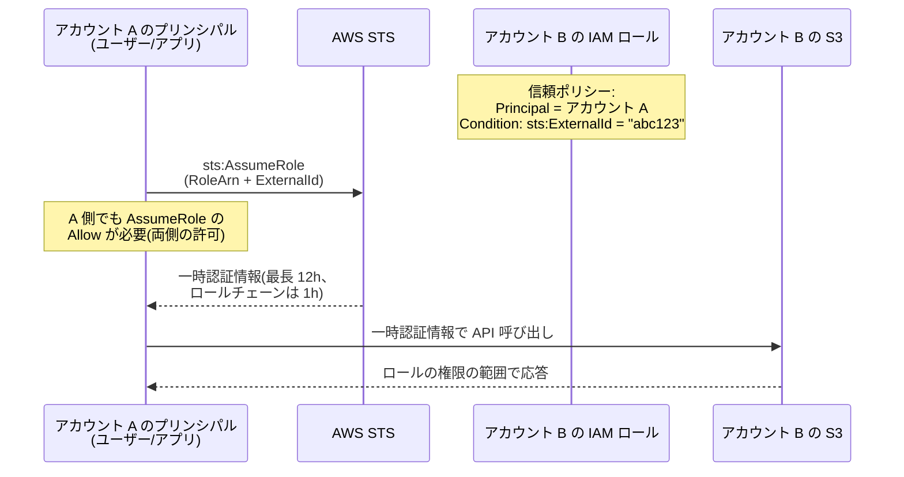
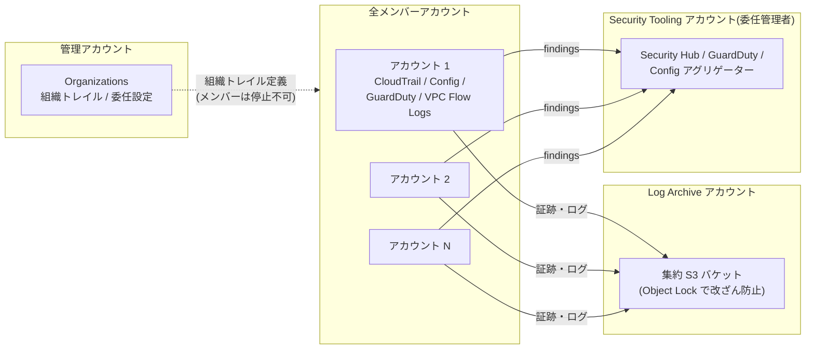

# 1.2 セキュリティ統制の規定(組織レベル)

## このテーマの背景 — 単一アカウントの IAM から「組織の統制」へ

SAA レベルのセキュリティは「1つのアカウントの中で IAM ポリシーを正しく書く」ことでした。SAP で問われるのはその先、**数十〜数百のアカウントにまたがる統制**です。規模が変わると、問題の性質が変わります。

第一に、**アカウントの壁を越えるアクセス**が日常になります。CI/CD アカウントから本番アカウントへデプロイする、監査チームが全アカウントのログを読む、外部の SaaS ベンダーに自社リソースの監視を許可する — これらはすべて「クロスアカウントアクセス」の設計問題です。第二に、**人間の ID 管理**が破綻します。アカウントごとに IAM ユーザーを作れば、100 アカウント × 500 人 = 5万のユーザーとパスワードを管理する羽目になります。企業の既存 ID 基盤(Active Directory や Okta)と連携する**フェデレーション**が必須になります。第三に、**「全アカウントで必ずこうなっている」という保証**が要ります。1つのアカウントで CloudTrail が無効化されていたら、組織全体の監査が穴だらけになるからです。

このノートは、この3つの問題 — クロスアカウントアクセス、フェデレーション、組織全体の統制と可視化 — を順に解説します。

## 関連する Well-Architected の柱

このテーマはセキュリティの柱の設計原則がそのまま出題される領域です。

- 「**強力なアイデンティティ基盤を実装する**」: IAM ユーザーの乱立ではなく、一時認証情報(AssumeRole)とフェデレーション(Identity Center)で人と権限を一元管理する
- 「**トレーサビリティを実現する**」: 組織トレイル・集中ログで「すべての操作が記録され、消せない」状態を作る
- 「**セキュリティのベストプラクティスを自動化する**」: 人の注意力に頼らず、SCP・Permissions Boundary・データ境界で構造的に強制する

## クロスアカウントアクセスの設計

### 基本形: IAM ロールの Assume

アカウント B のリソースをアカウント A のプリンシパルが操作する標準の方法は、B にロールを作って A に引き受けさせる(AssumeRole)ことです。ポイントは**両側の合意が必要**という点です。B 側はロールの**信頼ポリシー**で「A の誰が引き受けてよいか」を宣言し、A 側は IAM ポリシーで「このロールを Assume してよい」と許可する。どちらか片方では成立しません。STS が発行する認証情報は一時的(既定1時間、最長12時間。ロールを乗り継ぐロールチェーンは1時間固定)で、長期キーの配布・漏えいリスクを構造的に減らします。これが「強力なアイデンティティ基盤」の実践です。



### ExternalId — 「混乱した代理」問題への対策

サードパーティ(監視 SaaS など)に自社アカウントのロールを渡すときには、**ExternalId** という追加の合言葉を信頼ポリシーの条件に入れます。なぜ必要なのか。ベンダーは多数の顧客のロールを預かっています。攻撃者が「他人のロール ARN」をベンダーに登録すると、ベンダーの権限で他人のアカウントにアクセスさせられる恐れがあります(ベンダーが「混乱した代理 (confused deputy)」にされる)。顧客ごとに異なる ExternalId をベンダーが払い出し、Assume 時に必ず添えることで、「この顧客の依頼でこのロールを使う」という対応関係が保証されます。**「サードパーティにロールを渡す」と書いてあったら反射的に ExternalId** — これは SAP の鉄板です。

### リソースベースポリシーという選択肢

S3、KMS、SQS、SNS、Lambda、ECR などは、リソース側にポリシーを付けられます。ロールの Assume と違い、**呼び出し元は自分のアイデンティティのまま**相手のリソースにアクセスできる(ロールに「なりすます」必要がない)のが特徴で、複数アカウントから同時に使う共有リソースに向きます。評価ルールも重要です: **同一アカウント内**ならアイデンティティポリシーとリソースポリシーは OR(どちらかで Allow されればよい)、**クロスアカウント**では AND(両方の Allow が必要)になります。

### リソースそのものを共有する — RAM

「アクセスさせる」のではなく「リソース自体を相手のアカウントで使えるようにする」のが **AWS RAM** です。TGW、サブネット(VPC 共有)、Route 53 Resolver ルール、License Manager 設定などが共有でき、Organizations 内なら招待・承諾の手続きも不要です。ネットワーク系の中央集約(1-1)を支える仕組みです。

### 検出の仕組み — IAM Access Analyzer

設計をどれだけ丁寧にしても、「意図せず外部に公開されたリソース」は生まれます。**IAM Access Analyzer** は、組織(または アカウント)を「信頼ゾーン」として、**ゾーン外のプリンシパルからアクセス可能なリソース**(公開 S3 バケット、外部に開いた KMS キーやロール)をポリシー解析で洗い出します。実トラフィックではなくポリシーの数学的解析なので、まだ悪用されていない「穴」を事前に見つけられるのが価値です。未使用アクセスの検出や、CloudTrail 実績からの最小権限ポリシー生成もこのサービスの機能です。

## ポリシー評価ロジック — すべての権限問題の土台

クロスアカウントでも SCP でも、最後は「この API コールは許可されるか」という一点に帰着します。評価の優先順位を正確に覚えてください。

```
明示的 Deny > SCP(上限)> Permissions Boundary(上限)> セッションポリシー > アイデンティティ/リソースベースの Allow
```


この図から導かれる実務上の帰結が3つあります。

1. **SCP と Permissions Boundary は「上限」であって「付与」ではない**。SCP でいくら Allow を書いても、IAM 側に Allow がなければ何もできない。逆に IAM でフル権限でも、SCP の枠外は使えない
2. **明示的 Deny は絶対**。どのレイヤーの Deny も、他のすべての Allow に勝つ。だから「組織で絶対にさせたくないこと」は SCP の Deny で書く
3. **Permissions Boundary の使いどころは権限の委任**。「開発チームに IAM ロール作成を許可したいが、自分より強いロールを作られては困る」→ 作成されるロールに Boundary の添付を強制する(SCP はアカウント全体、Boundary は特定プリンシパル、というスコープの違い)

## フェデレーション — 企業 ID 基盤との統合

### なぜ IAM ユーザーを作ってはいけないのか

IAM ユーザー方式の問題は、退職者の削除漏れ・パスワード/アクセスキー管理・アカウント数×人数の組み合わせ爆発です。「ID とパスワードの管理は既存の企業ディレクトリ(AD、Okta、Entra ID)に任せ、AWS は認証結果を信頼して一時認証情報を発行するだけ」にするのがフェデレーションであり、W-A が言う「長期認証情報の排除」の実装です。

### 現代の標準解: IAM Identity Center

**IAM Identity Center(旧 AWS SSO)** は、マルチアカウント環境の人間のアクセスを一元化する現在の推奨解です。仕組みはこうです: 外部 IdP と **SAML 2.0** で認証連携し、**SCIM** でユーザー・グループを自動同期する。管理者は「**権限セット**」(実体は各アカウントに展開される IAM ロール)を定義し、「このグループには本番アカウント群の ReadOnly 権限セット」のように割り当てる。利用者は1つのポータルから全アカウントに SSO でき、CLI v2 も対応しています。

試験では「複数アカウント + 既存 IdP + SSO」という組み合わせが出たら Identity Center が既定解です。旧来の「各アカウントに SAML IdP を登録して AssumeRoleWithSAML」はレガシーな選択肢として比較に出ます(単一アカウント・特殊要件でない限り選ばない)。

### Active Directory との連携 — 2つの方式の使い分け

オンプレ AD がある企業では、Directory Service の2方式の違いが問われます。

- **AD Connector**: AWS 側にディレクトリを**持たない**プロキシ。認証要求をオンプレ AD にそのまま転送する。「ディレクトリ情報を AWS に置きたくない」「既存 AD をそのまま使いたい」場合の選択。MFA は RADIUS 連携で実現
- **AWS Managed Microsoft AD**: AWS 上に**本物の Microsoft AD** を構築し、オンプレ AD と**信頼関係 (trust)** を結ぶ。EC2 の Windows をドメイン参加させる、FSx for Windows の認証に使うなど、**AWS 内で AD 機能そのものが必要**な場合はこちら

判断基準は「AWS 側に AD の実体が必要か」です。コンソール SSO だけなら AD Connector(+Identity Center)、Windows ワークロードが AD 機能を使うなら Managed Microsoft AD。

### 人間以外のフェデレーション

- **Cognito**: アプリのエンドユーザー向け。User Pool(認証・JWT 発行)と Identity Pool(AWS 一時認証情報の払い出し)の2階建て
- **IAM OIDC フェデレーション**: GitHub Actions などの CI から、シークレットを置かずに AWS ロールを Assume する
- **IAM Roles Anywhere**: オンプレのサーバー・アプリに X.509 証明書ベースで一時認証情報を渡す。「オンプレに置いた長期アクセスキーをなくしたい」の答え

## ログ・脅威検知の集中管理

### なぜ「集中」なのか

各アカウントに証跡がバラバラに置かれていると、①横断調査ができない、②ワークロードアカウントの管理者が自分の証跡を消せてしまう、③設定漏れのアカウントが生まれる、という3つの問題があります。だから統制の効いた組織は、**ログは書き込み専用の別アカウントへ、検知は専門アカウントへ**集約します。トレーサビリティの柱の実装です。

### 定番アーキテクチャ

- **CloudTrail 組織トレイル**: 組織の全アカウントの API 証跡を1つの設定で有効化し、**Log Archive アカウントの S3** に集約する。決定的に重要なのは、**メンバーアカウント側からは停止も削除もできない**こと。これで「証跡を消して痕跡を隠す」ことが構造的に不可能になる
- **Config アグリゲーター**: 全アカウント・全リージョンの構成とコンプライアンス状態を1画面に集約
- **GuardDuty / Security Hub / Macie / Inspector / Detective**: それぞれ**委任管理者 (delegated administrator)** を Security Tooling アカウントに設定し、findings を集約する。管理アカウント自体で運用しないのがベストプラクティス(管理アカウントは触る人を最小化したいため)
- **CloudWatch Logs の集約**: サブスクリプションフィルタ → Kinesis Data Firehose(クロスアカウント)→ 集約 S3 が定番ルート



Log Archive の S3 には **Object Lock**(WORM)や MFA Delete を組み合わせ、「監査ログは誰にも(管理者にも)消せない」状態にします。Control Tower を使えば、この Log Archive / Audit アカウント構成が最初から自動でセットアップされます(1-4 参照)。

## データ境界 (Data Perimeter) — 「信頼できる範囲」を条件キーで固定する

組織統制の仕上げが、「**信頼されたアイデンティティが、信頼されたネットワークから、信頼されたリソースへ**しかアクセスできない」状態を IAM 条件キーで作るデータ境界です。個々のバケットポリシーを頑張るのではなく、**組織を単位とした条件**で一括制御するのが特徴です。

| 条件キー | 意味 | 典型的な使い方 |
|---|---|---|
| `aws:PrincipalOrgID` | 呼び出し元が自組織のプリンシパルか | S3 バケットポリシーで「組織内からのみ許可」(アカウント ID の列挙はメンテ不能なので不正解) |
| `aws:ResourceOrgID` | アクセス先リソースが自組織のものか | SCP で「組織外のバケットへのデータ持ち出しを禁止」 |
| `aws:SourceVpce` / `aws:SourceIp` | 経路の制限 | 「社内網 or 特定エンドポイント経由のみ」 |

SCP(アイデンティティ側の上限)、リソースポリシー、VPC エンドポイントポリシー(経路側)の3点を同じ思想で揃えることで、認証情報が漏えいしても「組織外から」「組織外へ」は使えない、という多層の壁ができます。

## ケーススタディ

**シナリオ**: 監視 SaaS ベンダーが、顧客である自社の複数アカウントのメトリクスを収集する。ベンダーへのアクセス付与方法として最も安全なものは? (A) 監視用 IAM ユーザーを作りアクセスキーを渡す (B) クロスアカウントロールを作り信頼ポリシーでベンダーのアカウントを指定する (C) B に加えて ExternalId 条件を付ける (D) ベンダーの IP を許可する SG を設定する

**解き方**: 長期キーの受け渡し (A) は漏えいリスクと無効化の難しさから最初に消える(「長期認証情報の排除」の原則)。(D) はネットワークの話で認可の答えになっていない。(B) は動くが、ベンダーが多数の顧客を持つ以上、混乱した代理攻撃に無防備。よって **(C)**。ロール + ExternalId はこの類題の定型解。

**シナリオ**: 500人の従業員が 40 アカウントを利用する。現在はアカウントごとの IAM ユーザーで、パスワードリセット対応が運用を圧迫している。会社は Entra ID(旧 Azure AD)を利用中。最小の運用負荷で改善するには?

**解き方**: 「複数アカウント + 既存 IdP + 運用負荷削減」の3点が揃ったら **IAM Identity Center**。Entra ID と SAML/SCIM 連携し、権限セットをグループに割り当てる。各アカウントに SAML IdP を個別登録する案は、40 アカウント分の設定を管理し続けることになり「運用負荷最小」に反する。

## 試験直前の要点(理由つき)

- **SCP は権限を付与しない** — SCP はフィルター(上限)であり、通すか通さないかを決めるだけ。実際の Allow は IAM 側に必要。「SCP で許可したのに動かない」の答えは常にこれ
- **SCP は管理アカウントに効かない** — だから管理アカウントではワークロードを動かさない、という運用原則とセットで覚える
- **サードパーティへのロール付与には ExternalId** — 混乱した代理対策。信頼ポリシーの `Condition` に入れる
- **「組織内の全アカウントからのみアクセス許可」は `aws:PrincipalOrgID`** — アカウント ID を列挙するポリシーはアカウント追加のたびに壊れるため不正解
- **クロスアカウントは「両側の許可」** — 信頼ポリシー(リソース側)と IAM ポリシー(呼び出し側)の AND。同一アカウント内は OR
- **AD Connector はプロキシ、Managed Microsoft AD は実体** — AWS 内で AD 機能(ドメイン参加、FSx 認証)が必要なら後者。認証の転送だけなら前者
- **組織トレイルはメンバーから停止できない** — これが「個別アカウントで CloudTrail を設定する」案に対する決定的な優位。改ざん防止は S3 Object Lock と log file validation で補完
- **Identity Center の権限セット = 各アカウントに展開される IAM ロール** — 実体を知っていると、権限セット変更が各アカウントへ伝播する仕組みも理解できる
