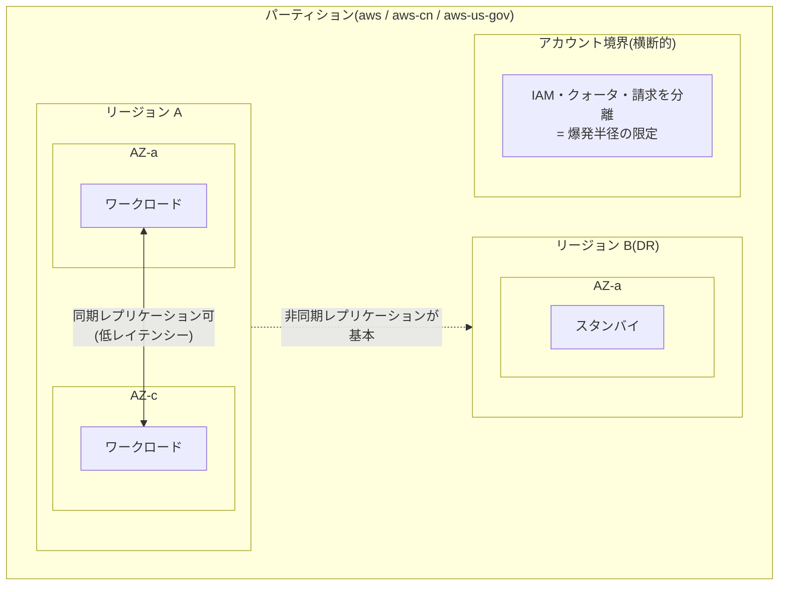

# 1.3 信頼性が高く回復性のあるアーキテクチャの設計(組織レベル)

## このテーマの背景 — 「壊れない」ではなく「壊れ方を設計する」

信頼性というと「壊れないシステム」を想像しがちですが、W-A の信頼性の柱の出発点は逆で、「**すべてのものは常に壊れる**」です。個々のディスク、サーバー、AZ、ときにはリージョン全体さえも障害を起こしうる。だからクラウドの信頼性設計とは、**障害が起きたときに、その影響がどこまで広がるかを事前に決めておく**こと、つまり「壊れ方の設計」です。

このとき鍵になる概念が**障害分離境界 (fault isolation boundary)** と**爆発半径 (blast radius)** です。AWS は AZ・リージョン・パーティションという物理・論理の分離境界を提供しており、さらに利用者は**アカウント**という境界を自分で追加できます。境界の内側で起きた障害は境界を越えて広がらない(ように設計されている)ので、「どの境界にワークロードを収め、どの境界をまたいで冗長化するか」がアーキテクトの意思決定になります。

もうひとつ、組織規模で見落とされがちなのが**サービスクォータと API 制限**という「見えない上限」です。平常時には意識しないこの上限が、DR 発動時 — つまり最悪のタイミング — で牙をむく、というのが SAP の定番シナリオです。個別ワークロードの DR 設計([2-2](../02-new-solutions/2-2-business-continuity.md))の前提となる、組織レベルの信頼性の考え方をこのノートで押さえます。

## 関連する Well-Architected の柱

信頼性の柱がほぼそのまま該当します。特に以下の設計原則がこのノートの主役です。

- 「**障害から自動的に復旧する**」— 障害分離境界とセル設計は、自動復旧が「境界の内側だけを復旧すればよい」状態を作る
- 「**復旧手順をテストする**」— Route 53 ARC の readiness check、FIS、DR 訓練。「バックアップはあるが復元したことがない」は信頼性ゼロと同じ
- 「**キャパシティを推測しない**」— クォータの事前確認・引き上げ、キャパシティ予約。DR リージョンで「起動できるはず」は推測にすぎない

## 障害分離境界 — どこで障害を止めるか

### 4つの境界とその意味

| 境界 | 分離されるもの | 設計への示唆 |
|---|---|---|
| AZ | 電源・冷却・ネットワークの物理設備 | マルチ AZ が基本。AZ 間は低レイテンシーなので**同期**レプリケーションが可能 |
| リージョン | ほぼ全て(コントロールプレーン含む) | リージョン間は距離があるため**非同期**が基本。DR とデータ主権の単位 |
| アカウント | IAM・クォータ・請求・API 制限 | **人為ミス・侵害・リソース枯渇の爆発半径**を区切る、利用者が自分で引ける境界 |
| パーティション | aws / aws-cn / aws-us-gov | IAM も ARN も完全分離。中国・GovCloud 要件で登場 |

「AZ 間は同期、リージョン間は非同期」という物理的制約は、後の DR 設計(RPO がゼロにできるか)を規定する土台なので、理由ごと覚えてください。同期レプリケーションは書き込みのたびに相手の応答を待つため、距離(レイテンシー)が大きいリージョン間では性能が成立しないのです。

### アカウント分割は信頼性の道具でもある

アカウント分割はセキュリティの文脈(1-4)で語られがちですが、信頼性の観点でも強力です。あるチームの暴走スクリプトが API スロットリングを引き起こしても、**クォータはアカウント単位**なので他チームのワークロードは無傷です。試験で「あるワークロードのバースト的な API 使用が、同一アカウントの別ワークロードに影響している」とあれば、答えはアカウント分離です。

### コントロールプレーンとデータプレーン、そして静的安定性

AWS の各サービスは、リソースを作成・変更する**コントロールプレーン**(RunInstances、CreateTable など)と、既存リソースが動き続ける**データプレーン**(EC2 上の処理、DynamoDB の読み書きなど)に分かれています。障害時の統計的な堅牢性はデータプレーンの方が圧倒的に高い — つまり「**すでに動いているものは動き続けやすいが、新しく作る操作は失敗しやすい**」。

ここから導かれる設計指針が**静的安定性 (static stability)** です: 障害時の復旧手順が「新規リソースの作成」に依存していると、まさにその時にコントロールプレーンが不調で失敗するかもしれない。だから、たとえば「AZ 障害時に ASG がスケールしてくれるはず」ではなく、**AZ 障害を見越して各 AZ に余剰キャパシティを事前に確保しておく**(1 AZ を失っても残りで 100% を賄える台数で常時運用する)。コストは上がりますが、フェイルオーバーが「何もしないこと」になる分だけ確実性が上がります。ミッションクリティカル要件でこのトレードオフを選ばせる問題が出ます。

### セル型アーキテクチャ — 境界を自分で作る

AZ やリージョンより細かい粒度で爆発半径を区切りたいとき、ワークロードを独立した「**セル**」(顧客グループごとの完全なスタック)に分割し、ルーティング層で顧客をセルに振り分ける設計をセル型アーキテクチャと呼びます。1つのセルの障害(不正なデータ、ポイズンピル、デプロイ事故)は、そのセルの顧客にしか影響しません。**シャッフルシャーディング**(顧客ごとにリソースの組み合わせをランダムに割り当て、同じ組み合わせを共有する顧客を最小化する手法)も同じ思想です。SAP では深掘りされませんが、「一部顧客の問題が全顧客に波及するのを防ぎたい」という記述からこれらの用語を選べるようにしておきます。

## サービスクォータ — 見えない上限との戦い

### なぜ DR のときに限って起動できないのか

サービスクォータは**アカウント × リージョン単位**です。ここに落とし穴があります。本番リージョンでは利用実績に応じてクォータが引き上がっていますが、**DR リージョンのクォータは初期値のまま**ということが普通に起きます。DR を発動して「vCPU 上限で EC2 が起動できない」— これが試験でも実世界でも頻発する失敗パターンです。

対策は3段階で考えます。

1. **Service Quotas でクォータを事前確認・引き上げ申請**し、本番と DR で揃える(最低ライン)
2. クォータがあっても物理キャパシティが枯渇する可能性に備え、**On-Demand Capacity Reservation** で確保する(静的安定性の実践。Savings Plans/RI と併用すれば割引も効く)
3. **Route 53 ARC の readiness check** で「両リージョンの構成・クォータが揃っているか」を継続監視する(ドリフトの検出)

### API スロットリングへの備え

大量のリソース操作(数百台の一斉起動、リカバリスクリプト)は API スロットリングに当たります。クライアント側の作法は**エクスポネンシャルバックオフ + ジッター**(リトライ間隔を指数的に伸ばし、ランダム要素で同時リトライの波を崩す)。これは AWS SDK に組み込まれていますが、設計の選択肢としても登場します。

## 組織レベルの回復性を支えるサービス群

個々の仕組みを繋いで「組織として信頼性を維持し続ける」ためのサービスを整理します。

- **AWS Resilience Hub**: アプリの RTO/RPO 目標を登録すると、実際の構成がそれを達成できるかを継続評価し、ギャップ(単一 AZ の DB、バックアップ欠如など)を指摘する。「信頼性の継続的な評価を自動化したい」の答え
- **AWS Fault Injection Service (FIS)**: EC2 停止・AZ 障害・API エラー注入などの**カオスエンジニアリング実験**をマネージドに実行する。「復旧手順をテストする」の実装手段。ゲームデーで使う
- **Route 53 ARC (Application Recovery Controller)**: DNS のヘルスチェック任せにせず、**ルーティングコントロール**という明示的なスイッチでフェイルオーバーを制御する。コントロール自体が超高可用のデータプレーンで動くため、「大規模障害の混乱の中でも確実に切り替えたい」場合の選択
- **AWS Health + EventBridge**: AWS 側の障害・メンテナンス通知をイベントとして受け、自動対応(該当インスタンスの退避など)につなげる
- **Trusted Advisor の耐障害性チェック**: 単一 AZ の RDS、バックアップ未設定、ELB 配下の AZ 偏りなどをルールベースで検出

## データレジデンシーとリージョン統制

「データを特定の国・リージョンから出してはならない」という規制要件は、信頼性(どこに冗長化するか)とガバナンスの交点です。技術的な実装は **SCP + `aws:RequestedRegion` 条件**で、許可リージョン以外での API 実行を組織的に拒否します。

ここで頻出のひっかけがあります。IAM、CloudFront、Route 53、WAF (CloudFront スコープ) などの**グローバルサービス**は特定リージョン(us-east-1)の API として実行されるため、単純なリージョン Deny を書くと**グローバルサービスまで使えなくなり組織が麻痺**します。SCP には必ずグローバルサービスの除外(NotAction)を入れる — この設計详细まで問われます。

## ケーススタディ

**シナリオ**: 金融企業が東京リージョンで基幹システムを運用し、大阪リージョンに Warm Standby の DR 環境を持つ。四半期ごとの DR 訓練で、大阪側のスケールアップ(EC2 を 10 台 → 200 台)が vCPU クォータ超過で失敗した。再発を防ぐ最も確実な方法は?

**解き方**: 直接の原因はクォータなので「大阪のクォータを引き上げる」は当然やる。しかし設問は「最も確実」— クォータが足りても、リージョン規模の障害時には物理キャパシティの争奪が起きうる(他社も一斉に DR を発動する)。確実性を最大化するのは **On-Demand Capacity Reservation で 200 台分を常時確保**すること。さらに Route 53 ARC の readiness check でクォータ・構成の非対称を継続監視する。コストは上がるが、金融の基幹という文脈が静的安定性への投資を正当化する。「訓練で失敗した」という記述自体が「復旧手順をテストする」原則の実演であることにも注目。

## 試験直前の要点(理由つき)

- **リージョン利用制限は SCP + `aws:RequestedRegion`、ただしグローバルサービスを除外** — 除外を忘れると IAM 操作まで拒否され組織運営が止まる。この「除外」まで含めて1セットの知識
- **DR リージョンのクォータは自動では揃わない** — クォータはアカウント×リージョン単位で、実績のないリージョンは初期値のまま。事前引き上げ+キャパシティ予約が対策
- **アカウント分割はクォータ・請求・爆発半径の分離でもある** — セキュリティ境界としてだけ覚えていると、「他ワークロードへの影響を防ぐ」系の問題で選べない
- **静的安定性 = 復旧を「新規作成」に依存させない** — コントロールプレーンは障害時に不安定になりやすい、という事実が根拠。事前確保はコストとのトレードオフとして出題される
- **「確実な手動フェイルオーバー」は Route 53 ARC** — 通常のヘルスチェックフェイルオーバーとの違いは、切替判断を自動検知に任せず、超高可用なコントロールで人間(または自動化)が明示的に倒せること
- **AZ 間=同期可、リージョン間=非同期が基本** — 物理的距離(レイテンシー)が理由。RPO ゼロのクロスリージョン同期を求める選択肢は原則疑ってかかる
