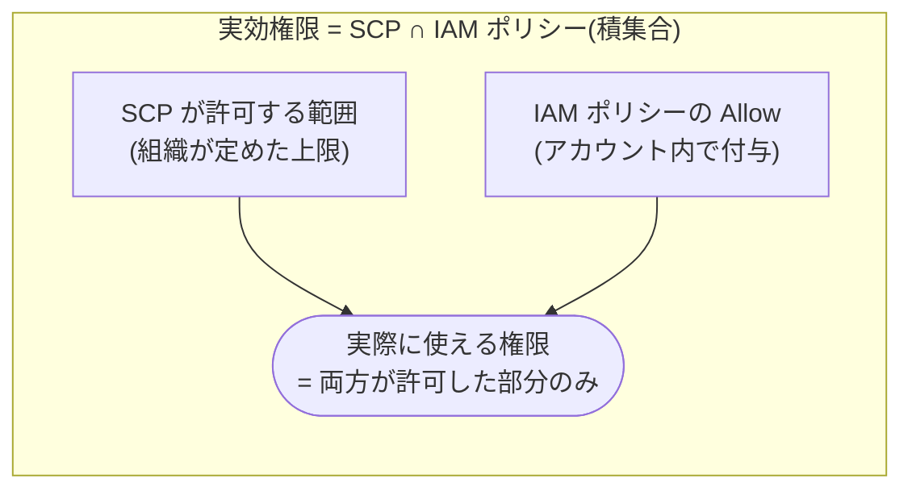
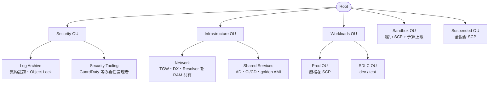

# 1.4 マルチアカウント AWS 環境の設計(最頻出トピック)

## このテーマの背景 — なぜアカウントを分けるのか

「アカウントは1つで、環境は VPC やタグで分ければいいのでは?」— マルチアカウント設計を学ぶ出発点は、この素朴な疑問に答えられることです。単一アカウント運用は、規模が小さいうちは快適ですが、成長すると次の壁に当たります。

1. **セキュリティ境界が曖昧**: IAM ポリシーでどれだけ頑張っても、同一アカウント内の分離は「ポリシーの書き間違い1つ」で破れます。アカウント境界は既定で完全遮断であり、破るには明示的な設定(クロスアカウントロール等)が必要 — 「間違えたら開く」と「間違えたら閉じたまま」の違いは決定的です
2. **爆発半径**: 侵害・オペミス・リソース暴走の影響範囲がアカウント全体に及ぶ(1-3 参照)
3. **クォータと請求の混在**: チーム間でクォータを取り合い、請求が分離できない
4. **監査の困難**: 「本番だけ監査対象」にしたくても、リソースが混在していると切り出せない

そこで「**ワークロード・環境ごとにアカウントを分け、AWS Organizations で束ねて統治する**」のが現代の標準です。ただしアカウントを分ければ今度は「数百アカウントをどう統制するか」という新しい問題が生まれます。SCP・Control Tower・RAM はすべて、この「分けたうえで束ねる」ための道具です。SAP で最も出題が集中する領域なので、機能の暗記ではなく「何の問題を解くための道具か」から理解してください。

## 関連する Well-Architected の柱

- **セキュリティ**: 「セキュリティのベストプラクティスを自動化する」— SCP・ガードレールは人の注意力でなく構造で強制する仕組みそのもの
- **運用上の優秀性**: 「運用をコードとして実行する」— Account Factory・StackSets によるアカウントの量産と標準化
- **コスト最適化**: 「支出を分析し、帰属させる」— アカウント分割は最も確実なコスト帰属の単位。一括請求と RI/SP 共有で規模の経済も効かせる

## AWS Organizations の構造

Organizations は、複数アカウントを**1つの組織**として束ねる仕組みです。構成要素は3つだけです: 組織のルートにいる**管理アカウント (management account)**、アカウントをグループ化する**OU (Organizational Unit)** のツリー、そして OU 階層に沿って継承される**ポリシー**(SCP ほか)。

押さえるべき機能を「何を解決するか」とともに整理します。

- **一括請求 (Consolidated Billing)**: 全アカウントの請求を管理アカウントに集約。単に請求書が1枚になるだけでなく、**ボリューム割引の使用量合算**と **RI/Savings Plans の未使用分の自動共有**が組織全体に効く(コストの規模の経済)
- **ポリシーの継承**: SCP をはじめとするポリシーは「ルート → OU → 子 OU → アカウント」と**継承**される。だから OU 設計 = 統制の設計
- **委任管理者 (Delegated Administrator)**: GuardDuty、Security Hub、Config、CloudTrail、StackSets などの組織横断管理を、管理アカウント以外(通常は Security Tooling アカウント)に委任する。**管理アカウントには SCP が効かない**ため、日常業務を管理アカウントで行うこと自体がリスク — 委任はそのリスクを減らすベストプラクティス
- **ポリシータイプは SCP だけではない**: **タグポリシー**(タグの標準化・監査)、**バックアップポリシー**(AWS Backup 計画の強制)、AI サービスオプトアウトポリシー、そして比較的新しい **RCP (Resource Control Policy)**(リソース側から見た上限 — 組織外プリンシパルによるアクセスまで制御できる)

## SCP の設計 — 「ガードレール」の意味を正確に

SCP の本質は一文で言えます: **SCP は権限の上限(フィルター)であり、権限を付与するものではない**。実効権限は「SCP が許す範囲」と「IAM が許す範囲」の**積集合**です。

評価はルートから対象アカウントまでの**全階層**で行われ、どこか1階層でも許可されていないアクションは使えません。既定では全階層に `FullAWSAccess`(全許可)が付いているので、運用スタイルは2通りに分かれます: `FullAWSAccess` を残して禁止事項だけ Deny を足す **deny-list 方式**(一般的)と、`FullAWSAccess` を外して許可するものだけ列挙する **allow-list 方式**(サンドボックスなど厳格な環境)。

### 定番の SCP パターン(そのまま出る)

| 目的 | 実装 |
|---|---|
| 利用リージョンの制限 | Deny + `aws:RequestedRegion` 条件(**グローバルサービスは NotAction で除外** — 1-3 参照) |
| 監査基盤の保護 | `cloudtrail:StopLogging`、`config:Delete*` 等を Deny(メンバーが証跡を止められなくする) |
| ルートユーザーの使用禁止 | Deny + `aws:PrincipalArn` = `arn:aws:iam::*:root` |
| タグなしリソースの作成禁止 | Deny + `aws:RequestTag` 条件(コスト帰属の強制) |
| 高額リソースの制限 | Deny + `ec2:InstanceType` 条件(サンドボックスで大型インスタンス禁止) |

### SCP が効かないもの(ひっかけの宝庫)

- **管理アカウント**(だからワークロードを置かない)
- **サービスにリンクされたロール**(AWS サービス自身の動作を壊さないため)
- リソースベースポリシー経由の**組織外プリンシパルの評価**(SCP はあくまで組織内プリンシパルのフィルター。この穴を塞ぐのが RCP)

## 推奨 OU 構成 — 組織図を写すのではなく統制で切る

OU 設計の原則は「**同じ統制(SCP・ガードレール)を受けるべきアカウントを同じ OU に**」です。会社の部署図をそのまま OU にすると、本番と開発が同じ OU に混ざり、統制の粒度と OU の粒度がずれます。AWS の標準ガイダンスは環境と機能で切ります。

各 OU の存在理由: Security OU は「ログと検知は誰にも触らせない」(1-2 の集中管理の受け皿)。Infrastructure OU は「全員が使う共通機能は一箇所に」(1-1 のネットワーク集約の受け皿)。Workloads の Prod/SDLC 分離は「本番だけ厳格な SCP・変更統制をかける」ため。Sandbox は「実験は自由に、ただし予算とリージョンは縛る」。Suspended は「退役アカウントは全拒否 SCP で凍結してから削除猶予期間を待つ」ためのゴミ箱です。

## AWS Control Tower — ベストプラクティスの自動組み立て

ここまでの構成(OU、Log Archive/Audit アカウント、組織トレイル、基本 SCP)を手作業で組むのは大仕事です。**Control Tower** はこれを「**ランディングゾーン**」として自動構築し、以後の統治も引き受けます。

- **コントロール(ガードレール)** は3種類あり、実装の実体を知っていると混乱しません: **予防的 (preventive)** = SCP(そもそも実行させない)、**検出的 (detective)** = Config Rules(実行後に非準拠を検出)、**プロアクティブ (proactive)** = CloudFormation フック(デプロイ前にテンプレートを検査)
- **Account Factory**: 標準化されたアカウントをセルフサービスで払い出す仕組み(実体は Service Catalog)。Terraform 派には **AFT (Account Factory for Terraform)**、追加カスタマイズには Customizations for Control Tower (CfCT)
- 試験での選び分け: 「**これから**マルチアカウントを整備する」「新規アカウントを統制付きで量産したい」→ Control Tower が既定解。「既存の複雑な Organizations 構成があり、細かい独自要件がある」→ 素の Organizations + StackSets を継続、という文脈なら自前構成が正解になる

## リソース共有 — RAM と VPC 共有

アカウントを分けると「共有したいもの」が必ず出ます。**AWS RAM** は、リソースを**所有権を移さずに**他アカウントへ使わせる仕組みで、組織内なら招待・承諾も不要です。共有できる代表は TGW、**サブネット(VPC 共有)**、Route 53 Resolver ルール、License Manager 設定、Service Catalog ポートフォリオなど。

**VPC 共有**は特に重要です。「アカウントは分けたいが、ネットワークは一元管理したい・IP 空間を節約したい」という要件に対し、ネットワークアカウントが所有する VPC のサブネットを各ワークロードアカウントに貸し出し、各アカウントは**自分のリソースをそのサブネットに起動**します。Peering や TGW のような「接続」ではなく「同居」なので、転送コストもホップも発生しません。この区別(接続 vs 同居)が選択問題の軸になります。

## アカウントの移動・統合シナリオ

企業合併や組織再編の文脈で、アカウントのライフサイクル操作が問われます。

- 既存アカウントの組織参加は**招待 → 承諾**。参加した瞬間から SCP と一括請求が適用される。別の組織に属している場合は**先に旧組織から離脱**が必要(組織同士をマージする機能は存在しない — 合併シナリオでは「片方の組織のアカウントを1つずつ移す」が正解)
- アカウントの OU 間移動・組織移動で**リソースは停止しない**(変わるのは統制と請求だけ)。「移行中のダウンタイム」を心配させる選択肢はひっかけ
- RI/SP の共有は**アカウント単位で無効化できる**。「特定部門の割引を他部門に流したくない」という会計要件に対応

## ケーススタディ

**シナリオ**: ある企業は 80 アカウントを Organizations で管理している。セキュリティチームは「全アカウントで、すべてのリソースに CostCenter タグを必ず付けさせたい」と考えている。最も確実な方法は? (A) タグポリシーを組織に適用する (B) 各アカウントに Config ルール required-tags を配布する (C) SCP で `aws:RequestTag` が無いリソース作成を Deny する (D) 全チームにタグ付けガイドラインを通知する

**解き方**: 「最も確実 = 作成時点で強制」と読み替える。(D) は統制ではない。(A) タグポリシーは**値の標準化と非準拠の検出**であり、**タグなし作成をブロックしない** — これが最大のひっかけ。(B) Config は事後検出(+修復)で、作成自体は通ってしまう。作成をブロックできるのは **(C) SCP** だけ。実務では A(標準化)+ C(強制)+ B(既存リソースの是正)を併用するが、「確実にブロック」と問われたら C。

**シナリオ**: 新設の分析チームに毎月数個のペースで新しいアカウントを払い出す。各アカウントには標準の VPC 構成・監査設定・ガードレールが最初から入っていなければならない。運用負荷を最小にするには?

**解き方**: 「標準構成付きアカウントの量産 + 運用負荷最小」→ **Control Tower の Account Factory**(+CfCT/AFT でカスタム構成を自動適用)。素の Organizations + 手動 StackSets 適用は、テンプレート適用の手作業・順序管理が残るため次点。CreateAccount API を Lambda で叩く自作案は「差別化につながらない重労働」であり W-A 的に不正解。

## 試験直前の要点(理由つき)

- **SCP は Allow を書いても権限を付与しない** — 実効権限は SCP ∩ IAM。この一点から派生する問題が無数に出る
- **SCP は管理アカウント・サービスリンクロールに効かない** — 「管理アカウントの利用を SCP で制限」は不可能。答えは「管理アカウントを使わない運用」
- **タグの強制は SCP、タグの標準化はタグポリシー** — タグポリシー単体では作成をブロックできない、が最頻出のひっかけ
- **「VPC を複数アカウントで共用」は RAM の VPC 共有** — Peering(接続)と混同させる選択肢が並ぶ。IP 節約・一元管理のキーワードで共有を選ぶ
- **Control Tower の検出的ガードレールの実体は Config Rules** — 「検出」であって「防止」ではない。防止は予防的ガードレール(SCP)
- **組織トレイル・組織 Config はメンバーから停止不可** — 集中管理の存在意義。個別設定との比較で決め手になる
- **組織のマージ機能はない** — 合併シナリオはアカウント単位の移動(離脱→招待→承諾)で解く
