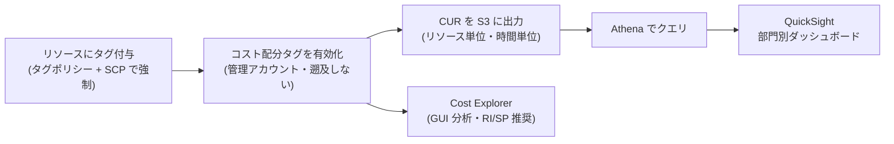
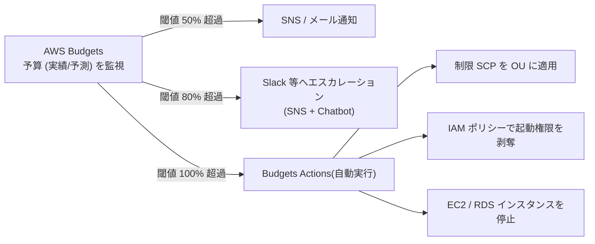

# 1.5 コスト最適化と可視化の戦略(組織レベル)

## このテーマの背景 — 「安くする」前に「見えるようにする」

クラウドのコスト管理が難しい本質的な理由は、**支出の意思決定が分散する**ことにあります。オンプレ時代は、サーバー購入は稟議を通る集中的な意思決定でした。クラウドでは、開発者がインスタンスを1つ起動するたびに支出が発生します。数百人が日々「小さな購買」をしている状態で、月末の請求書だけを見ていても打つ手はありません。

だから組織レベルのコスト最適化は、削減テクニックの前に「**見える化と帰属**」から始まります。誰が(どの部門・プロジェクトが)、何に、いくら使っているかをリアルタイムに特定できる仕組み — これが W-A の言う**クラウド財務管理 (Cloud Financial Management)** です。SAP の Domain 1 でコストが問われるときは、個別リソースの節約術(それは 2-6 と 3-5 の領域)ではなく、この**組織の仕組みづくり**が主題です。

このノートでは、可視化のツールチェーン(タグ → CUR → 分析)、統制の仕組み(Budgets、SCP)、そして組織だからこそ効く割引の管理(RI/SP 共有)を扱います。

## 関連する Well-Architected の柱

コスト最適化の柱の設計原則が直接対応します。

- 「**クラウド財務管理を実装する**」— このノート全体が実装論。可視化・帰属・統制の体制を仕組みで作る
- 「**支出を分析し、帰属させる**」— コスト配分タグと CUR。帰属できないコストは最適化のしようがない
- 「**消費モデルを導入する**」— Budgets Actions による上限管理、サンドボックスの統制

## コスト可視化のツールチェーン — 役割分担を正確に

コスト系サービスは名前が似ていて混同しやすいので、「**粒度と目的**」で区別します。

| ツール | 粒度・目的 |
|---|---|
| **Cost Explorer** | GUI でのインタラクティブ分析・傾向把握・予測。**RI/SP の購入推奨**もここ。ただし粒度は集計値 |
| **CUR (Cost and Usage Report)** | **最詳細の明細**(リソース ID 単位・時間単位)。S3 に吐き出す生データで、分析は自分で行う |
| **コスト配分タグ** | 明細に「誰の・何のコストか」の属性を付ける。**管理アカウントで有効化 (activate) しないと請求データに現れない** |
| **Cost Categories** | タグ・アカウント・サービスを組み合わせた独自の集計軸(「これらのアカウント+このタグ=A事業部」) |
| **AWS Budgets** | 予算の監視とアラート、そして**自動アクション** |
| **Cost Anomaly Detection** | ML による「いつもと違う支出」の検知(閾値を決めなくてよいのが Budgets との違い) |
| **Billing Conductor** | 独自レート・グループでの社内請求(プロフォーマ請求書)。MSP や社内転売の特殊要件 |

### 定番パイプライン: タグ → CUR → Athena → QuickSight

「部門別のコストダッシュボードを作りたい」という要件の標準解は決まっています。リソースにタグを付け、コスト配分タグとして有効化し、CUR を S3 に出力し、Athena でクエリして QuickSight で可視化する。Cost Explorer では実現できない「リソース単位のドリルダウン」「独自の集計軸」がこの構成の存在理由です。

ここで試験が突いてくる細部が2つあります。第一に、コスト配分タグは**有効化した時点以降のデータにしか付かない**(遡及しない)。「先月分から部門別に見たい」は不可能で、これを知らないと誤答します。第二に、タグは付いていなければ何の意味もない — だからタグ戦略は可視化の前提条件です。

## タグ戦略 — 「付けてもらう」ではなく「付かないと作れない」

タグ運用の失敗は、ほぼ常に「人が付け忘れる」ことに起因します。W-A の「ベストプラクティスを自動化する」の原則どおり、人の注意力ではなく仕組みで解決します。役割の異なる4つの道具を階層的に使います。

1. **タグポリシー**(Organizations): タグの**キーと値の標準**を定義(`CostCenter` の値は `CC-` で始まる、等)。非準拠を**検出**するが、**作成はブロックしない**
2. **SCP の `aws:RequestTag` / `aws:TagKeys` 条件**: タグなしリソースの**作成そのものを拒否**(強制)
3. **コスト配分タグの有効化**: 請求データへの反映(管理アカウントで)
4. **Config ルール (`required-tags`) + Tag Editor**: 既存リソースの棚卸しと是正

「タグポリシー = 標準化と検出」「SCP = 強制」という役割分担は 1-4 のケーススタディでも扱った最頻出ポイントです。

## 組織で効かせる割引 — RI / Savings Plans の共有

一括請求ファミリーでは、RI と Savings Plans の割引が**組織全体で自動共有**されます。アカウント A が買った RI が余っていれば、アカウント B の同条件インスタンスに自動適用される。これにより「組織全体の合算使用量に対してコミットする」ことができ、個別アカウントで買うより無駄が出にくくなります。S3 などの**ボリューム割引も合算**されます。

運用上の設計点:

- **購入の一元化**: 各チームが勝手に買うと過剰コミットが起きるため、管理アカウント(または財務専用アカウント)で集中購入するのが推奨
- **共有の無効化**: 「この部門の割引は他部門に使わせない」という会計要件には、**RI/SP 割引共有をアカウント単位でオフ**にできる
- 未使用率の監視は Cost Explorer の **RI/SP 使用率(utilization)・カバレッジ(coverage)レポート**で行う。使用率=「買った分をどれだけ使えたか」、カバレッジ=「使用量のうち割引が効いた割合」— 意味の違いがそのまま設問になる

## コストの統制 — 気づく仕組みと止める仕組み

可視化の次は「想定を超えたときにどうするか」です。段階的に強い手段があります。

- **Budgets** は実績だけでなく**予測 (forecasted)** ベースのアラートも出せる(「このペースだと月末に超える」を早期に掴む)
- **Budgets Actions** は通知を超えて、**SCP の適用・IAM 権限の剥奪・インスタンス停止**まで自動実行できる。「サンドボックスの使いすぎを自動で止めたい」の答え
- ただし Budgets は請求データの更新間隔(数時間)に依存するため、**リアルタイムの厳密な上限**にはならない。「1円も超えさせない」ことは構造的に不可能で、そこを求める選択肢はひっかけ
- 閾値を決められない「異常」の検知は **Cost Anomaly Detection**(ML ベース)に任せる

シナリオ別の整理:

| 要件 | 解 |
|---|---|
| サンドボックスの使いすぎ防止 | Budgets アラート + **Budgets Actions**(SCP 適用・権限剥奪) |
| 高額サービス・大型インスタンスの禁止 | SCP(`ec2:InstanceType` 条件等)— そもそも作らせない予防的統制 |
| 予期しない急増への気づき | Cost Anomaly Detection |
| 部門への請求転嫁 | コスト配分タグ(按分)/ アカウント分割(最も確実)/ Billing Conductor(独自レート) |
| メンバーアカウントに自分のコストを見せる | 各アカウントで Cost Explorer を利用(IAM で Billing アクセスを許可) |

## ケーススタディ

**シナリオ**: 経理部門から「AWS 費用を 30 のプロジェクト別に月次で報告せよ。リソース単位の内訳も求められたら出せること」と要求された。現在タグ運用はされていない。何をどの順で整備するか。

**解き方**: 順序が問われている点に注目。①タグポリシーで `Project` タグの標準を定義し、SCP でタグなし作成を拒否(将来のリソースの帰属を保証)。②管理アカウントで `Project` をコスト配分タグとして**有効化**(ここから先の請求データに反映 — **遡及しないので最初にやる**ことが重要)。③既存リソースは Tag Editor / Config で棚卸しして是正。④CUR + Athena + QuickSight で月次ダッシュボードを構築(リソース単位の内訳要件があるため Cost Explorer だけでは不足)。— 「Cost Explorer で見ればよい」という選択肢は、タグが付いていない・リソース単位の粒度がない、の2点で消える。

## 試験直前の要点(理由つき)

- **コスト配分タグは有効化以降のみ・遡及しない** — 請求パイプラインにタグが流れ始めるのが有効化時点だから。「過去に遡って部門別に」は不可能
- **リソース単位・時間単位の分析は CUR + Athena** — Cost Explorer は集計 GUI。粒度の要件が出たら CUR
- **Budgets はリアルタイム強制ではない** — 請求データの反映ラグがあるため。「超過を確実に防ぐ」は SCP などの予防的統制で、Budgets Actions は「超過に自動対応する」もの
- **RI/SP は組織で自動共有・アカウント単位で無効化可** — 「共有を止めたい」会計要件と、「組織で買うと無駄が減る」効率の両面から出る
- **使用率(utilization)とカバレッジ(coverage)の違い** — 使用率が低い=買いすぎ、カバレッジが低い=買い足す余地。どちらのレポートを見るべきかが問われる
- **タグの強制は SCP、標準化はタグポリシー** — 1-4 と共通の最重要ひっかけ。タグポリシーはブロックしない
