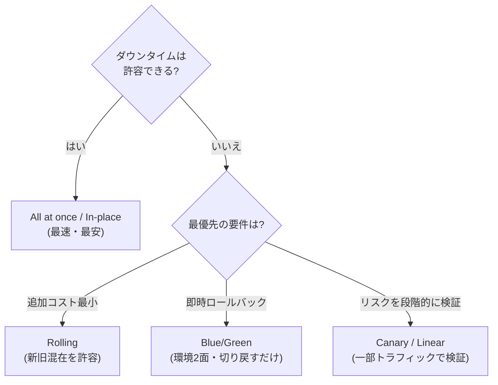
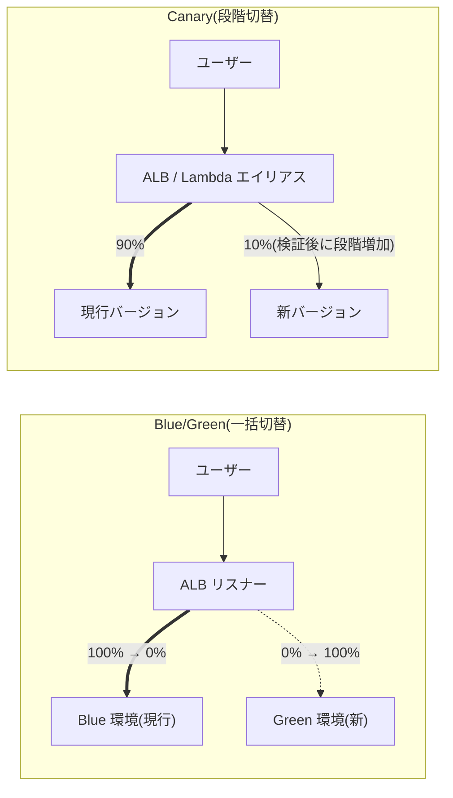

# 2.1 ビジネス要件を満たすデプロイ戦略の設計

## このテーマの背景 — デプロイは「リスクをどう受け取るか」の選択

新しいバージョンを本番に出す方法は、突き詰めると「**ダウンタイム・ロールバックの速さ・コスト**の3つをどう配分するか」の選択です。全台一斉に入れ替えれば速くて安いが、失敗すれば全ユーザーが巻き込まれ、戻すのにも時間がかかる。環境を丸ごと2面持てば失敗しても一瞬で戻せるが、コストは2倍かかる。**どの案も正しく、どれが最適かはビジネス要件が決める** — これが SAP のデプロイ問題の構図で、問題文の「ダウンタイム許容度」「ロールバック要件」「コスト制約」を読み取って方式を対応付ける力が問われます。

W-A の運用上の優秀性の柱は「**小さく、可逆的な変更を頻繁に行え**」と言います。Blue/Green や Canary は、この原則を実装に落としたものです。変更を可逆(すぐ戻せる)にすることで変更の心理的・実務的コストが下がり、結果として小さな変更を頻繁に出せるようになり、1回あたりのリスクがさらに下がる — この好循環がモダンなデプロイ戦略の狙いです。

もうひとつの軸が**マルチアカウントへの展開**です。SAP では「1つのアプリをデプロイする」だけでなく「**100 アカウントに標準インフラを配る**」ことも「デプロイ」です。CloudFormation StackSets と Service Catalog がこの領域の主役になります。

## 関連する Well-Architected の柱

- **運用上の優秀性**: 「運用をコードとして実行する」(IaC・パイプライン化)、「小さく可逆的な変更」(Blue/Green・Canary)、「障害を予測する」(自動ロールバックの仕込み)
- **信頼性**: 「自動化で変更を管理する」— 手作業デプロイの排除はそのまま信頼性向上
- **コスト最適化**: 環境2面のコストと引き換えに何を得るか、というトレードオフの認識

## デプロイ方式のカタログ — 3軸で比較する

各方式を「ダウンタイム」「ロールバック」「追加コスト」で並べると、選択の構造が見えます。

| 方式 | ダウンタイム | ロールバック | 追加コスト | 特徴 |
|---|---|---|---|---|
| In-place (All at once) | あり | 再デプロイが必要(遅い) | なし | 最速・最安。本番には不向き |
| Rolling | ほぼなし | 遅い(逆向きに再ロール) | なし | 新旧バージョン混在期間あり |
| Rolling with additional batch | なし | 遅い | 少(1バッチ分) | Elastic Beanstalk で選択可 |
| Immutable | なし | 速い(新環境を破棄) | 中(一時的に2倍) | 毎回新規インスタンス群に展開 |
| **Blue/Green** | なし | **最速(切り戻すだけ)** | 高(環境2面) | 試験頻出。LB や DNS で切替 |
| **Canary / Linear** | なし | 速い | 中 | 一部トラフィックで検証しながら段階拡大 |

読み方のポイントをいくつか。**Rolling** は既存の台を順に入れ替えるため追加コストゼロですが、「新旧が混在する時間帯」が必ず生じます — 後方互換のない変更(DB スキーマ変更を伴う等)では混在自体が障害になるので、この記述があれば Rolling は消えます。**Immutable** は「既存の台には触らず、丸ごと新しい群を作って置き換える」方式で、構成ドリフトの累積を断ち切れるのが本質的な利点です。**Blue/Green** はその発展形で、旧環境 (Blue) を稼働させたまま新環境 (Green) を完成させ、トラフィックを一括で切り替えます。失敗時は切り替えを戻すだけ — 「**ロールバック最速**」の根拠はここにあります。**Canary** は切替を段階化したもので、「まず 10% のユーザーで検証し、問題なければ全量へ」という進め方により、障害の影響範囲を最初から限定します。

## サービス別の実現方法 — 「どこで切り替えるか」を知る

Blue/Green・Canary の考え方は共通でも、**トラフィックを切り替える場所**はサービスごとに違います。SAP はこの実装レベルを問うので、対応表を頭に入れます。

| 対象 | 方法 | ポイント |
|---|---|---|
| EC2 / ASG | CodeDeploy Blue/Green(新 ASG を作成し LB で切替) | ALB のターゲットグループ切替 |
| ECS | CodeDeploy Blue/Green(タスクセット + リスナー切替) | **テストリスナー**で本番切替前に検証可能 |
| **Lambda** | **エイリアス + 加重ルーティング**(CodeDeploy の Canary10Percent5Minutes 等) | `PreTraffic`/`PostTraffic` フックで自動検証 |
| API Gateway | ステージのカナリアリリース設定 | ステージ変数と組み合わせ |
| Route 53 | 加重ルーティング (Weighted) | **DNS TTL の影響でロールバックが即時にならない** |
| CloudFront | 連続デプロイ(staging distribution) | ヘッダー/割合ベースで staging に振り分け |
| **RDS / Aurora** | **Blue/Green Deployments 機能**(MySQL/PostgreSQL/MariaDB) | DB のバージョンアップ・スキーマ変更を複製環境で準備し、短時間で切替 |

ここで最重要のひっかけが **Route 53 加重ルーティングの限界**です。DNS による切替は、クライアントやリゾルバーの**キャッシュ (TTL)** が切れるまで旧環境へのアクセスが続きます。つまり「切り替えた瞬間に全トラフィックが移る」保証がなく、ロールバックも同様に遅延します。「**即時ロールバックが要件**」なら、DNS ではなく **ALB のリスナー/ターゲットグループ切替**(接続単位で即時に効く)を選ぶ — この対比は繰り返し出題されます。

Lambda のデプロイも頻出です。エイリアス(`prod` など)が指すバージョンへの加重配分を CodeDeploy が自動制御し、CloudWatch アラームが発火したら自動で切り戻します。前提として**バージョンを発行 (publish) していること**が必要で、`$LATEST` を直接使う運用ではこの仕組みに乗れません。

## IaC — 「環境を作る」のもデプロイ

### CloudFormation の運用機能

IaC の基本ツールである CloudFormation について、SAP は「書けるか」ではなく「**安全に運用できるか**」を問います。

- **変更セット (Change Sets)**: 適用前に「何が変更・置換されるか」をプレビューする。本番変更の承認フローに組み込む(「意図しないリソース置換を防ぎたい」の答え)
- **ドリフト検出**: 手動変更(コンソールでの直接修正)とテンプレートの乖離を検出する。**検出のみで自動修復はしない**点が問われる
- **スタックポリシー / DeletionPolicy**: 更新・削除からの保護。`DeletionPolicy: Retain/Snapshot` でスタック削除時にデータを守る
- **カスタムリソース・フック**: CFn 未対応の操作や、デプロイ前のポリシー検証(プロアクティブ統制)
- **AWS CDK**: プログラミング言語で書いて CFn テンプレートを生成する上位レイヤー

### StackSets — マルチアカウント展開の主役

**CloudFormation StackSets** は、1つのテンプレートを**複数アカウント × 複数リージョン**へ一括デプロイする仕組みです。SAP 的に決定的なのは **Organizations 連携(service-managed permissions)** で、対象を OU で指定でき、**自動デプロイ**を有効にすると**OU に新しいアカウントが追加された瞬間、自動で標準リソースが展開されます**。「新規アカウントに監査ロール・標準 VPC を必ず入れたい」という組織要件の定番解です(Control Tower のカスタマイズも内部的にはこれです)。

### Service Catalog と Proton — 「作らせ方」の統制

- **Service Catalog**: 承認済みのテンプレートを「製品」として利用者にセルフサービス提供する。**起動制約 (Launch Constraint)** により、利用者本人には強い権限を与えず、起動時だけ管理者ロールでプロビジョニングさせられる — 「開発者に承認済み構成だけを、最小権限で作らせたい」の答え
- **AWS Proton**: プラットフォームチームがテンプレート(環境+サービス)を管理し、開発者はセルフサービスでデプロイするコンテナ/サーバーレス向けの仕組み

## CI/CD パイプライン

- **CodePipeline** がオーケストレーター。**クロスアカウントデプロイ**では、①ターゲットアカウントの IAM ロールを Assume する、②アーティファクト S3 バケットと KMS キーにクロスアカウントアクセスを許可する、の2点セットが問われる
- **CodeBuild**: ビルド/テスト実行。VPC 内のリソース(内部の Nexus など)にアクセスするには VPC 設定を追加
- **CodeDeploy**: EC2/ECS/Lambda/オンプレへの展開。`appspec.yml` のライフサイクルフックでカスタム処理。**CloudWatch アラーム連動の自動ロールバック**が「デプロイ失敗時に自動で戻す」の実装
- 人手の承認が必要なら **Manual approval アクション**(SNS 通知と組み合わせ)

## ケーススタディ

**シナリオ**: EC サイト(ALB + ECS)の新バージョンをリリースする。経営陣の要件は「ダウンタイムゼロ。問題があれば**数秒で**旧バージョンに戻せること。リリース前に本番と同じ環境で最終検証したい」。どう設計するか。

**解き方**: 「数秒で戻す」が決め手。DNS ベース(Route 53 加重)は TTL 遅延で失格。**ECS の CodeDeploy Blue/Green** なら、Green のタスクセットを本番と同じ構成で立ち上げ、**テストリスナー**(別ポート)で事前検証し、本番リスナーのターゲットを一括切替する。ロールバックはリスナーを Blue に戻すだけで接続単位で即時。環境2面分のコスト増はダウンタイムゼロ要件の対価として受け入れる(要件が優先順位を決めている)。

**シナリオ**: 組織は毎月新しいアカウントを作る。セキュリティチームは「すべてのアカウントに、作成直後から監査用 IAM ロールと Config 有効化が入っている」ことを保証したい。手作業なしで実現するには?

**解き方**: 「新規アカウントに自動で・保証」→ **StackSets の Organizations 連携 + 自動デプロイ**。対象 OU にアカウントが入った時点で自動展開されるため、人の作業も漏れも構造的に排除できる。「アカウント作成手順書に追加する」「定期的に Lambda でチェックする」は、それぞれ人依存・事後検出であり「保証」にならない。

## 試験直前の要点(理由つき)

- **即時ロールバック要件で DNS 切替は選ばない** — TTL とクライアントキャッシュのため切替が伝播に時間を要する。ALB リスナー切替(Blue/Green)が即時
- **Rolling は新旧混在を許容できるときだけ** — 後方互換のない変更(API 契約・スキーマ変更)では混在自体が障害になる
- **新規アカウントへの自動展開は StackSets(Organizations 連携・自動デプロイ)** — 手順書・定期チェックは「保証」にならない、という消去法とセットで
- **Lambda のトラフィックシフトは CodeDeploy + エイリアス、バージョン発行が前提** — `$LATEST` 運用では段階デプロイできない
- **ドリフト検出は検出のみ** — 「自動で修復される」と書いた選択肢は誤り
- **失敗時の自動ロールバックは CloudWatch アラーム連動** — CodeDeploy(および CFn のロールバックトリガー)にアラームを紐付ける実装まで覚える
- **Service Catalog の起動制約 = 利用者に権限を渡さずプロビジョニングさせる仕組み** — 「セルフサービス + 最小権限」の両立はこれ
- **RDS にも Blue/Green Deployments がある** — DB エンジンのバージョンアップを安全にやる問題で、リードレプリカ昇格の手作業と比較して優位
