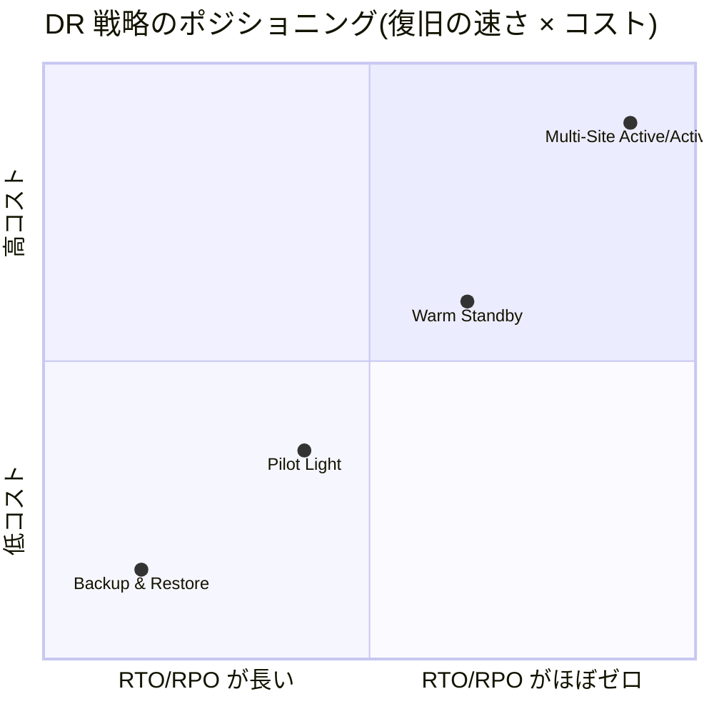
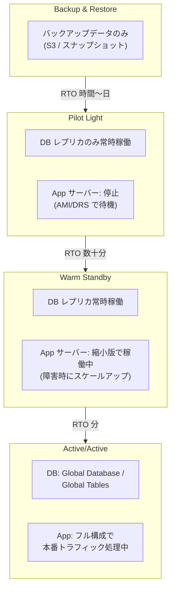
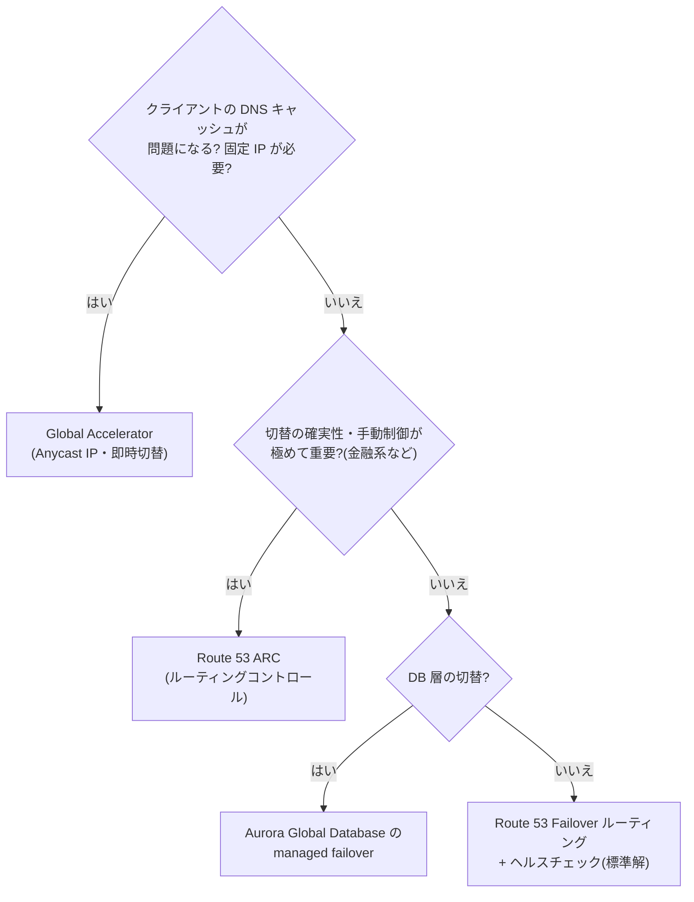

# 2.2 事業継続性を確保するソリューションの設計

## このテーマの背景 — RTO と RPO がすべての出発点

災害対策 (DR) の設計は、技術選定の前に**2つの数字**を決めることから始まります。

- **RTO (Recovery Time Objective)**: 障害発生から復旧までに許される時間。「何時間止まってよいか」
- **RPO (Recovery Point Objective)**: 失ってよいデータの時間幅。「最後のバックアップから障害までの間のデータは消える」ので、「何分ぶんのデータ損失まで許せるか」

この2つはビジネス側が決める要件であり、技術はそれを満たす最小コストの手段を選ぶ立場です。ここに DR 設計の本質的なトレードオフがあります: **RTO/RPO を短くするほど、平常時に維持しておくリソースが増え、コストが上がる**。ゼロに近づけるなら、もう一式の本番環境を常時動かすしかない(コスト2倍)。24時間でよいなら、バックアップを別リージョンに置いておくだけでよい(コスト数%)。

SAP の DR 問題は、ほぼすべてこの構図です。問題文から RTO/RPO(明示の数値、または「 almost zero downtime」「a few hours acceptable」といった表現)を抽出し、**4つの標準戦略のどれに対応するか**を即答し、あとは各データストアの複製手段の知識で肉付けする — この解法パターンを本ノートで身につけます。

## 関連する Well-Architected の柱

信頼性の柱の中核領域です。

- 「**復旧手順をテストする**」— DR は「構成した」では終わらず「訓練で復旧できた」までがワンセット。AWS Backup の復元テスト、FIS、ゲームデーが実装
- 「**障害から自動的に復旧する**」— フェイルオーバーの自動化(Route 53 ヘルスチェック、Aurora のマネージドフェイルオーバー)
- **コスト最適化**とのトレードオフ — 「要件を満たす最小コストの DR」を選ぶことが、そのまま試験の正解条件

## DR 4パターン — 確実に暗記し、根拠も言えるように

| 戦略 | RTO | RPO | コスト | 構成 |
|---|---|---|---|---|
| **Backup & Restore** | 数時間〜24時間 | 数時間 | 最安 | バックアップのみ DR リージョンへ。障害時に環境をゼロから再構築 |
| **Pilot Light** | 数十分〜数時間 | 数分〜 | 低 | **DB 複製などコア部分だけ常時稼働**。App サーバーは停止(AMI/レプリケーションで待機) |
| **Warm Standby** | 数分〜数十分 | 秒〜数分 | 中 | **縮小版の完全な環境**を常時稼働。障害時にスケールアップ |
| **Multi-Site Active/Active** | ほぼゼロ | ほぼゼロ | 最高 | 両リージョンで本番トラフィックを処理 |

なぜこの RTO 差が生まれるかを理解すると暗記が安定します。復旧時間は「障害時にやらなければならない作業の量」で決まります。Backup & Restore は「全部作る」ので時間単位。Pilot Light は「データはあるのでコンピューティングを起動する」ので数十分。Warm Standby は「動いているものを大きくする」ので数分。Active/Active は「やることがない(すでに受けている)」のでほぼゼロ。**平常時のコストと障害時の作業量は反比例する** — これが4パターンの背後にある唯一の原理です。

Pilot Light と Warm Standby の区別は特に狙われます。境界線は「**DR 側でアプリケーションがリクエストを処理できる状態か**」です。Pilot Light はデータこそ最新に保つが、アプリ層は**停止**している(火種 = pilot light だけが灯っている)。Warm Standby は縮小構成ながら**動いていて、今すぐ少量のトラフィックなら捌ける**。「DB だけレプリケーション、サーバーは AMI で待機」= Pilot Light、「最小台数で稼働中、障害時にスケールアウト」= Warm Standby です。

## データを DR リージョンへ運ぶ — サービス別複製手段

戦略を決めたら、次は「データ層をどう複製するか」です。SAP はここをサービス知識として問うので、代表的な手段と RPO 特性を対応させます。

| サービス | 手段 | RPO 特性 |
|---|---|---|
| S3 | **CRR (Cross-Region Replication)**。**RTC** を付ければ 15分以内の複製を SLA 保証 | 非同期(通常は秒〜分) |
| EBS | スナップショットのクロスリージョンコピー(DLM / AWS Backup で自動化) | スナップショット間隔に依存 |
| **Aurora** | **Global Database**: ストレージ層の専用レプリケーションで遅延 <1秒。**RPO 1秒 / RTO 1分未満**。write forwarding でセカンダリからの書き込み転送も可 | ほぼゼロ |
| RDS | クロスリージョンリードレプリカ(障害時に昇格・数分)/ 自動バックアップのクロスリージョンコピー | 非同期・分オーダー |
| **DynamoDB** | **Global Tables**: マルチリージョン・**マルチライター**(結果整合) | 秒オーダー |
| ElastiCache Redis | Global Datastore | 秒オーダー |
| EFS | EFS Replication | 分オーダー |
| ECR / KMS | クロスリージョンレプリケーション設定 / マルチリージョンキー | — |
| **EC2 サーバー一式** | **AWS Elastic Disaster Recovery (DRS)**: OS ごとブロックレベルで継続レプリケーション。**RPO 秒・RTO 分** | 秒 |

覚え方のコツは「**要件の数値 → 一意に決まるサービス**」の対応です。「リレーショナル DB で RPO 1秒・RTO 1分」と言われたら **Aurora Global Database** 以外に達成手段がありません。「両リージョンで書き込みたい KVS」なら **DynamoDB Global Tables**。「EC2 群を丸ごと、安く Pilot Light にしたい」なら **DRS**(レプリケーション先は低スペックのステージング領域なので平常時コストが小さい — Pilot Light の実装手段として最頻出)です。

## トラフィックをどう切り替えるか — フェイルオーバールーティング

データと環境が DR 側に用意できても、ユーザーを新しい環境へ導く仕組みがなければ復旧は完了しません。切替手段は「速さと確実さ」で選びます。

- **Route 53 Failover ルーティング + ヘルスチェック**: 標準解。プライマリの異常を検知したらセカンダリの IP を返す。ただし **DNS はキャッシュされる**ため、TTL を短くしても切替の完全伝播には時間がかかり、行儀の悪いクライアント(TTL 無視)には効かない
- **Global Accelerator**: Anycast の静的 IP 2個を入口にし、**AWS 側でエンドポイントを切り替える**ため DNS キャッシュの影響を受けない。**数十秒での確実な切替**と「顧客のファイアウォールに固定 IP を登録済み」という要件に対応
- **Route 53 ARC**: ヘルスチェック(自動判定)に任せず、**ルーティングコントロール**という明示的なスイッチで切替を制御。誤検知による意図しないフェイルオーバーを防ぎたい、切替判断を人間・手順に委ねたい金融系シナリオで登場
- DB 層は **Aurora Global Database のマネージド(計画)フェイルオーバー**(計画切替はデータロスなし)など、各サービスの切替機能を併用

Route 53 ヘルスチェックにはもうひとつ制約があります: チェッカーはインターネット側から到達するため、**VPC 内のプライベートリソースを直接監視できません**。プライベートエンドポイントの死活は CloudWatch アラームで観測し、**アラームの状態を条件にするヘルスチェック(metric-based)** に変換して使います。

## バックアップの一元管理 — 最後の砦を固める

どの DR 戦略を選んでも、その土台には「確実に取れていて、消せない、復元できるバックアップ」が必要です。組織規模でこれを保証するのが **AWS Backup** です。

- EBS/EC2/RDS/Aurora/DynamoDB/EFS/FSx/Storage Gateway/VMware などを**1つのバックアップ計画**で管理し、**クロスリージョン・クロスアカウントコピー**で隔離保管
- **Backup Vault Lock**(WORM): バックアップの削除・変更を**管理者にも**禁止する。ランサムウェア(攻撃者は本番データより先にバックアップを消しに来る)対策の決定打
- **Organizations のバックアップポリシー**で全アカウントに計画を強制(1-4 のポリシータイプの一つ)
- **復元テスト機能**で「復元できること」を定期・自動で検証 — 「復旧手順をテストする」原則の直接実装
- RDS の自動バックアップは最大 **35日**。それを超える保持要件(規制の7年保管など)は AWS Backup かスナップショットの長期保管で満たす

## ケーススタディ

**シナリオ**: 保険会社の契約管理システム(ALB + EC2 + Aurora MySQL)。経営要件は「リージョン障害時、**1時間以内**にサービス再開。データ損失は**5分以内**。DR の平常時コストはできる限り抑える」。どの構成か。

**解き方**: RTO 1時間・RPO 5分を4パターンに当てる。Backup & Restore は RTO・RPO とも未達で消える。Active/Active と Warm Standby は達成するが「コストはできる限り抑える」に反する(要件を超過達成する選択肢は SAP では不正解)。**Pilot Light** が適合: Aurora は**クロスリージョンレプリカ(または Global Database)**で常時複製し(RPO 数秒〜)、EC2 層は AMI と起動テンプレートを整備して停止(または DRS でレプリケーション)。障害時は ASG を起動し Route 53 Failover で切替 — 1時間以内に十分収まる。

**シナリオ**: グローバル展開するゲームバックエンド(TCP)。要件は「リージョン障害時に**秒単位**で別リージョンへ切替。ゲームクライアントは DNS を長時間キャッシュする実装で、接続先は固定 IP で配布済み」。

**解き方**: 「DNS キャッシュが効かない」「固定 IP」— Route 53 系は全滅。**Global Accelerator** の Anycast 静的 IP を配布し、両リージョンの NLB をエンドポイント登録、ヘルスチェックで即時切替。TCP(非 HTTP)であることも CloudFront でなく GA を選ぶ根拠になる。

## 試験直前の要点(理由つき)

- **RPO 秒・RTO 分のクロスリージョン RDBMS は Aurora Global Database 一択** — 専用ストレージレプリケーションだから達成できる。通常の RDS クロスリージョンレプリカは昇格に数分+非同期遅延
- **Pilot Light の EC2 実装は DRS(Elastic Disaster Recovery)** — 継続ブロックレプリケーション+低コストなステージング領域という特性が Pilot Light の定義に合致
- **DynamoDB Global Tables は結果整合のマルチライター** — 「クロスリージョンで強い整合性の書き込み」はできない。競合は last-writer-wins
- **DNS フェイルオーバーはキャッシュに勝てない** — TTL 無視クライアント・固定 IP 要件が出たら Global Accelerator
- **Route 53 ヘルスチェックはプライベートリソースを直接見られない** — チェッカーはインターネット側にいる。CloudWatch アラーム連動型で代替
- **バックアップの削除防止は Backup Vault Lock** — 「ランサムウェア」「管理者でも消せない」がキーワード。S3 なら Object Lock(Compliance モード)
- **要件を超過達成する構成は不正解** — RTO 24時間でよいのに Warm Standby を選ばない。「要件を満たす最小コスト」が常に正解条件
- **Pilot Light vs Warm Standby は「アプリが処理できる状態か」で切る** — 止まっている=Pilot Light、縮小で動いている=Warm Standby
