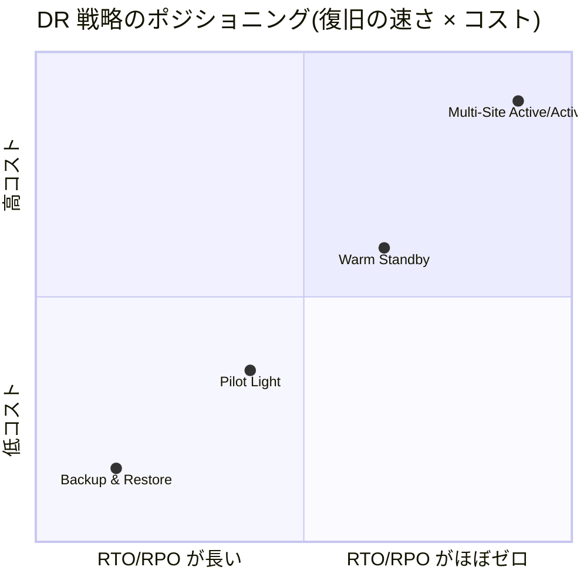
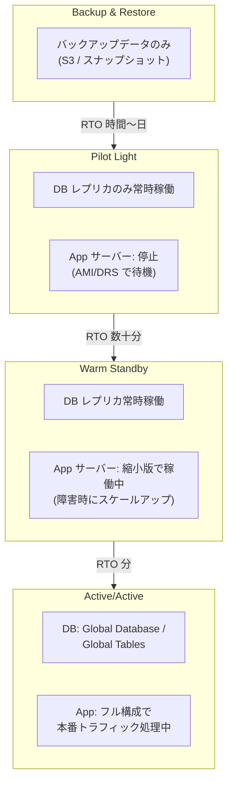
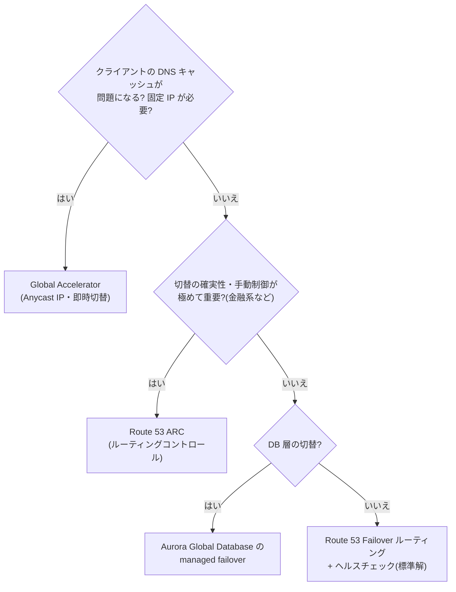

# 2.2 事業継続性を確保するソリューションの設計

## 試験で問われる観点

- 提示された **RTO/RPO の数値**から最適な DR 戦略とコストのバランスを選択できるか
- サービスごとのクロスリージョン複製手段を知っているか
- ルーティングによるフェイルオーバー設計(Route 53 / Global Accelerator)ができるか

## DR 4パターン(最重要・確実に暗記)

| 戦略 | RTO | RPO | コスト | 構成 |
|---|---|---|---|---|
| **Backup & Restore** | 数時間〜24時間 | 数時間 | 最安 | バックアップのみ DR リージョンへ。障害時に環境を再構築 |
| **Pilot Light** | 数十分〜数時間 | 数分〜 | 低 | DB 複製など**コア部分だけ常時稼働**。App サーバーは停止(AMI 準備のみ) |
| **Warm Standby** | 数分〜数十分 | 秒〜数分 | 中 | **縮小版の完全な環境**を常時稼働。障害時にスケールアップ |
| **Multi-Site Active/Active** | ほぼゼロ(秒) | ほぼゼロ | 最高 | 両リージョンで本番トラフィックを処理 |

**判断基準**: RTO/RPO が緩い+コスト最優先 → Backup & Restore。「DB だけは常に複製、他は障害時に起動」→ Pilot Light。「縮小構成で常時稼働」→ Warm Standby。「ダウンタイムゼロ」→ Active/Active。

### DR パターン別の構成イメージ(DR リージョンに常時何を置くか)

## サービス別クロスリージョン複製

| サービス | 手段 | RPO 特性 |
|---|---|---|
| S3 | **CRR (Cross-Region Replication)**。RTC (Replication Time Control) で 15分 SLA | 非同期(RTC で 15分保証) |
| EBS | スナップショットのクロスリージョンコピー(DLM / AWS Backup で自動化) | スナップショット間隔に依存 |
| **Aurora** | **Global Database**: 専用インフラでレプリカ遅延 <1秒、**RPO 1秒 / RTO 1分未満**。書き込み転送 (write forwarding) 対応 | 最小 |
| RDS | クロスリージョンリードレプリカ(昇格に数分)/ 自動バックアップのクロスリージョンコピー | 非同期 |
| **DynamoDB** | **Global Tables**(マルチリージョン・マルチライター、結果整合) | 秒オーダー |
| ElastiCache Redis | Global Datastore(クロスリージョンレプリカ) | 秒オーダー |
| EFS | EFS Replication(クロスリージョン) | 分オーダー |
| ECR | クロスリージョンレプリケーション設定 | — |
| KMS | マルチリージョンキー(同一キーマテリアルを複数リージョンで) | — |
| EC2 全体 | **AWS Elastic Disaster Recovery (DRS)**: 継続的ブロックレプリケーションで RPO 秒・RTO 分。**Pilot Light の実装手段**として頻出 | 秒 |

## フェイルオーバーのルーティング

| 手段 | 特徴 | 注意点 |
|---|---|---|
| **Route 53 Failover ルーティング** | ヘルスチェックで Primary → Secondary へ切替 | **DNS TTL とクライアントキャッシュで切替が遅延**しうる |
| **Route 53 ARC (Application Recovery Controller)** | ルーティングコントロールで**手動/確実な**切替。readiness check も提供 | 高可用が極めて重要な金融系シナリオで登場 |
| **Global Accelerator** | Anycast IP でエンドポイントを即時切替。**DNS キャッシュの影響を受けない** | 静的 IP が必要/高速フェイルオーバー要件で正解になりやすい |
| Aurora Global Database の managed planned failover | 計画切替(データロスなし)と unplanned failover を使い分け | |

**ひっかけ**: 「クライアントが DNS をキャッシュするため切替が効かない」「固定 IP をファイアウォールに登録済み」→ Route 53 ではなく **Global Accelerator**。

## バックアップの一元管理

- **AWS Backup**: EBS/RDS/DynamoDB/EFS/FSx/Storage Gateway/VMware 等を一元管理。**クロスリージョン・クロスアカウントコピー**、**Backup Vault Lock(WORM)** でランサムウェア対策・削除防止
- **AWS Organizations 連携**: Backup ポリシーを組織全体に強制適用
- RDS の自動バックアップは最大 35日。それ以上の保持要件は AWS Backup またはスナップショットのエクスポート

## 頻出のひっかけポイント

- RPO「1秒未満」+ マルチリージョン RDBMS → **Aurora Global Database** 一択
- 「Pilot Light を最小コストで(サーバーレプリケーション)」→ **Elastic Disaster Recovery (DRS)**(旧 CloudEndure)
- DynamoDB Global Tables は**結果整合のマルチライター**。強い整合性のクロスリージョン書き込みはできない
- Route 53 ヘルスチェックは **VPC 内のプライベートリソースを直接監視できない** → CloudWatch アラームと連動した「calculated/metric-based ヘルスチェック」を使う
- バックアップの改ざん・削除対策 → **Backup Vault Lock**(コンプライアンスモードは誰も解除不可)
- 「リージョン障害時も書き込みを継続」→ Active/Active + DynamoDB Global Tables / Aurora write forwarding を検討
