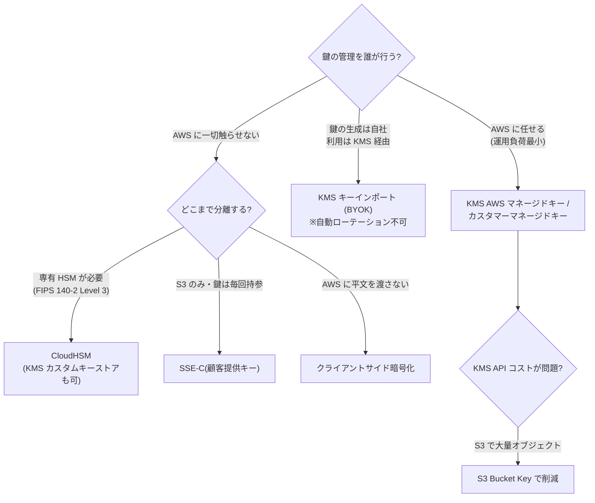
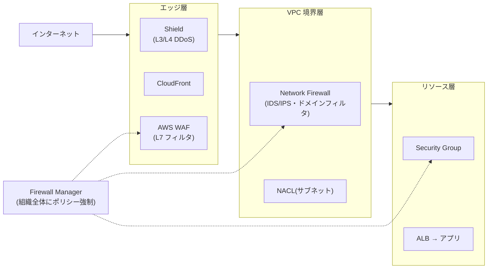

# 2.3 要件に基づくセキュリティ統制の決定

## このテーマの背景 — 「要件」を統制に翻訳する

新しいシステムの設計時、セキュリティ要件は「暗号化すること」「監査に耐えること」「攻撃から守ること」のような抽象的な言葉でやってきます。アーキテクトの仕事は、これを**具体的な統制の組み合わせ**に翻訳することです。翻訳のためには、各要件の裏にある「誰から・何を守るのか」を見極める必要があります。

たとえば同じ「暗号化」でも、「盗まれたディスクからの漏えいを防ぐ」なら SSE-S3 で十分ですが、「クラウド事業者にも鍵を渡したくない」なら CloudHSM やクライアントサイド暗号化まで行く必要があります。同じ「攻撃対策」でも、SQL インジェクション(L7)と DDoS(L3/4)では守る場所も道具も違います。**要件の強度を読み取り、過不足のない統制を選ぶ** — 過剰な統制はコストと運用負荷の無駄(W-A 的に不正解)、不足はそもそも要件未達です。

このノートは、新規設計時に問われる3領域 — ①暗号化とキー管理、②境界防御(ネットワーク)、③アプリケーション層と証跡 — を「要件の強度 → 統制の選択」という軸で解説します。組織全体への統制の広げ方は [1-2](../01-organizational-complexity/1-2-security-controls.md)、既存環境の改善は [3-2](../03-continuous-improvement/3-2-security.md) を参照してください。

## 関連する Well-Architected の柱

- 「**全レイヤーにセキュリティを適用する**」— 多層防御。エッジ(WAF/Shield)→ VPC(Network Firewall)→ リソース(SG)→ データ(暗号化)と重ねる
- 「**転送中および保管中のデータを保護する**」— 暗号化の既定化。ACM・KMS はその実装部品
- 「**セキュリティのベストプラクティスを自動化する**」— Secrets Manager の自動ローテーション、Firewall Manager の組織適用

## 暗号化とキー管理 — 「誰が鍵を握るか」で決まる

### KMS の仕組みを一段深く

AWS の保存時暗号化の中心は **KMS** です。仕組みの核は**エンベロープ暗号化**: データ本体は「データキー」で暗号化し、データキー自体を KMS のキー (CMK) で暗号化して一緒に保存します。復号時は KMS にデータキーの復号だけを頼む。この構造のおかげで、巨大なデータを KMS に送る必要がなく(KMS の直接 Encrypt は 4KB まで)、鍵へのアクセスは KMS の API 呼び出しとして**すべて CloudTrail に記録**されます。「どのデータが誰に復号されたか監査できる」ことが、KMS を使う本質的な価値です。

キーの選択は「誰がどこまで管理したいか」のグラデーションです。

| 要件 | 選択 |
|---|---|
| 標準的な保存時暗号化(運用負荷最小) | KMS AWS マネージドキー / カスタマーマネージドキー (CMK) |
| キーポリシー・ローテーションを自分で制御 | カスタマーマネージドキー(自動ローテーション年1回) |
| キーマテリアルは自社で生成したい | **キーインポート (BYOK)** — ただし**自動ローテーション不可** |
| **FIPS 140-2 Level 3** / 専有 HSM が規制要件 | **CloudHSM**(または KMS カスタムキーストア経由で KMS API から利用) |
| DR でリージョンをまたいでも同じ鍵で復号 | KMS **マルチリージョンキー** |
| S3 で AWS に鍵を渡さない | SSE-C(リクエストごとに鍵を持参)/ クライアントサイド暗号化 |
| 大量オブジェクトの KMS API コスト削減 | **S3 Bucket Key**(バケットレベルの中間キーで呼び出し回数を激減) |

クロスアカウントで KMS キーを使わせる条件も頻出です: **キーポリシーで相手アカウントを許可し、かつ相手側の IAM ポリシーでも許可する** — 両方が必要です(1-2 のクロスアカウント評価と同じ原理)。「暗号化スナップショットを他アカウントと共有したが復号できない」というトラブルシナリオの答えは、ほぼこのキーポリシー不足です。

### 転送時の暗号化

TLS 証明書は **ACM** が担います。パブリック証明書は無料で自動更新され、ALB・NLB・CloudFront・API Gateway に関連付けます。内部システム用の私設 CA が要件なら **ACM Private CA**。「証明書の期限切れ事故をなくしたい」という運用要件も ACM の自動更新が答えになります。

## 境界防御 — 攻撃のレイヤーに道具を合わせる

防御サービスは「**どのレイヤーの、どんな攻撃を防ぐか**」で整理すると迷いません。

| サービス | 防ぐもの | 適用先 |
|---|---|---|
| **AWS WAF** | L7 攻撃(SQLi/XSS/悪性ボット/レートベースの過剰リクエスト) | CloudFront, ALB, API Gateway, AppSync |
| **Shield Standard** | 一般的な L3/L4 DDoS(全アカウント無料・自動) | — |
| **Shield Advanced** | 大規模 DDoS + **SRT(専門チーム)支援** + **DDoS 起因のコスト増の補償** | CloudFront, Route 53, ALB, EIP, Global Accelerator |
| **Network Firewall** | VPC レベルの IDS/IPS、ステートフル検査、**ドメイン/プロトコルフィルタ** | VPC(検査用サブネット) |
| **Firewall Manager** | 上記 + SG のポリシーを**組織全体に強制適用** | Organizations 全体 |
| GWLB (Gateway Load Balancer) | サードパーティ検査アプライアンスのスケーラブルな挿入 (GENEVE) | インライン検査 |

読み解きのポイント: **WAF は「アプリへのリクエストの中身」を見る**ので、SQL インジェクションやログイン試行の速度制限は WAF。**DDoS は量の攻撃**なので Shield(Advanced の固有価値は「専門チーム」と「コスト保護」— この2語が出たら Advanced)。**アウトバウンド制御**(「EC2 から特定ドメイン以外への通信を禁止」)は SG では書けない(SG は宛先をドメインで指定できない)ため **Network Firewall** のドメインフィルタが答え。**サードパーティ IPS 製品を使い続けたい**なら、アプライアンスを GWLB の背後でスケールさせます。

そして組織要件 —「**全アカウントの ALB に WAF を強制し、新規リソースにも自動適用**」— は WAF 単体では実現できず、**Firewall Manager** の出番です(WAF/Shield/SG/Network Firewall のポリシーを組織へ配る上位管理サービス)。

この図が示す多層防御は「全レイヤーにセキュリティを適用する」の原則そのものです。1枚の壁に頼らず、突破されても次の層で止まる構造にします。

## アプリケーション層の統制

### シークレット管理 — Parameter Store との使い分け

DB パスワードや API キーをコードや環境変数に直書きする設計は、新規設計の時点で排除します。選択肢は2つで、決め手は**ローテーション**です。

- **Secrets Manager**: シークレット専用。**自動ローテーション**(RDS/Redshift/DocumentDB はマネージド対応、他は Lambda で拡張)、クロスアカウント共有、有料。「パスワードを定期的に自動変更」とあれば一択
- **SSM Parameter Store**: 汎用の設定ストア。Standard 無料、SecureString で KMS 暗号化も可能。ただしローテーション機能は**ない**。「設定値を安全に置きたいだけ・コスト最小」ならこちら

### エンドユーザー認証と API の保護

- **Cognito**: User Pool がアプリの認証(サインアップ/イン、MFA、JWT 発行)、Identity Pool が AWS 一時認証情報の払い出し。この2階建ての役割分担が問われる
- API Gateway の認可手段: **Cognito オーソライザー**(自前ユーザー基盤)/ **Lambda オーソライザー**(独自トークン・レガシー認証連携)/ IAM 認証(AWS 内サービス間)/ リソースポリシー(IP・VPC 制限)
- コンテンツ保護: S3 の**署名付き URL**(一時的なダウンロード許可)、CloudFront の**署名付き URL/Cookie**(有料会員向け配信)+ **OAC** でオリジン S3 を CloudFront 経由に限定

## 監査・証跡 — 「消せない記録」を設計する

監査要件の核心は「記録があること」ではなく「**記録が改ざん・削除されていないと証明できること**」です。

- **CloudTrail**: 組織トレイル(1-2)で全アカウント分を集約。**ログファイル整合性検証 (log file validation)** はダイジェストファイルの署名チェーンにより「改ざんされていないこと」を数学的に検証する機能 — 「監査人にログの完全性を示す」の答え
- **S3 Object Lock**: WORM 保管。Governance(特権で解除可)と **Compliance(root を含む誰にも解除不可)** の2モード。「規制で n 年間、削除も上書きも不可」= Compliance モード
- **CloudWatch Logs**: アプリログの集約。KMS 暗号化、保持期間設定、サブスクリプションフィルタで外部へ
- **Amazon Macie**: S3 の中身をスキャンして PII(個人情報)を検出。「機密データの所在を把握する」要件
- **AWS Config**: リソース構成の変更履歴と準拠評価(詳細は 3-2)

## ケーススタディ

**シナリオ**: 医療系 SaaS の新規設計。要件は「①患者データは保存時に暗号化。**鍵は自社の HSM 由来であること**(規制)。②鍵の使用はすべて監査可能。③アプリ改修は最小限」。どうするか。

**解き方**: ③がなければ CloudHSM 直利用も候補だが、アプリから CloudHSM を直接使うには PKCS#11 等の組み込みが必要で改修が大きい。①②③を同時に満たすのは **KMS カスタムキーストア(CloudHSM バックエンド)**または**キーインポート (BYOK)**: アプリは通常の KMS 統合(S3/RDS の SSE-KMS)のまま、キーマテリアルの出所を自社 HSM にでき、使用は CloudTrail に全記録される。規制が「鍵は専有 HSM に保管」とまで言うならカスタムキーストア、「自社生成の鍵を使う」までなら BYOK、と強度で選び分ける。

**シナリオ**: EC サイトで「ログインエンドポイントへの総当たり攻撃を防ぎたい。攻撃元は世界中に分散し、1 IP あたりは低頻度」。

**解き方**: 分散型の総当たりは単純なレートベースルール(IP 単位)をすり抜ける。**WAF** を ALB/CloudFront に付け、**マネージドルール(Account Takeover Prevention / Bot Control)** を使うのが正解。Shield は DDoS(量)向けで認証攻撃(質)には効かない、NACL/SG は L3/4 で URL もログイン失敗も見えない — と各層の守備範囲で消去する。

## 試験直前の要点(理由つき)

- **「AWS に鍵を渡さない」の階段** — SSE-KMS(AWS 管理インフラ上)→ BYOK(生成は自社)→ カスタムキーストア/CloudHSM(保管も専有)→ SSE-C/クライアントサイド(AWS は鍵を保持しない)。要件の強度に合わせ、過剰にしない
- **BYOK は自動ローテーション不可** — キーマテリアルを AWS が作れないから。ローテーションは新マテリアルの手動インポート
- **クロスアカウント KMS は「キーポリシー + IAM」の両方** — 共有スナップショットが復号できないトラブルの定番原因
- **WAF は NLB に付けられない** — WAF は L7(HTTP)を見るため、L4 の NLB には適用不可。CloudFront/ALB/API GW/AppSync のみ
- **Shield Advanced の固有価値は「SRT 支援」と「DDoS コスト保護」** — この2語が問題文にあれば Standard では足りない
- **アウトバウンドのドメインフィルタは Network Firewall** — SG はドメイン指定不可、NACL は IP のみ。プロキシ自作は運用負荷で負ける
- **組織全体への WAF/SG 強制は Firewall Manager** — 個々のサービスに組織適用機能はない
- **自動ローテーションが要件なら Secrets Manager** — Parameter Store にはローテーション機能がない。逆に「安く設定値を置くだけ」なら Parameter Store
- **ログの完全性証明は CloudTrail log file validation、削除防止は Object Lock** — 「改ざんされていない証明」と「消せない保管」は別の機能で実現する
