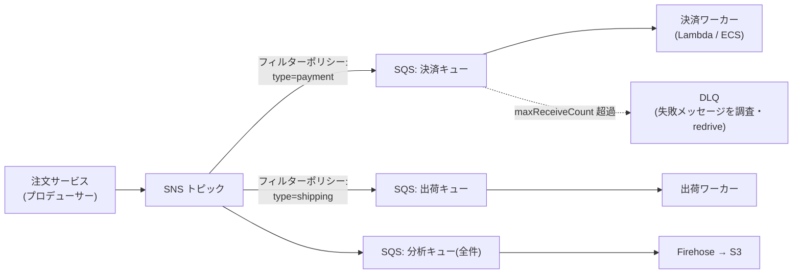
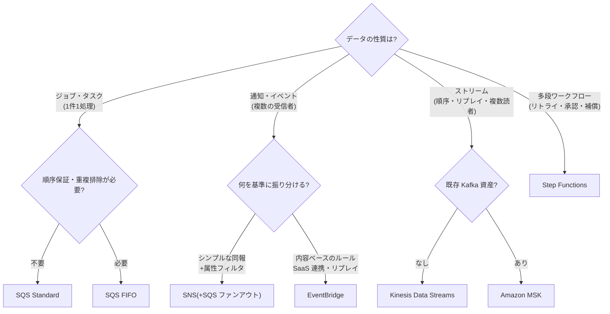

# 2.4 信頼性要件を満たすソリューションの設計

## このテーマの背景 — 密結合はなぜシステムを壊すのか

あるシステムで、Web サーバーが注文を受け、同期的に在庫サービスを呼び、在庫サービスが決済サービスを呼ぶ——という**同期呼び出しの連鎖**を考えてください。決済サービスが 10 秒詰まると、その待ちは在庫へ、Web へ、そしてユーザーのブラウザへと**逆流**します。各サーバーはレスポンス待ちのスレッドを抱えて枯渇し、リトライの嵐が負荷をさらに増幅し、1コンポーネントの不調がシステム全体の停止に化けます。これが**密結合 (tight coupling)** の破綻メカニズムです。

対策の原理はひとつ: **コンポーネント間に「時間差を許す仕組み」を挟む**ことです。キュー(SQS)を挟めば、受け手が遅くても送り手は書き込んで即座に戻れる。イベントバス(SNS/EventBridge)を挟めば、受け手が何個あるか・生きているかを送り手が知る必要がなくなる。この**疎結合化 (loose coupling)** が、新規設計における信頼性の中核です。あわせて、負荷の変動に自動で追従する**スケーリング設計**と、単一障害点 (SPOF) の排除を扱います。

このノートで学ぶ判断力は「メッセージングサービス4兄弟(SQS/SNS/EventBridge/Kinesis)+ Step Functions の使い分け」に集約されます。どれも「非同期にする」道具ですが、解決する問題が異なります。

## 関連する Well-Architected の柱

- 「**水平方向にスケールして全体の可用性を高める**」— 大きな1台より小さな多数。ASG・疎結合はその実装
- 「**障害から自動的に復旧する**」— ヘルスチェック連動の自動置換、DLQ による failed メッセージの隔離
- 「**キャパシティを推測しない**」— スケーリングポリシーで需要に追従。キューは需要とキャパシティのズレを吸収するバッファ

## 疎結合パターンのカタログ

### SQS — 「仕事の預かり所」

SQS はプロデューサーとコンシューマーの間に立つキューです。信頼性への寄与は2つ: **バッファリング**(スパイクを吸収し、下流は自分のペースで処理)と**再試行の器**(処理失敗したメッセージはキューに戻り、やり直せる)です。

仕組みの理解が問題を解きます。コンシューマーがメッセージを受信すると、メッセージは削除されず**可視性タイムアウト**の間だけ他のコンシューマーから見えなくなります。処理完了後に明示的に削除する。処理が可視性タイムアウトより長引くと、メッセージが再び見えるようになり**別のコンシューマーが重複処理**します — 「同じ注文が2回処理された」というトラブルの第一容疑者です(対策: タイムアウトを処理時間より長く設定+処理の冪等化)。何度受信しても処理に失敗するメッセージ(ポイズンピル)は、`maxReceiveCount` 超過で **DLQ (Dead Letter Queue)** へ退避し、本流を止めずに後で調査します(redrive で書き戻しも可能)。

Standard と FIFO の違いも頻出です。**Standard** は事実上無制限のスループットを持つ代わり、**at-least-once(重複しうる)・順序ベストエフォート**。**FIFO** は**順序保証と重複排除**を提供する代わり、スループットに上限(300 TPS、バッチで 3,000、高スループットモードでさらに向上)があります。「イベントの順序が業務的に重要(口座残高の増減など)」なら FIFO、そうでなければ Standard が既定です。メッセージは最大 **256KB** — 超えるペイロードは S3 に置いて参照キーだけを流します(Extended Client Library)。

### SNS — 「1対多の同報」

SNS は Pub/Sub のトピックです。1つのイベントを複数のサブスクライバー(SQS、Lambda、HTTP、メール等)へ**push 配信**します。定番は **SNS → 複数 SQS のファンアウト**: プロデューサーはトピックに1回発行するだけで、決済・出荷・分析などの各系統が**自分専用のキュー**で受け取ります。各系統の障害・遅延が互いに影響しない(それぞれのキューが緩衝材になる)のがこの構成の信頼性上の意味です。**フィルターポリシー**でサブスクライバーごとに受け取るメッセージを絞れます。

### EventBridge — 「ルールで捌くイベントバス」

EventBridge も Pub/Sub ですが、SNS との違いは3点です。①**コンテンツベースのルーティング**: イベント JSON の中身に対するパターンマッチでターゲットを選べる(SNS のフィルタより表現力が高い)。②**SaaS・AWS サービスとの統合**: ほぼ全 AWS サービスのイベントと、Datadog 等の SaaS イベントがネイティブに流れ込む。③**アーカイブとリプレイ**: 過去のイベントを保存し、後から再投入できる(SNS にはない — 「障害復旧後にイベントを再処理したい」の決め手)。加えて **EventBridge Scheduler** は cron サーバーの置き換え(3-4 参照)、Pipes はソース→ターゲットの1対1接続に使います。

### Kinesis Data Streams — 「巻き戻せるストリーム」

Kinesis は「キュー」ではなく**ログ(追記型の記録)**です。メッセージは消費されても消えず、保持期間(24時間〜365日)の間、**複数のコンシューマーが独立に、好きな位置から**読めます。この性質が SQS との本質的な違いです: SQS は「1メッセージを誰か1人が処理して消す」、Kinesis は「同じストリームをリアルタイム分析・アーカイブ・検知がそれぞれ読む」「障害時に位置を巻き戻して再処理する」。シャード単位の順序保証もあります。「複数コンシューマー」「リプレイ」「順序付き大量ストリーム」が出たら Kinesis(既存 Kafka 資産があるなら MSK)です。

### Step Functions — 「失敗する多段処理の指揮者」

複数ステップの業務フロー(注文→与信→請求→通知)を、自前の「フラグ管理+リトライ処理」で書くとバグの温床になります。**Step Functions** はステートマシンとしてフローを定義し、**ステップごとのリトライ・エラーハンドリング(Catch)・補償処理・人間の承認待ち**をマネージドに実行します。Standard ワークフローは最長1年動き続けられるので、「数日かかる承認フロー」も表現できます。「リトライと失敗時の分岐を含む複雑なフロー」「Saga パターン」とあれば Step Functions です。

### 決定木 — 4+1 の使い分け

## スケーリング設計 — 需要に追従する

ASG のスケーリングポリシーは4種類あり、「需要のパターン」で選びます。

- **Target Tracking**(まず検討): 「CPU 50% を維持」のような目標値追従。設定が単純で大半のケースに足りる
- **Step Scaling**: 閾値ごとに段階的な増減。細かい制御が必要な場合
- **Predictive Scaling**: 過去の周期パターンを ML で学習し、**需要が来る前に**スケールする。「毎朝9時に急増し、通常のスケールでは間に合わない」の答え
- **Scheduled**: 既知のイベント(月末バッチ、セール開始)に合わせた予約

スケール「速度」の問題には別の道具を使います。起動に時間がかかるアプリ(初期化が重い)は **ウォームプール**(初期化済みインスタンスを停止状態でプール)や **golden AMI**(依存を焼き込んだ AMI で起動時間短縮)。起動直後のインスタンスへの負荷集中は ALB の slow start とヘルスチェック猶予期間で緩和します。**ライフサイクルフック**は起動/終了時の割り込み(終了前のログ退避など)に使います。

Lambda の同時実行制御も整理が必要です: **リザーブド同時実行**は「この関数の上限(と確保)」— 下流の DB を守るスロットルとして使う。**プロビジョンド同時実行**は「初期化済みインスタンスの事前確保」— コールドスタート排除に使う。名前が似ていて役割が違う、試験の典型的な引っ掛け対です。

## SPOF の排除 — 構成図の中の「1」を探す

新規設計のレビュー観点として、「1つしかないもの」を機械的に探します。

- **NAT Gateway が1つ**: その AZ が落ちると全 AZ のアウトバウンドが死ぬ。**AZ ごとに NAT GW を置き、AZ ごとのルートテーブルで自 AZ の NAT へ**向けるのが定石
- **RDS シングル AZ**: Multi-AZ 化(同期スタンバイ+自動フェイルオーバー)。**リードレプリカは可用性対策ではない**(非同期・手動昇格)— Multi-AZ(可用性)とリードレプリカ(読み取り性能)の目的の違いは最頻出
- **単一 EC2 のアプリ**: 最低でも ASG(min=1)に入れて自己復旧、できれば複数台+ELB
- **大量接続で詰まる RDS**: **RDS Proxy** で接続プーリング(Lambda との組み合わせが定番)+ フェイルオーバー時間の短縮
- **状態を持つサーバー**: セッションを ElastiCache/DynamoDB へ外出しし、サーバーをステートレスに(どの台が死んでも他が継げる)

## ケーススタディ

**シナリオ**: 画像アップロードサービスの新規設計。アップロード後にサムネイル生成・メタデータ抽出・不適切画像判定の3処理を行う。要件は「アップロードの応答は即座に返す」「3処理は互いに独立して失敗・再試行できる」「判定処理の失敗メッセージは調査用に保全」。

**解き方**: 「即座に返す」→ アップロード(S3)と後続処理を非同期に分離。「3処理が独立」→ **S3 イベント → SNS(または EventBridge)→ 3つの SQS へファンアウト**、各キューを Lambda/ECS が処理。1つの SQS を3処理で共有する案は、1メッセージ1コンシューマーの SQS では成立しない(それぞれが全件を受け取れない)ため誤り。「失敗の保全」→ 判定キューに **DLQ** を設定。この「S3 → ファンアウト → キューごとのワーカー + DLQ」は SAP の頻出テンプレート。

**シナリオ**: チケット販売サイト。発売開始の瞬間に通常の 100 倍のリクエストが来て、その先の RDS が毎回過負荷で倒れる。アプリの大改修はできない。

**解き方**: スパイク vs 固定キャパシティ DB のミスマッチが本質。注文の書き込みを**同期処理から SQS 経由の非同期処理に変える**(受付は即時応答し「処理中」を返す、ワーカーが RDS の処理能力に合わせた速度でキューを消化)。「RDS を巨大にスケールアップ」はピークのためだけの常時コストで W-A 的に劣後、「RDS Proxy」は接続数の問題には効くが書き込みスループット自体は増えない、と切り分ける。

## 試験直前の要点(理由つき)

- **SQS Standard は at-least-once・順序なし** — 重複と順序が業務要件なら FIFO。ただし FIFO はスループット上限とのトレードオフ
- **重複処理の原因は可視性タイムアウト不足(+非冪等な処理)** — 仕組み(受信でメッセージは消えない)から導けるようにする
- **SQS 256KB 制限 → 大きいデータは S3 参照パターン** — キューに実体を流さない
- **「複数コンシューマー」「リプレイ」は Kinesis、「1件1処理」は SQS** — キューとログの構造の違いが根拠
- **「イベントの再処理」は EventBridge のアーカイブ&リプレイ** — SNS は配信したら終わり(再送不可)
- **Multi-AZ は可用性、リードレプリカは読み取り性能** — 「可用性を上げたい」への「レプリカ追加」は誤答の定番
- **NAT GW は AZ ごとに置く** — 1つだと NAT の AZ 障害が全 AZ に波及する(SPOF)
- **リザーブド=上限/確保、プロビジョンド=コールドスタート対策** — Lambda の2つの「同時実行」設定の役割を混同しない
- **予見できる急スパイクは Predictive/Scheduled + ウォームプール** — リアクティブな Target Tracking では立ち上がりが間に合わない
