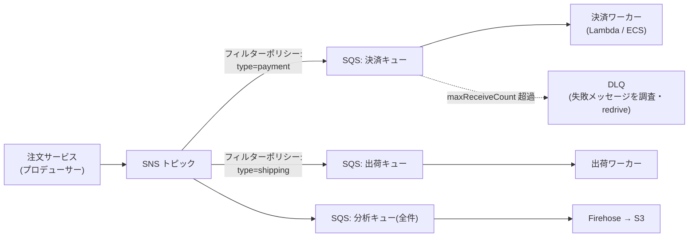
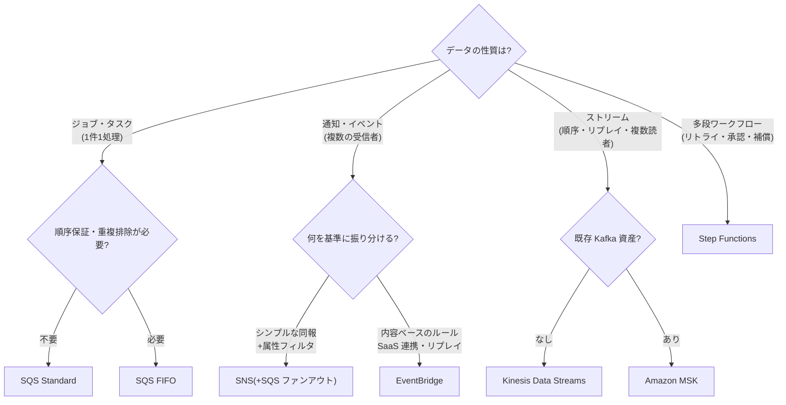

# 2.4 信頼性要件を満たすソリューションの設計

## 試験で問われる観点

- 疎結合(キュー/イベント駆動)によって障害の伝播を防ぐ設計
- スケーリング設計(ASG のポリシー、ウォームアップ、スケジュール)
- 単一障害点(SPOF)の排除とマルチ AZ /マルチリージョン構成

## 疎結合パターン

| パターン | サービス | 使いどころ |
|---|---|---|
| キューによるバッファリング | **SQS**(Standard / FIFO) | 処理のスパイク吸収・非同期化。FIFO は順序保証+重複排除(300 TPS、バッチで 3,000) |
| Pub/Sub ファンアウト | **SNS → SQS**(ファンアウト) | 1イベントを複数システムに配信。フィルターポリシーで振り分け |
| イベントルーティング | **EventBridge** | SaaS/AWS サービスイベントの統合、スケジュール、アーカイブ&リプレイ |
| ワークフロー制御 | **Step Functions** | リトライ・エラーハンドリング・人間の承認を含む多段処理(Standard は最長1年) |
| ストリーム | Kinesis Data Streams / MSK | 順序付き・複数コンシューマー・リプレイが必要なリアルタイム処理 |

**判断基準**: 「1つのメッセージを複数の処理系に」→ SNS+SQS ファンアウト。「失敗時のリトライと補償処理を含む複雑なフロー」→ Step Functions。「複数アプリが同じストリームを再読み込み」→ Kinesis。

- **DLQ (Dead Letter Queue)**: SQS/SNS/Lambda/EventBridge で処理失敗メッセージを退避。「失敗メッセージを失わず調査したい」→ DLQ

### 定番構成: SNS→SQS ファンアウト + DLQ

- SQS の可視性タイムアウト: 処理時間より長く設定。「重複処理が発生」→ 可視性タイムアウト不足 or Standard キューの at-least-once 特性

## スケーリング設計

- **ASG ポリシーの使い分け**:
  - Target Tracking(推奨・まず検討): CPU 50% 維持など
  - Step Scaling: 段階的な閾値
  - **Predictive Scaling**: 周期的パターンを ML で先読み(「毎朝9時にスパイク」)
  - Scheduled: 既知の時刻(「月末バッチ」)
- **ライフサイクルフック**: 起動/終了時にカスタム処理(ログ退避など)
- **ウォームプール**: 起動が遅い(初期化が重い)インスタンスを事前初期化してプール
- ALB の **slow start** / ヘルスチェック猶予期間で起動直後の負荷を回避
- Lambda の同時実行: リザーブド(上限/確保)とプロビジョンド(コールドスタート排除)の違い — 頻出

## SPOF の排除

- NAT Gateway は **AZ ごとに配置**(1つだと AZ 障害で全滅) — 頻出
- RDS Multi-AZ(インスタンス障害対策)とリードレプリカ(読み取りスケール)は目的が違う
- **RDS Proxy**: Lambda など大量接続のコネクションプーリング + フェイルオーバー時間短縮
- Route 53 は SLA 100% のグローバルサービス。ELB はマルチ AZ 配置が基本
- 単一 EC2 上のアプリ → ASG(min=max=1)+ EIP や、コンテナ化して ECS サービスで自己復旧

## マルチ AZ とマルチリージョンの判断

- 「AZ 障害に耐える」→ マルチ AZ で十分(コスト重視の正解になりやすい)
- 「リージョン障害に耐える」「地理的に分散したユーザー」→ マルチリージョン(2-2 の DR パターンへ)
- **静的安定性 (static stability)**: 障害時に新規リソース作成に頼らない設計(例: AZ 障害を見越して各 AZ に余剰キャパシティを事前確保)

## 頻出のひっかけポイント

- SQS Standard は **at-least-once・順序保証なし**。「順序が必要+重複不可」→ FIFO(スループット制限に注意、高スループットモードあり)
- SQS の最大メッセージサイズは 256KB。大きいペイロードは **S3 に置いて参照を渡す**(Extended Client Library)
- Kinesis Data Streams と SQS の使い分け: 「複数コンシューマーが同じデータを読む」「リプレイ」→ Kinesis。「1メッセージ1処理のジョブキュー」→ SQS
- スパイクで下流の RDS が過負荷 → 間に SQS を挟んで平準化(またはRDS Proxy / Aurora Serverless)
- EventBridge は **アーカイブとリプレイ**が可能(SNS は不可)— 「イベントを後で再処理」なら EventBridge

### 決定木: メッセージング/イベントサービスの選択

