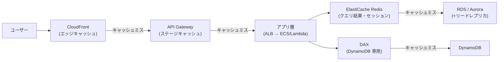
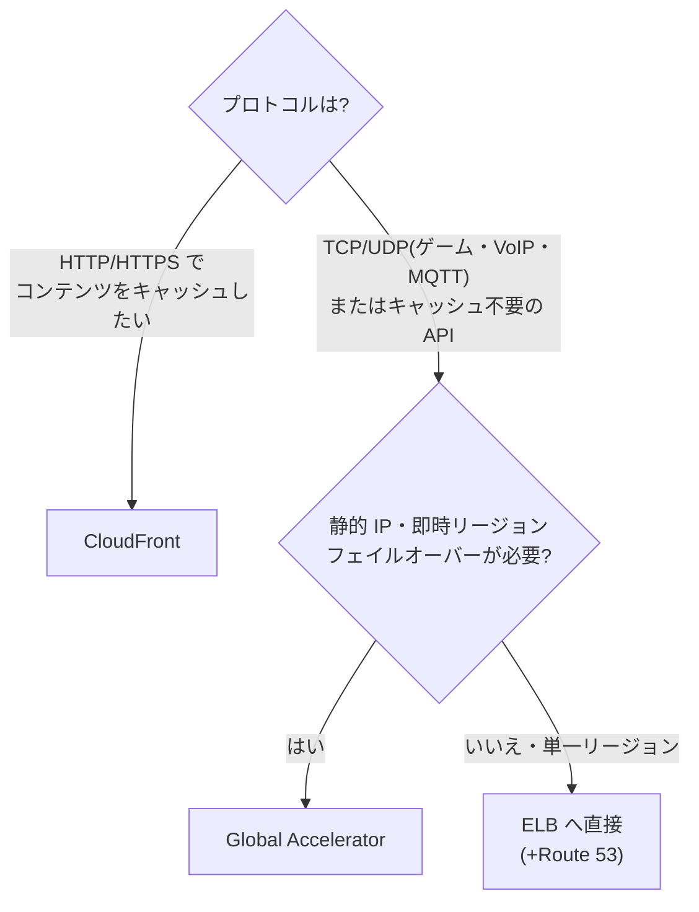

# 2.5 パフォーマンス目標を満たすソリューションの設計

## このテーマの背景 — 性能問題の解は「近く・軽く・適材適所」

パフォーマンス設計の原理は、物理法則に根ざしたシンプルなものです。**データと処理をユーザーの近くに置くほど速い**(光速は有限)、**同じ計算を繰り返さないほど速い**(キャッシュ)、**ワークロードの形に合った道具ほど速い**(適材適所)。AWS の性能系サービスは、すべてこの3原理のどれかの実装です。

- 「近くに置く」→ CloudFront(エッジキャッシュ)、Global Accelerator(AWS 網への早期引き込み)、マルチリージョン展開
- 「繰り返さない」→ ElastiCache、DAX、API Gateway キャッシュ、リードレプリカ
- 「道具を合わせる」→ パーパスビルト DB、EBS のボリュームタイプ、インスタンスファミリー、FSx の製品群

新規設計では、性能要件(「応答 100ms 以内」「世界中で一様の体感」「秒間 10 万リクエスト」)をこの3原理に分解し、各レイヤーに適切な部品を割り当てます。W-A のパフォーマンス効率の柱が言う「メカニカルシンパシー(道具の内部特性を理解して使う)」が最も試されるドメインであり、各サービスの**性能特性の数字**(gp3 の IOPS、S3 のプレフィックス上限など)が選択の根拠になります。

## 関連する Well-Architected の柱

- 「**数分でグローバル展開する**」— エッジサービスとマルチリージョンで、ユーザーの近くへ
- 「**サーバーレスアーキテクチャを使用する**」— 性能管理そのものをマネージドに任せる(Aurora Serverless、DynamoDB On-Demand)
- 「**メカニカルシンパシーを考慮する**」— DynamoDB のパーティション、EBS とインスタンスストアの物理的違い、S3 のプレフィックス分散を理解して設計する
- 「**より頻繁に実験する**」— 構成比較のベンチマークを安価に回す

## キャッシュ戦略 — どの層で繰り返しを消すか

キャッシュは「置く場所」ごとに守備範囲が違います。手前(ユーザー側)で当たるほど、後段の負荷とレイテンシーが同時に消えます。

| レイヤー | サービス | 使いどころ |
|---|---|---|
| エッジ | **CloudFront** | 静的コンテンツ全般。動的でも接続最適化の効果あり |
| API | **API Gateway キャッシュ** | ステージ単位の TTL キャッシュ。バックエンド呼び出し自体を削減 |
| アプリ / セッション | **ElastiCache Redis** | クエリ結果・セッション・ランキング (Sorted Set)・Pub/Sub |
| シンプル大容量 | ElastiCache Memcached | マルチスレッドの単純 KVS(永続化・レプリケーションなし) |
| DynamoDB 前段 | **DAX** | DynamoDB 専用・マイクロ秒応答・**API 互換でコード変更最小** |
| DB リード | リードレプリカ(RDS/Aurora 最大15) | 読み取りのスケールアウト(非同期である点に注意) |

選び分けの根拠を言語化しておきます。**Redis vs Memcached** は「機能 vs 単純さ」: レプリケーション・永続化・データ構造(Sorted Set でランキング)・Pub/Sub が要るなら Redis、単純なオブジェクトキャッシュを太くスケールしたいだけなら Memcached。**DAX** の固有価値は「DynamoDB API 互換」で、SDK のエンドポイントを差し替えるだけ — 「**アプリ変更を最小に** DynamoDB の読み取りをマイクロ秒へ」という条件が付いたら Redis ではなく DAX です。**リードレプリカ**はキャッシュではなく複製なので古さ(レプリケーションラグ)があり、強整合の読み取りが要る処理はプライマリへ向けます。

## グローバル配信 — CloudFront と Global Accelerator の本質的な違い

この2つは「世界中のユーザーへの体感を改善する」点で似ていますが、**動作原理がまったく違います**。

**CloudFront** は**キャッシュを持つ CDN** です。エッジでコンテンツのコピーを返すので、当たれば桁違いに速く、オリジン負荷も消えます。対象は HTTP(S)。付随機能も試験対象です: **OAC** で S3 オリジンを非公開のまま配信、オリジンフェイルオーバー(プライマリ/セカンダリ)、そしてエッジでのコード実行 — **CloudFront Functions**(閲覧者エッジで動く超軽量 JS。ヘッダー操作・リダイレクト・URL 書き換え程度)と **Lambda@Edge**(リージョナルエッジで動く Node/Python。オリジンリクエストの改変や認可など重めの処理)。「単純なヘッダー操作」なら安くて速い CloudFront Functions、が使い分けです。

**Global Accelerator** は**キャッシュしません**。Anycast の静的 IP 2つを世界中のエッジで受け、**AWS のバックボーン網に最寄りで引き込んで**リージョンのエンドポイント(ALB/NLB/EIP)へ運ぶ、L4(TCP/UDP)の高速道路です。価値は「経路の最適化」と「**DNS に依存しない即時フェイルオーバー**」「固定 IP」。ゲーム・VoIP・IoT など非 HTTP プロトコル、またはキャッシュ不能な API で選びます。

S3 への遠隔アップロードには **S3 Transfer Acceleration**(エッジ経由で S3 へ)、複数リージョンのバケットを1つの窓口にするには **S3 Multi-Region Access Points** を使います。

## コンピューティングの選択

- **インスタンスファミリー**は頭文字で: C(コンピューティング最適化)、M(汎用)、R(メモリ最適化)、I(ローカル NVMe・高 IOPS)、P/G(GPU)、そして **Graviton**(ARM、価格性能比が数割良い — コストと性能の同時改善案として頻出)
- **プレイスメントグループ**: Cluster(同一ラック近傍・ノード間レイテンシー最小 — HPC/MPI)、Spread(ハード分離・AZ あたり7台 — 少数の重要インスタンス)、Partition(ラック群単位の分離 — Kafka/HDFS のようなラック障害を意識する分散システム)
- ネットワーク: **ENA**(拡張ネットワーキング)は前提、**EFA** は MPI 等の HPC 通信で OS バイパスが必要なときの選択
- **Lambda の制約**(15分・メモリ比例 CPU・ペイロード制限)を超える処理は Fargate / **AWS Batch**(ジョブキュー+Spot 活用の大規模バッチ)へ — 「制約を知って土俵を変える」判断が問われる

## ストレージの性能設計

ブロックストレージは「**ネットワーク越し (EBS) か、物理直結 (インスタンスストア) か**」の理解が土台です。

- **EBS**: gp3(ベースライン性能をサイズと独立に設定可・gp2 より約2割安 — 迷ったら gp3)、io2 Block Express(〜256K IOPS・99.999% 耐久 — ミッションクリティカル DB)、st1/sc1(スループット型/コールド・シーケンシャル向け)。**マルチアタッチは io1/io2 のみ**で、クラスタ対応ファイルシステムが前提
- **インスタンスストア**: ホスト直結 NVMe で**最高の IOPS**、ただし停止で消えるエフェメラル。「**一時データの超高速処理**(シャッフル領域、スクラッチ)」で EBS では届かない性能要件が出たらこれ
- **EFS**: NFS の共有ファイルシステム。数千の同時マウントに耐える。スループットモード(Bursting/Provisioned/Elastic)とパフォーマンスモード(General Purpose/Max I/O)の組み合わせ
- **FSx for Lustre**: HPC/ML 向け並列ファイルシステム。**S3 と連携**(S3 のデータを lazy load し、結果を書き戻す)— 「S3 の学習データを高速ファイルアクセスしたい」の定番解
- **S3**: **プレフィックスあたり 3,500 PUT / 5,500 GET/秒**、プレフィックスを分ければ線形にスケール。大オブジェクトはマルチパートアップロード+バイトレンジ取得で並列化

## データベースの選択 — パーパスビルトの考え方

「全部 RDBMS に入れる」から「アクセスパターンに合う専用 DB を使う」への転換が、パフォーマンス効率の柱の「適材適所」です。選択はワークロードの特性記述から逆引きします。

| 特性 | 選択 |
|---|---|
| キー単位アクセス・ミリ秒・無限スケール | DynamoDB(+DAX でマイクロ秒) |
| リレーショナル・読み取りスケール | Aurora + リードレプリカ |
| リレーショナル・负荷が変動/断続的 | **Aurora Serverless v2** |
| 大規模集計・分析 (OLAP) | Redshift(+ Spectrum で S3 直接) |
| S3 上のデータへのアドホック SQL | Athena(Parquet 化+パーティションでスキャン削減) |
| 全文検索・ログ分析 | OpenSearch Service |
| グラフ探索(つながりの分析) | Neptune |
| 時系列(IoT メトリクス) | Timestream |
| インメモリで永続性も必要 | MemoryDB for Redis |

DynamoDB の性能問題はほぼ**パーティション設計**に帰着します。少数のキーにアクセスが集中する(ホットパーティション)とプロビジョン容量が余っていてもスロットリングされる — 対策はキー設計の見直し(高カーディナリティ化、write sharding)であり、「容量を増やす」は対症療法です。「メカニカルシンパシー」の代表例として覚えてください。

## ケーススタディ

**シナリオ**: ニュースサイト(S3 静的サイト + API Gateway/Lambda + DynamoDB)。世界中の読者から「記事表示が遅い」との苦情。記事データの読み取りがワークロードの 95%。改善策を、アプリ変更最小で。

**解き方**: 3原理で分解する。①静的アセットと記事 API 応答は「近くへ」→ **CloudFront** を前段に(S3 は OAC、API はキャッシュ有効化)。②DynamoDB の繰り返し読み取りは「繰り返さない」→ **DAX**(API 互換なのでコード変更最小 — ElastiCache だとキャッシュロジックの実装が必要になり条件に反する)。読み取り 95% という比率がキャッシュの効果を保証する。インスタンス増強系の選択肢はサーバーレス構成には該当しない。

**シナリオ**: 機械学習チームが S3 に 500TB の学習データを持つ。GPU クラスタ(EC2)での学習時、S3 からの読み込みがボトルネック。POSIX ファイルアクセスが必要。

**解き方**: 「S3 連携 + 並列ファイルシステム + HPC/ML」→ **FSx for Lustre** 一択。S3 をリポジトリとしてリンクし、必要なデータを lazy load、スループットは数百 GB/s まで。EFS は汎用 NFS で並列スループットの桁が足りず、EBS は共有できない、と消去する。

## 試験直前の要点(理由つき)

- **「アプリ変更最小」+ DynamoDB 高速化 = DAX** — API 互換だから。ElastiCache は自前のキャッシュロジックが必要
- **CloudFront はキャッシュする L7、GA はキャッシュしない L4** — 「非 HTTP」「固定 IP」「DNS キャッシュ非依存の切替」は GA、「コンテンツ配信」は CloudFront
- **CloudFront Functions は軽量・閲覧者エッジ、Lambda@Edge は高機能・リージョナルエッジ** — ヘッダー操作程度に Lambda@Edge はオーバーキル(コストも高い)
- **一時データの極限 IOPS はインスタンスストア** — 物理直結だから EBS(ネットワーク越し)では届かない。永続性がない点をトレードオフとして明記できるように
- **gp2 → gp3 は「同性能以上で約2割安」** — 性能がサイズ連動(gp2)から独立設定(gp3)に変わったため。改善問題の定番クイックウィン
- **S3 の並列性能はプレフィックスで稼ぐ** — 3,500/5,500 の数字と「プレフィックス分散で線形スケール」をセットで
- **Athena の高速化・低コスト化は Parquet + パーティション + 圧縮** — スキャン量課金だから、読む量を減らす前処理がすべて
- **DynamoDB のスロットリングはまずキー設計を疑う** — ホットパーティションは容量追加では解決しない
- **Aurora Serverless v2 は「変動・断続・予測不能」のキーワードで選ぶ** — 定常高負荷ならプロビジョンドの方が安い
