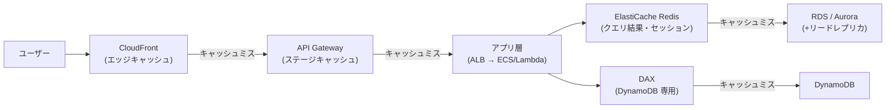
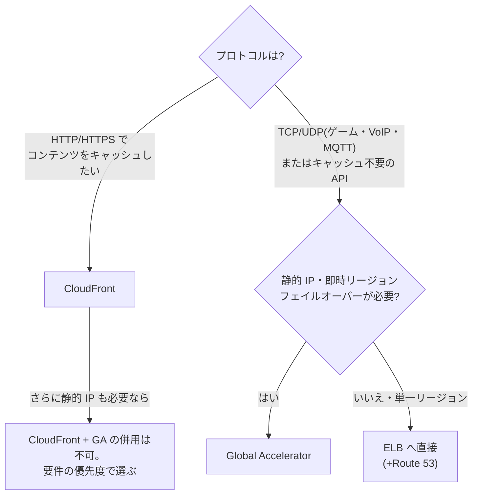

# 2.5 パフォーマンス目標を満たすソリューションの設計

## 試験で問われる観点

- レイテンシー要件(グローバル配信、キャッシュ、エッジ)への対応
- 大規模データのスループット設計(S3、転送、DB)
- ワークロード特性に合ったコンピューティング/DB の選択

## キャッシュ戦略(レイヤー別)

| レイヤー | サービス | 使いどころ |
|---|---|---|
| エッジ(静的+動的) | **CloudFront** | 静的コンテンツ、動的でも接続最適化効果あり。オリジン負荷削減 |
| API | **API Gateway キャッシュ** | ステージ単位の TTL キャッシュ |
| アプリ / セッション | **ElastiCache Redis** | セッションストア、ランキング(Sorted Set)、Pub/Sub |
| シンプルな大容量キャッシュ | ElastiCache Memcached | マルチスレッド・シンプルな KVS(永続化・レプリケーションなし) |
| DynamoDB 前段 | **DAX** | DynamoDB 専用・マイクロ秒応答・アプリ変更最小(API 互換) |
| DB リード | リードレプリカ(RDS/Aurora 最大15) | 読み取りスケールアウト |

**判断基準**: 「DynamoDB の読み取りをマイクロ秒に・コード変更最小」→ DAX。「セッション共有・順位表」→ Redis。「読み取り比率が高い RDS」→ リードレプリカ + キャッシュ。

### 多層キャッシュの全体像(手前で返すほど速く・安い)

## グローバル配信・エッジ

- **CloudFront**: OAC で S3 を非公開のまま配信。オリジンフェイルオーバー(プライマリ/セカンダリ)。**Lambda@Edge**(Node/Python、リージョナルエッジ)と **CloudFront Functions**(軽量 JS、閲覧者エッジ、超低レイテンシー)の使い分け — ヘッダー操作・リダイレクト程度なら CloudFront Functions
- **Global Accelerator**: TCP/UDP の L4。**静的 Anycast IP 2個**。ゲーム/VoIP/API の高速化と即時リージョンフェイルオーバー。キャッシュはしない
- **S3 Transfer Acceleration**: 遠隔地からの S3 アップロード高速化(エッジ経由)
- **S3 Multi-Region Access Points**: 複数リージョンのバケットを単一エンドポイントで最寄りアクセス

**CloudFront vs Global Accelerator**(頻出): HTTP コンテンツのキャッシュ → CloudFront。非 HTTP(TCP/UDP)・静的 IP・高速フェイルオーバー → Global Accelerator。

## コンピューティング選択

- **EC2 インスタンスファミリー**: C(コンピューティング)/ R(メモリ)/ M(汎用)/ I(ローカル NVMe・高 IOPS)/ P・G(GPU)/ Graviton(価格性能比)
- **プレイスメントグループ**: Cluster(低レイテンシー・HPC)/ Spread(障害分離、AZ あたり7)/ Partition(HDFS/Kafka 等のラック分離)
- **Enhanced Networking (ENA)** / **EFA**(HPC・MPI 用、OS バイパス)
- Lambda: メモリ増でCPU も比例増。15分制限。長時間・大容量処理は Fargate/Batch へ
- **AWS Batch**: 大規模バッチのジョブキュー+コンピューティング管理(Spot 活用)

## ストレージ性能

- **EBS**: gp3(独立して IOPS/スループット設定可・gp2 より安い)/ io2 Block Express(最大 256K IOPS)/ st1(スループット型)/ sc1(コールド)。**io2 はマルチアタッチ可**(クラスタ FS 必須)
- **インスタンスストア**: 最高 IOPS・エフェメラル。「一時データで最高性能」→ インスタンスストア
- **EFS**: パフォーマンスモード(General Purpose / Max I/O)とスループットモード(Bursting / Provisioned / Elastic)。数千同時接続の共有 FS
- **FSx for Lustre**: HPC・ML 向け高速並列 FS。**S3 とのシームレス連携**(lazy load / エクスポート)
- S3: プレフィックスあたり 3,500 PUT / 5,500 GET(プレフィックス分散でスケール)。マルチパートアップロード + byte-range fetch

## データベース選択(ワークロード特性別)

| 特性 | 選択 |
|---|---|
| ミリ秒・キー単位アクセス・無限スケール | DynamoDB(+DAX でマイクロ秒) |
| リレーショナル・読み取りスケール | Aurora + リードレプリカ / Aurora Serverless v2(変動負荷) |
| 分析(OLAP)・大規模集計 | Redshift(+ Spectrum で S3 直接クエリ) |
| アドホックな S3 データのクエリ | Athena(サーバーレス、スキャン課金 → Parquet 化・パーティション化で削減) |
| 全文検索・ログ分析 | OpenSearch Service |
| グラフ(関係性探索) | Neptune |
| 時系列 | Timestream |
| インメモリ永続 DB | MemoryDB for Redis |

## 頻出のひっかけポイント

- 「数百万 IOPS の一時ファイル処理」→ インスタンスストア(EBS では届かない)
- 「ML トレーニングで S3 の大量データを高速に読みたい」→ **FSx for Lustre**(S3 連携)
- DynamoDB のホットパーティション → パーティションキー設計の見直し / Write Sharding。「読み取りの偏り」→ DAX
- Athena が遅い/高い → **Parquet/ORC への変換 + パーティション分割 + 圧縮**(Glue で ETL)
- gp2 → gp3 移行は「同性能でコスト削減」の定番正解
- Aurora Serverless v2 は「予測不能・断続的な負荷」のキーワードで選ぶ
