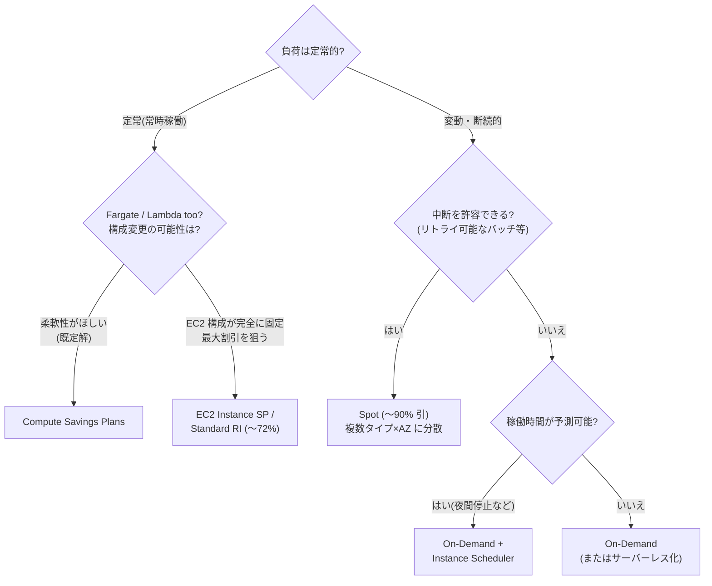
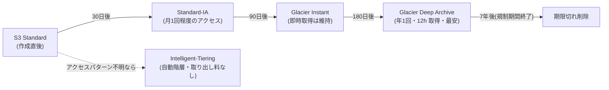

# 2.6 コスト目標を満たすソリューションの決定

## 試験で問われる観点

- 購入オプション(Savings Plans / RI / Spot / On-Demand)の適材適所
- ストレージ階層とライフサイクルの設計
- データ転送コストの削減パターン
- 「最小コスト」と「最小運用負荷」の両立(サーバーレス化)

## 購入オプションの使い分け

| オプション | 割引 | 柔軟性 | 適用場面 |
|---|---|---|---|
| **Compute Savings Plans** | 〜66% | **最高**(EC2 ファミリー/リージョン/OS 不問 + Fargate/Lambda にも適用) | まず検討する既定解 |
| EC2 Instance Savings Plans | 〜72% | 中(ファミリー・リージョン固定) | 構成が安定している場合 |
| Standard RI | 〜72% | 低 | 既存契約・キャパシティ予約と併用 |
| Convertible RI | 〜66% | 中(交換可能) | 長期だが構成変更ありうる |
| **Spot** | 〜90% | 中断あり(2分前通知) | **中断耐性のある**バッチ/ステートレス処理 |
| On-Demand | なし | 最高 | 予測不能・短期・中断不可 |

- **判断基準**: 「定常稼働」→ Savings Plans。「中断可能なバッチ」→ Spot。「毎晩数時間だけ」→ On-Demand + スケジュール or Spot
- Spot のベストプラクティス: **複数インスタンスタイプ×複数 AZ に分散**(capacity-optimized 配分戦略)、中断通知のハンドリング
- RI/Savings Plans は **Organizations の一括請求で共有される**(共有を無効化も可能)— 1-5 参照
- **キャパシティ確保**が目的なら On-Demand Capacity Reservation(割引なし。RI と併用で割引+確保)

## ストレージのコスト設計

| 階層 | 用途 | 注意 |
|---|---|---|
| S3 Standard | 頻繁アクセス | |
| **S3 Intelligent-Tiering** | **アクセスパターン不明** | 監視料はあるが取り出し料なし。「パターン不明」の既定解 |
| S3 Standard-IA / One Zone-IA | 低頻度(月1回程度) | 取り出し課金・最低30日。One Zone は単一 AZ |
| Glacier Instant Retrieval | 四半期1回・**即時取得** | 最低90日 |
| Glacier Flexible Retrieval | 分〜時間で取得 | 最低90日 |
| **Glacier Deep Archive** | 年1回・12時間取得可 | **最安**。最低180日 |

- **ライフサイクルポリシー**で自動階層移動 + 期限切れ削除。**S3 Storage Class Analysis / Storage Lens** で分析

- EBS: gp2 → **gp3**(〜20% 減)。未使用ボリューム・古いスナップショットの削除(DLM で自動化)
- EFS: **EFS IA / Archive + ライフサイクル管理**。「ほとんど読まれない共有ファイル」→ EFS-IA

## データ転送コスト(頻出)

- **同一 AZ 内は無料、AZ 間・リージョン間は課金**。「AZ 間転送コストを削減」→ 同一 AZ 配置(可用性とのトレードオフ)や VPC エンドポイント経由
- **NAT Gateway 経由の S3/DynamoDB アクセス** → **ゲートウェイ型 VPC エンドポイント(無料)** に置き換え — 定番の正解
- インターネットへの大量配信 → **CloudFront**(S3 直接配信よりエッジ配信の方が転送単価が安く、キャッシュでオリジン転送も減る)
- オンプレへの大量転送 → Direct Connect(DX 経由の Data Transfer Out は割安)
- クロスリージョンレプリケーションは転送課金があることを念頭に(要件がなければ同一リージョン)

## アーキテクチャによるコスト削減

- 「使った分だけ」= サーバーレス化: EC2 常時稼働 → Lambda / Fargate / Aurora Serverless v2 / DynamoDB On-Demand
- アイドルの多い開発環境 → **Instance Scheduler**(夜間・週末停止)
- 分析: Redshift 常設クラスタ → **Athena**(アドホックなら)/ Redshift Serverless
- ログ保管: CloudWatch Logs は保持期間設定 + S3 エクスポート(長期保管は S3 の方が安い)
- **Compute Optimizer / Trusted Advisor / Cost Explorer のライトサイジング推奨**で過剰プロビジョニングを検出

## 頻出のひっかけポイント

- 「アクセスパターンが予測できない」→ S3 **Intelligent-Tiering**(IA へのライフサイクルではない)
- Fargate/Lambda にも効く割引 → **Compute Savings Plans**(EC2 Instance SP や RI は効かない)
- Spot は「中断されても再実行できる」記述があるときのみ。「SLA あり・中断不可」なら選ばない
- S3 → インターネットの転送費が問題 → CloudFront を前段に
- NAT Gateway の処理料金が高い → S3/DynamoDB はゲートウェイエンドポイント、他サービスはインターフェイスエンドポイント(PrivateLink)を比較
- DynamoDB: 「トラフィックが予測可能で定常」→ プロビジョンド(+Auto Scaling)。「ゼロ〜スパイク」→ On-Demand
