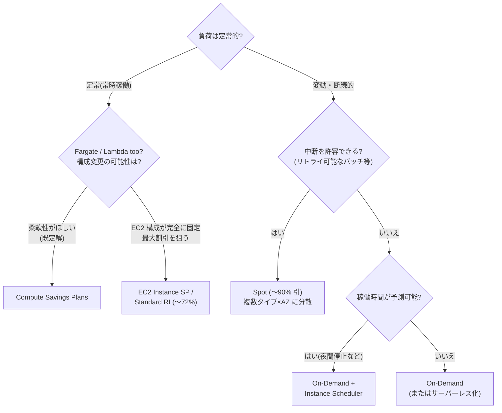
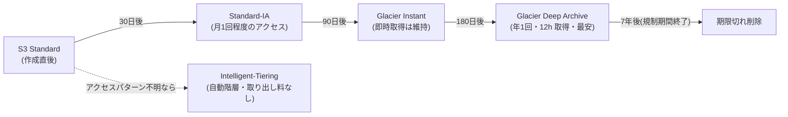

# 2.6 コスト目標を満たすソリューションの決定

## このテーマの背景 — 「MOST cost-effective」の読み方

SAP で最も頻繁に現れる制約キーワードが「**MOST cost-effective**」です。誤解してはいけないのは、これが「一番安い選択肢を選べ」という意味ではないことです。正しい読み方は「**他のすべての要件(RTO、性能、可用性、運用)を満たした上で、最も安いものを選べ**」。つまりコスト問題は常に2段階で解きます — まず要件で選択肢をふるい落とし、残った候補をコストで並べる。要件を満たさない激安構成も、要件を超過達成する高級構成も、どちらも不正解です。

新規設計におけるコストの決定要因は、大きく4つに分解できます。①**コンピューティングの買い方**(オンデマンドか、コミットするか、Spot か)、②**ストレージの置き方**(アクセス頻度に階層を合わせる)、③**データの動かし方**(転送経路で課金が桁違いに変わる)、④**アーキテクチャそのもの**(常時稼働かイベント駆動か)。このノートはこの4分解に沿って進めます。W-A のコスト最適化の柱の「消費モデルを導入する」「差別化につながらない重労働への支出をやめる」が、④の判断(サーバーレス化・マネージド化)の理論的根拠です。

## 関連する Well-Architected の柱

- 「**消費モデルを導入する**」— 使う分だけ払う設計(サーバーレス、スケジュール停止、On-Demand キャパシティ)
- 「**差別化につながらない重労働への支出をやめる**」— 自前運用よりマネージド。人件費・運用工数も総コスト
- 「**支出を分析し、帰属させる**」— 設計時点でタグ・メーターの入る構成にしておく(組織編は 1-5)
- **信頼性・性能とのトレードオフの明示** — 「要件を満たす最小コスト」の判断こそこのタスクの本体

## 購入オプション — コミットの深さと割引の交換

EC2(および Fargate/Lambda)の価格は「**どれだけ長く・固定的にコミットするか**」で決まります。柔軟性を手放すほど安くなる、という一直線の構造です。

| オプション | 割引 | 柔軟性 | 適用場面 |
|---|---|---|---|
| On-Demand | なし | 最高 | 予測不能・短期・中断不可 |
| **Compute Savings Plans** | 〜66% | **高**(インスタンスファミリー/リージョン/OS 不問 + **Fargate/Lambda にも適用**) | 定常利用の既定解 |
| EC2 Instance Savings Plans | 〜72% | 中(ファミリー・リージョン固定) | 構成が安定しているなら深い割引 |
| Standard RI | 〜72% | 低 | 既存契約・キャパシティ予約と併用 |
| Convertible RI | 〜66% | 中(属性交換可) | 長期だが構成変更がありうる |
| **Spot** | 〜90% | **中断あり**(2分前通知) | **中断耐性のある**バッチ・ステートレス |

判断の起点は「**時間額 × 稼働パターン**」です。24時間365日動く定常負荷は、$1/時のオンデマンドを払い続けるより、コミットして 6〜7 割引を取るべき — まず **Compute Savings Plans**(ファミリー変更や Fargate 移行にも追従する柔軟さが、長期の技術変化リスクをヘッジする)。夜だけ・月末だけの負荷はコミットせず On-Demand + スケジュール。そして「**中断されても再実行できる**」処理(データ変換、CI、レンダリング)だけが **Spot** の土俵です — Spot は AWS の余剰キャパシティなので**2分前通知で回収されうる**、この一点を許容できるかが分水嶺で、問題文に中断耐性の記述がなければ Spot は選びません。Spot 運用のベストプラクティスは「**複数インスタンスタイプ × 複数 AZ に分散**(プールを広げて同時中断の確率を下げる)+ capacity-optimized 配分戦略」です。

割引ではなく**確保**が目的なら On-Demand Capacity Reservation(割引ゼロ、RI/SP と重ねれば割引も併用可)— DR の静的安定性(1-3)で登場した道具です。

RI/SP は Organizations の一括請求で**組織全体に共有**される(管理と会計の設計は [1-5](../01-organizational-complexity/1-5-cost-optimization.md))ことも思い出してください。

## ストレージ — アクセス頻度に階層を合わせる

S3 のストレージクラスは「**取り出しの速さ・頻度**と**保管単価**の交換」です。下に行くほど保管は安く、取り出しに課金・時間・最低保管期間の縛りが付きます。

| 階層 | 用途 | 注意 |
|---|---|---|
| S3 Standard | 頻繁アクセス | |
| **S3 Intelligent-Tiering** | **アクセスパターン不明・変動** | 自動で階層移動。取り出し料なし(少額の監視料のみ) |
| Standard-IA / One Zone-IA | 月1回程度 | 取り出し課金・最低30日。One Zone は単一 AZ(再生成可能なデータ向け) |
| Glacier Instant Retrieval | 四半期1回・**即時取得が必要** | 最低90日 |
| Glacier Flexible Retrieval | 分〜時間の取得でよい | 最低90日 |
| **Glacier Deep Archive** | 年1回・12時間待てる | **最安**。最低180日 |

設計の作法は、**ライフサイクルポリシー**で時間経過による自動移行(+期限切れ削除)を仕込むことと、パターンが読めないデータには **Intelligent-Tiering** を既定にすることです。「アクセスパターンが予測できない」という文言は Intelligent-Tiering を指すサインで、無理に IA へのライフサイクルを組むと取り出し課金で逆に高くつく、という対比で出題されます。

S3 以外では: EBS は **gp3** を既定に(gp2 比 ~2割安・性能独立設定)、スナップショットは DLM で世代管理して古いものを削除。EFS は**ライフサイクル管理で EFS-IA / Archive へ**(共有ファイルの大半は実は読まれていない)。ログは CloudWatch Logs に無期限で溜めず、**保持期間を設定**するか S3 (+Glacier) へ退避します。

## データ転送 — 「見えない請求」を設計で消す

データ転送は設計図に現れにくいのに、大規模システムでは支配的なコストになりえます。課金の基本構造は「**AWS に入るのは無料、出る・跨ぐと課金**」: 同一 AZ 内は無料、**AZ 間・リージョン間・インターネットへのアウトは課金**です。ここから定番の削減パターンが導かれます。

- **NAT Gateway 経由で S3/DynamoDB に行かない**: プライベートサブネットから S3 へのアクセスが NAT GW を通ると、NAT の処理料+転送料が全量にかかる。**ゲートウェイ型 VPC エンドポイント(無料)** に切り替えるだけで消える — SAP 最頻出のクイックウィン
- **インターネット配信は CloudFront を前に**: S3/ALB から直接出すより、CloudFront 経由の方がエッジ転送単価が安く、キャッシュヒット分はオリジン転送自体が消える
- **AZ 間トラフィックを意識する**: マイクロサービス間の大量通信が AZ を跨いでいないか。可用性(マルチ AZ)とのトレードオフとして意識的に選ぶ
- **オンプレへの大量転送は DX**: DX 経由のアウト転送単価はインターネット経由より安い。帯域だけでなくコストの根拠にもなる
- **クロスリージョンレプリケーションは要件があるときだけ**: 転送課金が常時発生する。「なんとなく DR」で全データを複製しない

## アーキテクチャで安くする — 消費モデルへの転換

最後の、そして最も効果の大きいレバーが「そもそも常時稼働をやめる」ことです。

- リクエストが来たときだけ動く: EC2 常駐 → **Lambda / Fargate**(アイドル時間の課金が消える)
- 使われる分だけの DB: 低稼働・変動 RDS → **Aurora Serverless v2**、DynamoDB は「定常なら プロビジョンド+Auto Scaling、ゼロ〜スパイクなら On-Demand」
- 常設クラスタをやめる: アドホック分析の Redshift/EMR 常駐 → **Athena / Redshift Serverless**
- 使わない時間は止める: 開発環境の夜間・週末 → **Instance Scheduler**
- 効率の良いハードへ: x86 → **Graviton**(同性能帯で価格性能比が数割改善 — 持続可能性の柱とも整合)

注意点はワークロードの形との適合です。**定常的に高負荷**なワークロードをサーバーレス化すると、かえって高くつくことがあります(Lambda の単価は常時稼働の EC2 より高い)。「アイドルが多い・スパイクする・断続的」がサーバーレスの土俵、という適用条件まで含めて判断します。

## ケーススタディ

**シナリオ**: 動画変換パイプラインの新規設計。毎晩 2,000 本の動画をバッチ変換する(各ジョブは独立・失敗時は再実行可・処理は数時間で完了すればよい)。最もコスト効率の良いコンピューティングは?

**解き方**: 要件を分解 — 「独立・再実行可」= **中断耐性あり**、「数時間以内」= 厳密な締切なし、「毎晩」= 断続的(常時稼働ではない)。中断耐性が明記されているので **Spot** の土俵。ジョブ管理には **AWS Batch**(キュー+複数インスタンスタイプ×AZ の Spot フリートを自動運用)。Savings Plans は「毎晩数時間」の稼働率ではコミットが無駄になり、On-Demand は Spot 比で最大10倍。「Spot は中断があるから危険」という直感を、要件の記述(再実行可)で上書きできるかが問われている。

**シナリオ**: プライベートサブネットの分析ジョブが S3 から毎日 50TB を読む。月の請求で NAT Gateway の費用が突出していた。最小の変更で削減するには?

**解き方**: S3 への経路が NAT GW を通っている構成が原因。**ゲートウェイ型 VPC エンドポイント**を作りルートテーブルに追加するだけで、NAT 処理料・転送料が消える(エンドポイント自体は無料)。「NAT インスタンスに置き換える」は処理料は減っても転送は残り運用も増える、「Direct Connect」は無関係、と消去。

## 試験直前の要点(理由つき)

- **コスト問題は2段階で解く** — 要件で足切り → 残りを価格順。要件未達の最安も、超過達成の高級も不正解
- **Fargate/Lambda にも効くのは Compute Savings Plans だけ** — EC2 Instance SP と RI は EC2 限定。コンテナ・サーバーレス移行の予定があるなら Compute SP
- **Spot は「中断されても良い」記述があるときだけ** — 2分前通知で回収される仕組み上、SLA 付き・ステートフルには不適。分散(複数タイプ×AZ)とセットで
- **「アクセスパターン不明」は Intelligent-Tiering** — IA へのライフサイクルは、パターンが読めるときの道具。読み違えると取り出し課金で逆転する
- **NAT GW 経由の S3/DynamoDB はゲートウェイエンドポイントへ** — 無料で NAT 課金が丸ごと消える、最頻出のクイックウィン
- **大量のインターネット配信は CloudFront を前置** — エッジ転送単価とキャッシュの二重効果
- **DynamoDB の容量モード** — 「予測可能・定常」= プロビジョンド(+Auto Scaling)、「ゼロからスパイク・読めない」= On-Demand
- **サーバーレス化はアイドルの多さで判断** — 定常高負荷ならコミット付き EC2/コンテナの方が安い。「常に安い」わけではない
- **最低保管期間(IA 30日・Glacier 90日・Deep Archive 180日)** — 短期で消すデータを深い階層に入れると早期削除料で損をする
