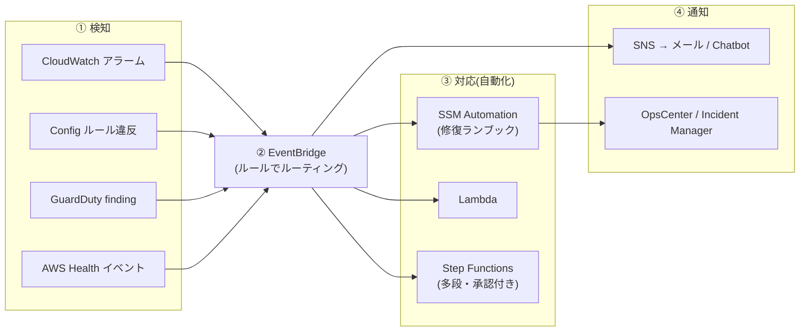

# 3.1 運用上の優秀性(Operational Excellence)を高める戦略

## このテーマの背景 — 「見えないものは改善できない、手作業は改善が続かない」

既存システムの運用改善は、2つの欠乏から始まります。第一に**可視性の欠乏**: 「なんとなく遅い」「たまに落ちる」が数値で説明できない。第二に**再現性の欠乏**: 対応手順が担当者の頭の中にあり、パッチ適用やログ調査が手作業で、実施のたびに結果が違う。

W-A の運用上の優秀性の柱は、これに対応する2つの処方箋を示します。**Observability(可観測性)** — メトリクス・ログ・トレースの3信号でシステムの内部状態を外から説明できるようにすること。そして「**運用をコードとして実行する**」 — 手順書を Runbook(実行可能な自動化)に置き換え、人間は判断だけを担うこと。SAP の Domain 3 では、「手動で○○している」「SSH で入って調査している」「パッチが台ごとにバラバラ」といった**現状のアンチパターン描写**から、対応する改善サービスを選ばせます。このノートでは Observability スタックと、運用自動化の中核である Systems Manager を軸に解説します。

## 関連する Well-Architected の柱

運用上の優秀性の柱の設計原則がそのまま適用されます。

- 「**運用をコードとして実行する**」— SSM Automation / Run Command / State Manager。手順書の Runbook 化
- 「**障害を予測する**」— アラーム・合成監視で「ユーザーより先に気づく」
- 「**運用上の失敗すべてから学ぶ**」— Incident Manager・OpsCenter によるインシデントの記録と再発防止

## Observability — 3つの信号を揃える

### メトリクス: CloudWatch

CloudWatch メトリクスは数値の時系列です。最初に覚えるべき制約は、**EC2 の標準メトリクスに「メモリ使用率」と「ディスク使用率」がない**こと。ハイパーバイザーから見える値(CPU、ネットワーク、ディスク I/O)しか標準では取れず、OS の中の値は **CloudWatch Agent** を入れて custom metrics として送る必要があります。「メモリ枯渇を監視したい」→ Agent 導入、が定番の第一手です(Agent の全台展開は後述の SSM で自動化します)。

粒度は基本モニタリング 5分、詳細モニタリング 1分、カスタムの高解像度メトリクスなら 1秒。アラームは静的閾値のほか、**複合アラーム**(複数アラームの AND/OR でノイズを削減)、異常検知(バンドからの逸脱)を使い分けます。

### ログ: CloudWatch Logs

ログは CloudWatch Logs に集約し、2つの機能で活かします。**メトリクスフィルタ**はログから数値を抽出してメトリクス化する(例: "ERROR" の出現回数 → アラーム)。**サブスクリプションフィルタ**はログをリアルタイムに Kinesis/Firehose/Lambda へ流す(クロスアカウントのログ集約や OpenSearch での分析に接続)。保持期間は既定で無期限なのでコストの罠になります — 保持設定と S3 退避は 3-5 のコスト改善にもつながります。

### トレース: X-Ray

マイクロサービス化したシステムで「どのサービス間呼び出しが遅いのか」はメトリクスだけでは分かりません。**X-Ray** はリクエストに ID を付けてサービス横断で追跡し、サービスマップ上で遅延・エラーの発生区間を特定します。SDK/エージェントの組み込みが必要(自動で全部見えるわけではない)という点も問われます。

### 外形と実ユーザー

サーバー側が正常でも、ユーザー体験が壊れていることはあります。**CloudWatch Synthetics (canary)** はスクリプト化したユーザー操作を定期実行する外形監視 — 「ユーザーが気づく前に検知」の実装です。**CloudWatch RUM** は実ユーザーのブラウザから体感性能を収集します。組織全体の一元可視化には、クロスアカウント・クロスリージョン対応の **CloudWatch ダッシュボード**(モニタリングアカウント方式)を使います。既存の Prometheus/Grafana 資産があるなら Amazon Managed Service for Prometheus / Managed Grafana が受け皿です。

## Systems Manager — 運用自動化の中核

SSM は「フリート(EC2 群+オンプレサーバー群)を、SSH を使わずコードで運用する」ためのツール箱です。SAP 頻出の機能を「解決する運用課題」から整理します。

| 運用課題 | SSM 機能 | 要点 |
|---|---|---|
| SSH 鍵の配布・踏み台の管理をやめたい | **Session Manager** | ポート開放も鍵も不要(エージェント+IAM で接続)。**操作ログを S3/CloudWatch Logs に記録**でき、監査要件も同時に満たす |
| 数百台にコマンドを一括実行 | **Run Command** | エージェント経由で並列実行・レート制御・結果集約 |
| パッチを毎月確実に当てたい | **Patch Manager** | パッチベースライン(何を当てるか)+ メンテナンスウィンドウ(いつ当てるか)+ パッチグループ(どこに当てるか) |
| 構成を「あるべき状態」に保ちたい | **State Manager** | エージェント導入・設定をドリフトさせず維持(関連付けの定期適用) |
| 定型手順を自動化したい | **Automation** | Runbook(AMI 作成、再起動、修復)。**Config/EventBridge から呼ばれる自動修復の実行役** |
| 設定値・シークレットの一元管理 | Parameter Store | 階層化・バージョン管理・KMS 暗号化(2-3 参照) |
| インベントリ・準拠状況の把握 | Inventory / Compliance | 導入ソフトウェア・パッチ適用状況の収集 |
| 運用課題・インシデントの管理 | OpsCenter / **Incident Manager** | 対応の記録・エスカレーション・オンコール |
| **オンプレサーバーも同じ道具で** | **ハイブリッドアクティベーション** | オンプレに SSM Agent を入れ、AWS と同一の Run Command / Patch / Session 管理下に置く |

特に **Session Manager** は「セキュリティ改善」(SSH ポート閉鎖・鍵廃止)と「運用改善」(操作証跡)の両文脈で正解になる万能選手です。また**ハイブリッドアクティベーション**は「オンプレと AWS の運用を一元化したい」という移行期の要件に対する唯一の直接解として覚えてください。

## イベント駆動の運用自動化 — 検知から対応までを閉じる

改善の最終形は「検知 → 判断 → 対応 → 通知」のループから人を外すことです。共通パターンは次の形に収束します。

このテンプレートに当てはめると、多くの頻出問題が機械的に解けます。

- 「EC2 のシステム障害から自動復旧」→ CloudWatch アラームの **EC2 アクション**(システムステータス異常なら recover、インスタンスステータス異常なら reboot)— EventBridge すら不要な最短ルート
- 「パッチ済み標準 AMI を毎月作って配りたい」→ **EC2 Image Builder** のパイプライン(ビルド→テスト→配布を自動化)
- 「AWS の計画メンテ通知に自動対応」→ **AWS Health → EventBridge → Automation**(対象インスタンスの退避など)
- 「非準拠設定を見つけたら直す」→ Config → 自動修復(3-2 で詳述)

## IaC 化 — 手作業で作られた環境の救済

長く運用された環境ほど「コンソールで手作業構築され、誰も全体を知らない」状態に陥っています。改善の道筋は: **CloudFormation の IaC generator / リソースインポート**で既存リソースをテンプレート管理下に取り込み、以後の変更を変更セット経由に一本化、**ドリフト検出**で手動変更を監視する。環境複製(別リージョンの DR、新しい検証環境)が「テンプレートからのデプロイ」になり、複製のたびの手作業ミスが消えます。

## ケーススタディ

**シナリオ**: 300台の EC2(+オンプレ 50台)を運用するチーム。現状: 管理者が SSH で各台にログインして調査・パッチ適用。SSH 鍵は共有スプレッドシートで管理。監査部門から「誰が・いつ・何を実行したかの記録」を求められた。改善策は?

**解き方**: 課題は「SSH 依存・鍵管理・証跡なし・オンプレ混在」の4点。**SSM** で一括解決する: 全台に SSM Agent(オンプレは**ハイブリッドアクティベーション**)→ 接続は **Session Manager**(鍵と 22 番ポートを廃止、IAM で認可、**セッションログを S3 へ**)→ パッチは **Patch Manager + メンテナンスウィンドウ**。踏み台サーバーの増強や鍵管理ツール導入は、手作業の枠組み自体を残すため「改善」として弱い — 運用をコード化する方向が W-A 的正解。

**シナリオ**: マイクロサービス群(ECS 上に 30 サービス)で「特定の画面が遅い」というユーザー報告。どのサービスが原因か分からない。まず何をすべきか?

**解き方**: 「どこが遅いか分からない」段階で構成変更(スケールアップ等)を選ぶのは計測の飛ばし。**X-Ray** を組み込んでサービスマップで遅延区間を特定 → 特定後に該当サービスの深掘り(3-3 へ)。「まず計測」は改善ドメイン全体の解法原則。

## 試験直前の要点(理由つき)

- **EC2 のメモリ・ディスク使用率は CloudWatch Agent が必要** — ハイパーバイザーからは OS 内部が見えないため。標準メトリクスと思い込ませる出題が多い
- **SSH 廃止・操作証跡の同時要求は Session Manager** — 接続機能と監査ログが一体になっているのが決め手。踏み台の改良案はすべて劣後
- **オンプレ込みの一元運用は SSM ハイブリッドアクティベーション** — オンプレを AWS と同じ管理平面に乗せる唯一の直接解
- **X-Ray は組み込みが必要** — SDK/エージェント/サイドカーの導入があって初めてトレースが取れる。「有効化するだけ」ではない
- **自動修復の実行役は SSM Automation(呼び出し元は Config/EventBridge)** — 「検知サービス自身が直す」わけではない、という役割分担
- **EC2 の recover アクションは EBS ブート限定** — インスタンスストア搭載型は別ホストで再現できないため。ハード障害からの自動復旧問題で条件を確認する
- **「ユーザーより先に気づく」は Synthetics(外形監視)** — サーバーメトリクスが正常でも体験が壊れるケースを拾う
- **複数アカウントの一元監視は CloudWatch のモニタリングアカウント(クロスアカウントオブザーバビリティ)** — ダッシュボードを各アカウントで作る案との比較で
