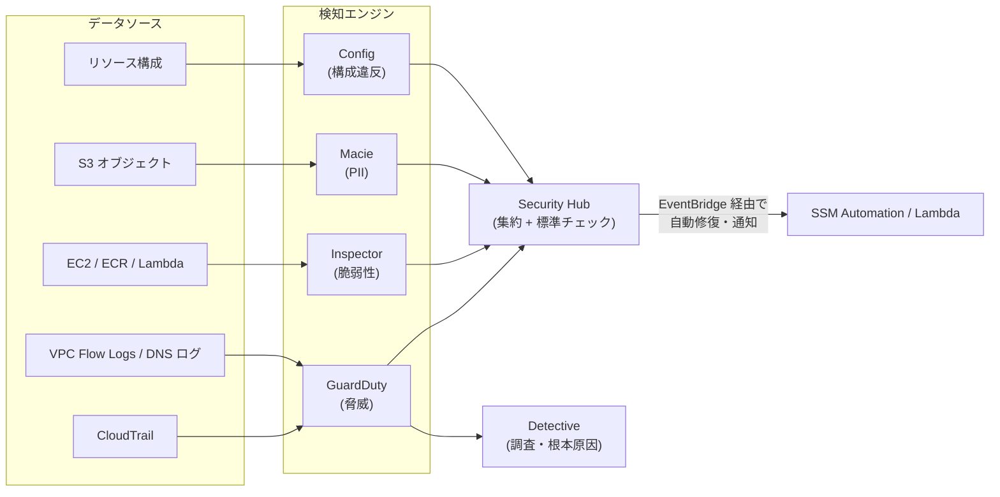
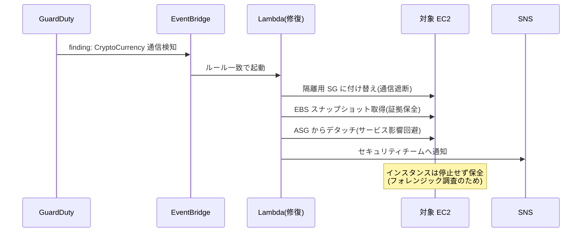

# 3.2 セキュリティを改善する戦略

## このテーマの背景 — 既存環境の「穴」は種類ごとに見つけ方が違う

稼働中のシステムに潜むセキュリティ問題は、性質の違う4種類に分けられます。①**構成の穴**(公開された S3、全開の SG、無効化された暗号化)、②**ソフトウェアの穴**(未パッチの CVE)、③**進行中の攻撃**(不正アクセス、マルウェア、暗号通貨マイニング)、④**データの露出**(気づかず置かれた個人情報)。重要なのは、**この4つは検出の原理が違うため、担当サービスも別**だということです。構成は「あるべき状態との差分」で分かる(Config)、CVE は「パッケージ一覧と脆弱性 DB の突合」で分かる(Inspector)、攻撃は「ログに現れる振る舞いの異常」で分かる(GuardDuty)、PII は「データの中身のスキャン」で分かる(Macie)。

SAP の改善ドメインにおけるセキュリティ問題は、大半が「**どの種類の穴の話をしているかを見極めて、正しい検知サービスを選び、検知から修復までを自動化する**」という構図です。そして検知・修復のさらに手前に「そもそも穴を作れなくする」**予防的統制**があり、選択肢に並んだときは予防が最優先 — この優先順位も含めて解説します。

## 関連する Well-Architected の柱

- 「**トレーサビリティを実現する**」— 検知サービス群と Security Hub への集約。「監視し、アラートし、自動的に対応する」
- 「**セキュリティのベストプラクティスを自動化する**」— 検知 → EventBridge → 自動修復のループ。人の巡回に頼らない
- 「**セキュリティイベントに備える**」— インシデント対応(隔離・保全・調査)の手順化と自動化

## 検知サービスの使い分け — 「何を・どこから見つけるか」

| サービス | 検知対象 | データソース |
|---|---|---|
| **GuardDuty** | **脅威(不正アクセス・マルウェア・マイニング・C&C 通信)** | CloudTrail, VPC Flow Logs, DNS ログ, EKS 監査ログ, S3 データイベント等 |
| **Inspector** | **脆弱性(CVE)と意図しないネットワーク露出** | EC2(SSM 経由), ECR イメージ, Lambda |
| **Macie** | **S3 内の機密データ (PII)** | S3 オブジェクトの中身 |
| **Security Hub** | 上記の**集約** + セキュリティ標準チェック(CIS 等) | 各サービスの findings |
| **Detective** | インシデントの**調査・根本原因分析** | GuardDuty findings とログの関連付け |
| **Config** | **構成のコンプライアンス** | リソース構成のスナップショットと変更履歴 |
| IAM Access Analyzer | 外部共有・未使用権限 | ポリシーの静的解析 |
| CloudTrail Insights | 異常な API 活動量 | CloudTrail |

見極めの練習: 「EC2 が既知の C&C サーバーと通信している」— 振る舞いの異常なので **GuardDuty**。「全 EC2 の OS パッケージの CVE を継続監視」— 脆弱性 DB との突合なので **Inspector**。「S3 に個人情報が置かれていないか」— 中身のスキャンなので **Macie**。「40 アカウントの findings を1画面で優先度管理」— 集約なので **Security Hub**(委任管理者でセキュリティアカウントへ、1-2 参照)。「この侵害はいつどこから始まったのか」— 時系列の掘り下げなので **Detective**。

運用特性の違いも出題されます: **GuardDuty は有効化するだけ**で動く(エージェント不要 — ログは AWS 側で取得済みのものを解析するから)。**Inspector の EC2 スキャンは SSM Agent 経由**(OS 内部のパッケージ一覧が必要だから)。この「なぜ」ごと覚えると混同しません。

## 予防 > 検知+修復 — 統制の優先順位

改善の選択肢に「そもそも起こせなくする」ものがあれば、それが最優先です。検知+修復には必ず「露出している時間窓」が残るからです。

- 公開 S3 の再発防止: Config で検知して直すより、**アカウント/組織レベルの S3 Block Public Access を有効化し、SCP でその設定変更自体を禁止**する方が強い
- 過剰な SG の再発防止: 修復 Lambda より、そもそも SG 変更権限を絞る/ Firewall Manager でポリシー強制
- 検知+修復が正解になるのは、「予防が業務上できない」「既存リソースの是正」「予防をすり抜けた事象への対応」の文脈

この「予防的統制 (preventive) / 発見的統制 (detective) / 是正的統制 (corrective)」の3層で選択肢を分類する癖をつけると、正解の相対比較がしやすくなります。

## 検知から修復へ — 自動化パターン

発見的統制は「見つけた後」が本体です。共通形は 3-1 のテンプレートと同じ「検知 → EventBridge → SSM Automation / Lambda → 通知」です。

| シナリオ | 修復の実装 |
|---|---|
| SG に 0.0.0.0/0 の SSH が開けられた | Config ルール (`restricted-ssh`) + **自動修復(SSM Automation)** で当該ルールを剥がす |
| S3 バケットが公開設定にされた | Config ルール + 修復(+並行して Block Public Access の予防を提案) |
| **EC2 の侵害を検知** | GuardDuty → EventBridge → Lambda: **隔離 SG へ付け替え → EBS スナップショット取得(証拠保全)→ ASG からデタッチ → 通知**。インスタンスは**停止せず**保全(メモリ・ディスクのフォレンジックのため) |
| アクセスキーの漏えい兆候 | GuardDuty finding → キーの無効化 + 通知 |
| 組織全体の非準拠を一括是正 | Security Hub の自動化ルール / カスタムアクション |

侵害対応の手順には理由があります。「即terminate」しない理由は証拠(メモリ、一時ファイル、プロセス)の消失。「ASG からデタッチ」する理由は、ヘルスチェック失敗で ASG が勝手に置換・終了してしまうのを防ぎつつサービス側は新しい台で継続させるため。理由ごと覚えると選択肢の並べ替えに惑わされません。

## 認証情報・権限の改善

既存環境で最も多い「静かな穴」が認証情報です。改善の定石:

- EC2 に置かれたアクセスキー → **インスタンスプロファイル(IAM ロール)** へ。キーの配布・ローテーション・漏えいリスクが構造的に消える
- コード・設定ファイル内の DB パスワード → **Secrets Manager**(+自動ローテーション)
- オンプレサーバーの長期キー → **IAM Roles Anywhere**(X.509 証明書ベースの一時認証情報)
- 過剰な IAM 権限 → **IAM Access Analyzer** の未使用アクセス検出と、CloudTrail 実績からのポリシー生成で最小権限へ絞る
- SSRF によるメタデータ窃取対策 → **IMDSv2 の強制**(`HttpTokens=required`)

## パッチと脆弱性の運用

- OS パッチ: **Patch Manager**(ベースライン+メンテナンスウィンドウ+パッチグループ)で全台を計画的に(3-1 参照)
- コンテナ: **ECR 拡張スキャン(Inspector 連携)** でレジストリ内を継続スキャン + CI パイプラインでのビルド時スキャン
- 「パッチ適用済みの標準イメージを組織で配る」→ **EC2 Image Builder** でパイプライン化し、AMI を Organizations/RAM で共有(golden AMI)

## コンプライアンスの継続監視

「一度監査を通る」ではなく「常に準拠している状態を証明し続ける」ための道具立てです。

- **AWS Config**: マネージド/カスタムルールで評価、**コンフォーマンスパック**でルール集を一括展開、**組織アグリゲーター**で全社を1画面に
- **Security Hub のセキュリティ標準**: CIS AWS Foundations / AWS Foundational Security Best Practices / PCI DSS をスコア化し、継続的に採点
- **Audit Manager**: 監査フレームワークに沿った**証拠収集の自動化**(監査対応の工数削減)
- **AWS Artifact**: AWS 側の準拠レポート(SOC・ISO)の取得 — 責任共有モデルの「AWS 側」の証明はこれで足りる、という切り分けも出題される

## ケーススタディ

**シナリオ**: 通販企業のセキュリティ監査で指摘: 「①一部の S3 バケットが公開されていた ②EC2 に 2 年前の CVE が残存 ③検知の仕組みが何もない」。40 アカウントある。改善の設計は?

**解き方**: 指摘を種類に分解する。①構成の穴 — 是正は S3 Block Public Access(アカウントレベル)+ SCP で変更禁止(**予防**)、既存の棚卸しは Config ルール + IAM Access Analyzer。②ソフトウェアの穴 — **Inspector** を組織有効化(SSM Agent 前提)+ Patch Manager で是正のサイクル化。③検知 — **GuardDuty + Security Hub を委任管理者(セキュリティアカウント)で組織一括有効化**し、findings を集約、重大 finding は EventBridge → 通知/修復へ。単一サービスで全部をカバーする選択肢(「GuardDuty を入れれば解決」等)は、穴の種類ごとに担当が違う原理から誤りと判定できる。

**シナリオ**: GuardDuty が本番 EC2 の暗号通貨マイニング通信を検知した。サービスを止めずに、後の調査可能性を保ちながら対応する手順は?

**解き方**: ①**隔離 SG に付け替え**て通信を遮断(終了ではなく)②**EBS スナップショット**で証拠保全 ③**ASG からデタッチ**して代替インスタンスをサービスに投入(サービス無停止)④ Detective / フォレンジック環境で調査。「即時 terminate」は証拠消失、「放置して調査」は被害拡大 — 「遮断・保全・置換」の3点セットが正解の型。

## 試験直前の要点(理由つき)

- **4種の穴と担当**: 構成=Config、CVE=Inspector、振る舞い=GuardDuty、PII=Macie — 検出原理が違うから担当も違う。問題文の主語で判別する
- **GuardDuty はエージェント不要、Inspector は SSM Agent 経由** — 解析対象(AWS 側ログ vs OS 内部)の違いが理由
- **Security Hub は検知エンジンではない** — 集約と標準チェック。「Security Hub が脅威を検知」という選択肢は誤り
- **予防できるものは予防が最優先** — Block Public Access + SCP は、Config 修復ループより時間窓がない分強い
- **侵害 EC2 は「隔離・保全・置換」、終了しない** — フォレンジックの証拠を残すため。ASG デタッチはサービス継続と保全の両立
- **キー漏えいの構造的対策はロール化** — EC2 はインスタンスプロファイル、オンプレは Roles Anywhere、CI は OIDC。「キーを注意深く管理」は答えにならない
- **「監査証拠の収集を自動化」は Audit Manager、「AWS 側の証明」は Artifact** — 責任共有モデルのどちら側の話かで切り分け
- **組織展開は常に委任管理者パターン** — GuardDuty/Security Hub/Config/Macie/Inspector をセキュリティアカウントから一括管理(1-2 と接続)
