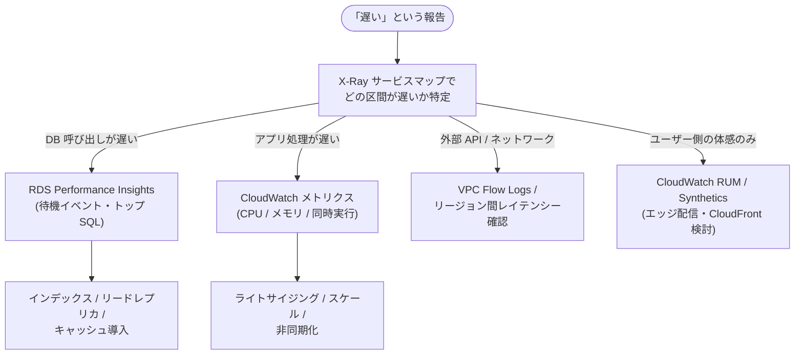

# 3.3 パフォーマンスを改善する戦略

## 試験で問われる観点

- 既存システムのボトルネック特定(計測 → 特定 → 改善)
- 「アプリ変更最小」でのパフォーマンス改善(キャッシュ・レプリカ・インフラ置換)
- より適したサービスへの置き換え判断

※新規設計時の性能選択は [2-5](../02-new-solutions/2-5-performance.md) を参照。ここは「既存の改善」視点。

## ボトルネック特定のツール

| 層 | ツール |
|---|---|
| 分散システム全体 | **X-Ray**(サービスマップでどの区間が遅いか) |
| EC2/RDS リソース | CloudWatch メトリクス(CPU, IOPS, スループット, キュー深度) |
| DB クエリ | **RDS Performance Insights**(待機イベント・トップ SQL)— 頻出 |
| ネットワーク | VPC Flow Logs, CloudWatch の NetworkIn/Out, ENA メトリクス |
| フロントエンド | CloudWatch RUM / Synthetics |
| コスト対性能 | **Compute Optimizer**(EC2/EBS/Lambda の推奨) |

### 診断フロー: どこが遅いかの切り分け

## 定番の改善パターン(現状 → 改善)

| 現状の問題 | 改善 |
|---|---|
| RDS の読み取り負荷が高い | **リードレプリカ追加** + 読み書き分離(Aurora ならリーダーエンドポイント) |
| 同じクエリが繰り返される | **ElastiCache**(lazy loading / write-through) |
| DynamoDB の読み取りレイテンシー | **DAX**(コード変更最小) |
| Lambda のコールドスタート | **プロビジョンド同時実行** / SnapStart (Java) |
| Lambda から RDS への接続枯渇 | **RDS Proxy** |
| グローバルユーザーの遅延 | **CloudFront** / Global Accelerator / リージョン追加 + Route 53 レイテンシールーティング |
| S3 への遠隔アップロードが遅い | **Transfer Acceleration** / マルチパートアップロード |
| EBS の IOPS 不足 | gp2 → **gp3(IOPS 独立設定)** / io2。※gp2 はサイズ比例なので「拡張」も暫定策 |
| EC2 のネットワーク帯域不足 | インスタンスサイズ拡大 / ENA・EFA / プレイスメントグループ (Cluster) |
| 単一 EC2 での画像処理などの重い同期処理 | **SQS + ワーカーの非同期化**(応答性改善) |
| Athena のクエリが遅い | **Parquet 変換 + パーティション + 圧縮** |
| Redshift の同時実行待ち | Concurrency Scaling / WLM 調整 / 結果キャッシュ |
| ALB 経由の静的コンテンツ配信 | CloudFront + S3 へオフロード |

## スケーリングの見直し

- ASG のスケーリングが遅い → **ウォームプール** / 予測スケーリング / 起動テンプレートの AMI 事前ベイク(golden AMI で起動時間短縮)
- スケールの単位が粗い → コンテナ化(ECS/Fargate)で細粒度に
- スパイクに追従できない → SQS で平準化 or サーバーレス化(Lambda)
- **golden AMI パターン**: user data での長い初期化 → Image Builder で事前組み込み — 頻出

## 頻出のひっかけポイント

- 「アプリケーションを変更せずに」→ インフラ側の改善(gp3 化、レプリカ、DAX、RDS Proxy、CloudFront)に限定して選ぶ
- 「どこが遅いか分からない」→ まず **X-Ray / Performance Insights で計測**(いきなりスケールアップは不正解になりやすい)
- リードレプリカは**非同期**(古い読み取りが許容できるか確認)。強い整合性が必要な読み取りはプライマリへ
- ElastiCache 導入時の戦略: Lazy Loading(初回ミス・stale あり)vs Write-Through(常に新鮮・書き込みコスト)+ TTL 併用
- DynamoDB のスロットリング → まず**パーティションキー設計**を疑う(容量追加は対症療法)
