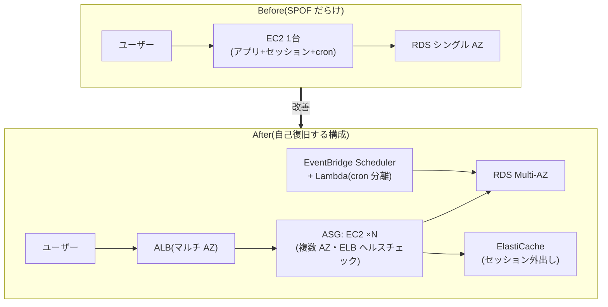

# 3.4 信頼性を改善する戦略

## このテーマの背景 — 動いているシステムの「1」を数える

新規設計(2-4)では最初から疎結合・冗長で作れますが、現実のシステムは違う経緯で育ちます。「とりあえず1台で始めたサーバーがそのまま本番」「cron ジョブが特定のインスタンスに住み着いている」「セッションがローカルメモリにある」— 動いているがゆえに触られず、単一障害点 (SPOF) が温存される。改善ドメインの信頼性問題は、この**歴史的経緯で生まれた脆さを、稼働を止めずに直す**ことがテーマです。

解法の第一歩は機械的です: **構成図の中で「1つしかないもの」を数える**。1台の EC2、1つの NAT Gateway、シングル AZ の RDS、1台に住む cron。それぞれに定番の是正パターンが存在し、SAP はその対応表を問います。第二歩は「**自己復旧 (self-healing)**」— 直したうえで、次に壊れたときに人手なしで戻る仕組み(ヘルスチェック連動の自動置換、アラームアクション)を仕込むこと。第三歩が「**検証**」— 復旧が本当に機能するかをテストで確かめること(W-A の「復旧手順をテストする」)。この3段階で本ノートを構成します。

## 関連する Well-Architected の柱

- 「**障害から自動的に復旧する**」— ヘルスチェックと自動置換の整備が本ノートの中心
- 「**復旧手順をテストする**」— FIS・ゲームデー・AWS Backup 復元テスト。「バックアップがあるが復元未検証」は改善対象として出題される
- 「**水平方向にスケールする**」— 1台のペットを、置換可能な群れ (cattle) に変えることが SPOF 排除の本質

## 第一歩: SPOF 発見チェックリスト

問題文の構成説明を読みながら、以下のアンチパターンを探します。それぞれ「なぜ問題か」→「是正」をセットで。

| アンチパターン | なぜ問題か | 是正 |
|---|---|---|
| 単一 EC2 でアプリ稼働 | ホスト障害=全停止。復旧は手作業 | ASG(複数 AZ)+ ELB。最低でも min=1 の ASG で自動置換 |
| RDS シングル AZ | AZ 障害・メンテで停止 | **Multi-AZ 化**(設定変更のみ・アプリはエンドポイント名のまま) |
| NAT Gateway が 1 AZ のみ | NAT の AZ 障害で**全 AZ の外向き通信が死ぬ** | **各 AZ に NAT GW** + AZ ごとのルートテーブル |
| ELB 配下が単一 AZ | AZ 障害で全ターゲット喪失 | 複数 AZ に分散(+クロスゾーン負荷分散) |
| セッション・ファイルがローカルディスク | 台が死ぬと状態も死ぬ。スケールもできない | セッションは ElastiCache/DynamoDB、ファイルは EFS/S3 へ**外出し(ステートレス化)** |
| cron が特定の1台に住む | その台が SPOF。ASG 化も阻む | **EventBridge Scheduler + Lambda/ECS タスク**へ分離 |
| ハードコードされた IP | 置換・フェイルオーバーで切れる | DNS 名・エンドポイント・Cloud Map(サービスディスカバリ)参照へ |
| 同期呼び出しの連鎖 | 1つの不調が全体へ逆流(2-4) | SQS/SNS/EventBridge で疎結合化 |

この Before/After は SAP 頻出の「モノリシックな1台構成の近代化」の縮図です。ポイントは順序で、**ステートの外出しが先**(ステートフルなままでは台を増やせない)、その後 ASG+ELB 化、cron の分離、DB の Multi-AZ 化と進みます。

RDS の Multi-AZ とリードレプリカの混同には繰り返し注意してください。**Multi-AZ は可用性**(同期スタンバイ・自動フェイルオーバー・読み取り不可)、**リードレプリカは性能**(非同期・読み取り可・昇格は手動)。「可用性を上げたい」への「レプリカを追加」は誤答の第一候補です。また Multi-AZ のフェイルオーバーは **DNS の切替(通常 60〜120 秒)** で実現されるため、**接続文字列は必ずエンドポイント名**を使います(IP 直書きはフェイルオーバーを無効化する隠れ SPOF)。

## 第二歩: 自己復旧の仕組みを仕込む

SPOF を排除したら、「壊れたら人が対応する」を「壊れたら勝手に戻る」に変えます。レイヤーごとの道具:

- **ASG のヘルスチェックを ELB 連動に**: 既定の EC2 ヘルスチェックは「インスタンスが動いているか」しか見ません。アプリがハングしても OS が生きていれば healthy のまま — `HealthCheckType: ELB` にすると**アプリレベルの異常でも自動置換**されます。「プロセスは生きているが応答しない台が残り続ける」症状の答え
- **CloudWatch アラームの EC2 アクション**: 基盤側の障害(システムステータス異常)には **recover**(同一インスタンス ID・EIP・メタデータを保ったまま別ホストで復旧。EBS ブート限定)、OS 側の異常には reboot
- **ECS/EKS**: サービスの desired count とコンテナヘルスチェックによる自動置換(コンテナ化自体が自己復旧の実装になる)
- **Lambda 非同期呼び出し**: 自動リトライ(2回)+ **DLQ / Destinations** で「失敗の握り潰し」を防ぐ
- **Route 53 ヘルスチェック + フェイルオーバー**: エンドポイント単位の切替(DR 文脈は 2-2)
- **Step Functions のリトライ/キャッチ**: 多段バッチの「途中で死んで放置」を、再試行と補償に置き換える

## 第三歩: データ保護と復旧の検証

- バックアップが手動・ばらばら → **AWS Backup で一元化**し、**Organizations のバックアップポリシー**で全アカウントに強制(1-4)。隔離保管(クロスアカウントコピー+Vault Lock)まで含めて設計
- 誤操作への防御: S3 バージョニング(+MFA Delete)、RDS 削除保護、CloudFormation の termination protection / DeletionPolicy
- **復元テスト**: AWS Backup の復元テスト機能で「復元できること」を定期自動検証。「バックアップは取れているが復元したことがない」という記述は、それ自体が是正対象
- **FIS(Fault Injection Service)**: AZ 障害・インスタンス停止などを意図的に注入し、自己復旧が設計どおり働くかを**実験で確認**(カオスエンジニアリング)。**Resilience Hub** で RTO/RPO 目標に対する構成の妥当性を継続評価

「復旧手順をテストする」は W-A の設計原則であると同時に、SAP の正解選択肢の頻出フレーズです。「訓練・検証を仕組みに組み込む」選択肢は原則として強い、と覚えてください。

## ケーススタディ

**シナリオ**: 社内 Web アプリ。構成は EC2 1台(アプリ+セッション+夜間バッチの cron)と RDS シングル AZ。「サーバー再起動のたびに全ユーザーがログアウトし、業務が数分止まる。障害時は管理者が手動で再構築している」。ダウンタイムを最小化する改善の**順序**は?

**解き方**: いきなり「ASG で2台に」を選ぶと、セッションがローカルにあるため**ログアウト問題が悪化**する(リクエストが台間で揺れるたびにセッション喪失)。正しい順序は ①**セッションを ElastiCache へ外出し**(ステートレス化)②cron を **EventBridge Scheduler + Lambda** に分離 ③ASG(マルチ AZ)+ ALB 化、ヘルスチェックは ELB 連動 ④RDS を **Multi-AZ** に変更。順序の依存関係(ステートレス化が先)を理解しているかが、この型の問題の核心。

**シナリオ**: 障害訓練で、プライマリ AZ を止めたところ、アプリは別 AZ で継続したが外部 API への通信が全断した。原因と恒久対策は?

**解き方**: 「アプリは生きたが外向きが死んだ」= **NAT Gateway が停止した AZ にしかなかった**ことが典型原因。各 AZ に NAT GW を置き、**AZ ごとのルートテーブルで自 AZ の NAT を向く**構成に是正する。訓練で発見できた事実自体が FIS/ゲームデーの価値(復旧手順をテストする)の実例。

## 試験直前の要点(理由つき)

- **Multi-AZ は可用性、リードレプリカは性能** — 同期/非同期、自動/手動昇格の違いが根拠。混同を誘う選択肢が必ず並ぶ
- **接続はエンドポイント名で** — Multi-AZ フェイルオーバーは DNS 切替だから。IP 直書きはフェイルオーバーを殺す
- **ELB 連動ヘルスチェックにしないと「ゾンビ台」が残る** — EC2 チェックは OS の生死しか見ない。アプリレベルの検知は ELB 経由
- **EC2 recover はEBS ブート限定・システムステータス異常向け** — インスタンスストアの内容は別ホストで再現できないため
- **NAT GW は AZ ごと + AZ ごとのルートテーブル** — 1つでは NAT の AZ 障害が全 AZ に波及する
- **ステートの外出しがスケールと自己復旧の前提** — セッションは ElastiCache/DynamoDB、ファイルは EFS/S3。ASG 化より先にやる
- **cron の SPOF は EventBridge Scheduler へ** — 「2台に増やす」と重複実行するため不正解。スケジュールの実行基盤自体をマネージドに
- **「復元テストをしていない」は是正対象** — バックアップの存在と復旧能力は別物。AWS Backup の復元テスト・FIS・ゲームデーが対応する道具
