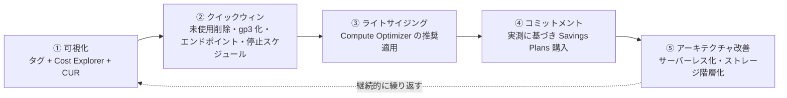

# 3.5 コスト最適化の機会の特定

## 試験で問われる観点

- 既存環境の無駄(アイドル・過剰プロビジョニング・非効率なストレージ/転送)の発見
- 検出ツール(Trusted Advisor / Compute Optimizer / Cost Explorer)の使い分け
- 削減施策の優先順位付け

※購入オプションや新規設計時のコスト判断は [2-6](../02-new-solutions/2-6-cost-optimization.md)、組織レベルの可視化は [1-5](../01-organizational-complexity/1-5-cost-optimization.md) を参照。

## 検出ツールの使い分け

| ツール | 得意分野 |
|---|---|
| **Trusted Advisor** | アイドル/低使用率リソースのチェック(RDS アイドル、未関連付け EIP、低使用 EC2 等)。Business/Enterprise サポートでフルチェック |
| **Compute Optimizer** | **ML ベースのライトサイジング推奨**(EC2 / ASG / EBS / Lambda / ECS on Fargate)。Graviton 移行推奨も |
| **Cost Explorer** | 使用傾向の分析、**RI/SP の推奨と使用率・カバレッジレポート** |
| **CUR + Athena** | リソース単位の詳細分析(どのリソースがいくらか) |
| **S3 Storage Lens** | 組織全体の S3 使用状況(未完了マルチパート、旧バージョン等) |
| Cost Anomaly Detection | 想定外の急増検知 |

## 定番の削減パターン(現状 → 改善)

| 無駄の兆候 | 施策 |
|---|---|
| CPU 使用率が常に低い EC2 | ダウンサイズ / Graviton 移行(Compute Optimizer の推奨) |
| 夜間・週末も稼働する開発環境 | **Instance Scheduler** / ASG のスケジュールでゼロ化 |
| 定常稼働のオンデマンド EC2 | **Compute Savings Plans** |
| 中断可能なバッチがオンデマンド | **Spot**(+複数タイプ/AZ 分散) |
| gp2 ボリューム | **gp3 化**(〜20%減、性能は独立設定) |
| 未使用 EBS・古いスナップショット・未関連付け EIP | 削除(DLM/Backup のライフサイクルで自動化) |
| S3 Standard に古いデータが滞留 | **ライフサイクル → IA/Glacier**、パターン不明なら Intelligent-Tiering |
| S3 の未完了マルチパートアップロード・旧バージョン | ライフサイクルで削除(Storage Lens で発見) |
| CloudWatch Logs の無期限保持 | 保持期間設定 / S3 エクスポート + Glacier |
| NAT Gateway 経由の S3/DynamoDB 通信 | **ゲートウェイエンドポイント**(無料)へ |
| S3 から直接大量配信 | CloudFront 前置(転送単価減+キャッシュ) |
| 低負荷時間帯が長い RDS | Aurora Serverless v2 / 停止スケジュール(非本番) |
| 過剰な DynamoDB プロビジョニング | Auto Scaling / On-Demand 切替(負荷特性による) |
| ログ分析専用の常設 Redshift/EMR | Athena(サーバーレス)へ置換 |
| 旧世代インスタンスファミリー | 新世代 / Graviton へ(同性能で安い) |

## 進め方(優先順位)

1. **可視化**: コスト配分タグ + Cost Explorer で「何に・どこで」かかっているか特定
2. **クイックウィン**: 未使用リソース削除、gp3 化、ゲートウェイエンドポイント、スケジュール停止
3. **コミットメント**: 定常負荷を測ってから Savings Plans(過剰コミットに注意)
4. **アーキテクチャ改善**: サーバーレス化・階層化(工数がかかるが効果大)

## 頻出のひっかけポイント

- 「ML ベースの推奨でライトサイジング」→ Compute Optimizer(Trusted Advisor はルールベースのチェック)
- Savings Plans は**使用実績に基づいて**購入(先にライトサイジング、が正しい順序)
- 「開発環境のコスト削減・最小の運用工数」→ Instance Scheduler(手動停止やスクリプト自作より優先)
- S3 の隠れコスト: **旧バージョン(バージョニング)と未完了マルチパート**はライフサイクルで明示的に消す
- RI/SP の**使用率 (utilization) とカバレッジ (coverage)** レポートの意味の違い(使用率=買った分を使えているか、カバレッジ=使用量のうち割引が効いている割合)
