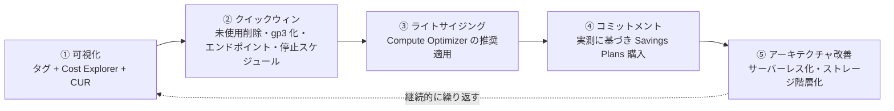

# 3.5 コスト最適化の機会の特定

## このテーマの背景 — 無駄は「静かに」溜まる

クラウドの無駄なコストには特徴があります: **何も壊さないので誰も気づかない**。検証で作って消し忘れた EBS ボリューム、退職者のプロジェクトの EC2、無期限保持の CloudWatch Logs、バージョニングで増え続ける S3 の旧世代 — どれもアラートを鳴らさず、毎月の請求に紛れ込みます。新規設計のコスト判断(2-6)が「これから作るものを正しく選ぶ」ことだとすれば、改善ドメインのコスト最適化は「**すでにある無駄を発見する**」ことが主戦場です。

発見には道具が要ります。SAP は「どの無駄を・どのツールが見つけるか」の対応を問います — ルールベースのチェックは Trusted Advisor、ML ベースのライトサイジング推奨は Compute Optimizer、使用傾向と RI/SP 分析は Cost Explorer、S3 の詳細は Storage Lens。そして発見した無駄への対処は、リスクの小さい順(削除 → 設定変更 → 購入 → 再設計)に進めるのが定石です。W-A のコスト最適化の柱にある「**全体的な効率を測定する**」「**支出を分析し帰属させる**」が、この「まず見つける」アプローチの原則的裏付けです。

## 関連する Well-Architected の柱

- **コスト最適化**: 「支出を分析し、帰属させる」(発見)、「消費モデルを導入する」(スケジュール停止・サーバーレス化)
- **持続可能性**: 「使用率を最大化する」— アイドル排除・ライトサイジング・Graviton は環境負荷とコストを同時に下げる。「サステナビリティ目標」というキーワードでも同じ施策群が正解になる
- **パフォーマンス効率**: ライトサイジングは性能データに基づく(Compute Optimizer が両方の柱にまたがる理由)

## 発見の道具箱 — 誰が何を見つけるか

| ツール | 得意分野 | 特徴 |
|---|---|---|
| **Trusted Advisor** | **アイドル・低使用率のチェック**(低使用 EC2、アイドル RDS、未関連付け EIP、低使用 EBS) | ルールベース。フルチェックは Business/Enterprise サポート契約が必要 |
| **Compute Optimizer** | **ライトサイジング推奨**(EC2 / ASG / EBS / Lambda / ECS on Fargate) | **ML ベース**で「このインスタンスは m5.xlarge → m6g.large が最適」まで提案(Graviton 移行含む) |
| **Cost Explorer** | 使用傾向・予測、**RI/SP の推奨・使用率・カバレッジ** | 集計 GUI(1-5 参照) |
| **CUR + Athena** | リソース単位の深掘り | 「どのリソースがいくら」の最終手段 |
| **S3 Storage Lens** | 組織全体の S3 使用状況 | **未完了マルチパートアップロード・旧バージョンの堆積**を可視化 |
| Cost Anomaly Detection | 想定外の急増 | ML で「いつもと違う」を検知(1-5 参照) |

「ML ベースのサイジング推奨」とあれば Compute Optimizer、「サポートプランに含まれるチェック」とあれば Trusted Advisor、という語彙の対応も出題されます。

## 定番の削減パターン — 症状から引く

発見された無駄への一手を、頻出順に整理します。多くは「サービスを変えず設定だけ変える」クイックウィンです。

### 消す・止める(リスク最小)

| 無駄の兆候 | 施策 |
|---|---|
| 未接続の EBS・古いスナップショット・未関連付け EIP | 削除(DLM / AWS Backup のライフサイクルで再発防止) |
| 夜間・週末も動く開発環境 | **Instance Scheduler** で自動停止(消費モデルの実践) |
| CloudWatch Logs の無期限保持 | 保持期間設定 / S3 + Glacier へ退避 |
| S3 の未完了マルチパート・旧バージョン | **ライフサイクルで明示的に削除**(Storage Lens で発見) |

### 設定を変える(クイックウィン)

| 無駄の兆候 | 施策 |
|---|---|
| gp2 ボリューム | **gp3 化**(〜20%減・性能は独立設定) |
| NAT GW 経由の S3/DynamoDB 通信 | **ゲートウェイエンドポイント**(無料)へ切り替え |
| S3 Standard に古いデータが滞留 | ライフサイクルで IA/Glacier へ。パターン不明なら **Intelligent-Tiering** |
| S3 から直接の大量配信 | **CloudFront 前置**(転送単価減+キャッシュ) |
| EFS に読まれないファイルが堆積 | **EFS-IA / Archive + ライフサイクル管理** |
| 旧世代インスタンス | 新世代 / **Graviton** へ(同性能で安い・持続可能性にも寄与) |

### 買い方を変える(実測後に)

| 無駄の兆候 | 施策 |
|---|---|
| 定常稼働がオンデマンドのまま | **Compute Savings Plans**(※ライトサイジング後に購入 — 順序が重要) |
| 中断可能なバッチがオンデマンド | **Spot** へ(2-6 の条件確認) |
| 過剰な DynamoDB プロビジョン | Auto Scaling / On-Demand へ(負荷特性で選択) |

### 作りを変える(効果大・工数大)

| 無駄の兆候 | 施策 |
|---|---|
| アイドルの長い常駐 EC2 | Lambda / Fargate へ(イベント駆動化) |
| 低稼働の RDS | Aurora Serverless v2 / 非本番は停止スケジュール |
| ログ分析のためだけの常設 Redshift/EMR | **Athena**(サーバーレス)へ置換 |

## 進め方 — 順序に意味がある

この順序には論理があります。**③が④より先**なのは、サイズを直す前に Savings Plans を買うと「無駄に大きいサイズでコミットしてしまう」から(過剰コミットは3年間取り返せない)。**①が全ての前**なのは、帰属の分からないコストは削る判断ができないから。試験でも「まず何をすべきか」という順序問題として出ます。

## ケーススタディ

**シナリオ**: 経費削減指示を受けた運用チーム。Cost Explorer で見ると EC2 が支出の 6 割。インスタンスは 200 台、多くが数年前に「とりあえず m4.xlarge」で作られたもの。今後の方針として最初にやるべきことは? (A) 全台を Savings Plans でカバーする (B) Compute Optimizer の推奨に基づきライトサイジングする (C) 全台を Spot に移行する (D) Graviton に一括移行する

**解き方**: (A) は現状の(過剰かもしれない)サイズで 1〜3 年コミットする行為で、順序が逆。(C) は中断耐性の確認なしには不可。(D) はアーキテクチャ(AMI/バイナリ互換)の検証が必要で「最初」ではない。**(B)** が正解 — 実測データに基づいてサイズを適正化し、**その後**に残った定常分を Savings Plans でカバーする。「ライトサイジング → コミット」の順序そのものが問われている。

**シナリオ**: S3 の請求が毎月増え続けている。バケットはバージョニング有効。アプリは日次で大きなファイルを再アップロードしており、アップロード失敗もたびたび起きる。原因の候補と対策は?

**解き方**: バージョニング有効+日次上書き = **旧バージョンが無限に堆積**(画面には最新しか見えないので気づかない)。さらに失敗したマルチパートアップロードの**断片が残存**。どちらも **Storage Lens** で可視化し、**ライフサイクルルール**(旧バージョンの期限切れ削除 + 未完了マルチパートの中止)で恒久対策。「Intelligent-Tiering にする」は現行バージョンの階層の話で、堆積の根本原因に効かない。

## 試験直前の要点(理由つき)

- **「ML ベースのサイジング推奨」= Compute Optimizer、「ルールベースのチェック」= Trusted Advisor** — 語彙の対応で即答できる
- **ライトサイジングが先、Savings Plans は後** — 過剰サイズでのコミットは長期に固定化される。順序問題の定番
- **バージョニング有効バケットの膨張は旧バージョンと未完了マルチパート** — 見えないところに溜まる。Storage Lens で発見、ライフサイクルで削除
- **開発環境の停止は Instance Scheduler** — 手動停止・自作スクリプトより優先される(運用をコードとして実行する)
- **gp3 化・ゲートウェイエンドポイント・CloudFront 前置は「無リスクのクイックウィン」枠** — 機能を変えずに請求だけ下がる施策として最初に検討
- **使用率 (utilization) とカバレッジ (coverage) の使い分け** — 「買った RI が余っている」→ 使用率レポート、「まだオンデマンドが多い」→ カバレッジレポート
- **持続可能性の問題も同じ施策群で解く** — 使用率最大化(ライトサイジング・アイドル排除・Graviton・階層化)はコストと環境負荷の共通解
