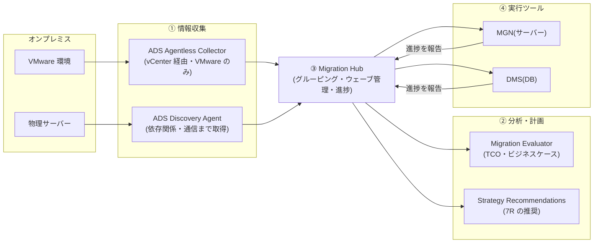

# 4.1 移行可能なワークロードの選定と評価

## 試験で問われる観点

- 移行前の情報収集(何が動いているか・依存関係・コスト)のツール選択
- ビジネスケース(TCO 比較)の作成
- 移行の全体管理(Migration Hub)

## 評価フェーズのツール(暗記必須)

| ツール | 役割 |
|---|---|
| **Application Discovery Service (ADS)** | オンプレサーバーの**インベントリ・使用率・依存関係**を収集。**Agentless Collector**(VMware 向け・vCenter 経由)と **Discovery Agent**(サーバー内にインストール・**プロセス間の依存関係やネットワーク接続まで取得**)の2方式 — 方式の違いが頻出 |
| **Migration Evaluator**(旧 TSO Logic) | 収集データから **TCO 比較・ビジネスケース**を作成(経営層向けの費用対効果) |
| **Migration Hub** | 移行全体の**進捗を一元管理**するダッシュボード。ADS のデータ表示、各移行ツール(MGN/DMS)の状況集約、**ネットワーク可視化・アプリのグルーピング** |
| Migration Hub Strategy Recommendations | サーバー/アプリを分析して **7R 戦略の推奨**を提示 |
| **AWS Migration Readiness Assessment (MRA)** | CAF に基づく**組織の移行準備度**評価(技術以外も含む) |
| AWS Cloud Adoption Framework (CAF) | 移行の観点整理(ビジネス/人材/ガバナンス/プラットフォーム/セキュリティ/オペレーション) |

**判断基準**:
- 「VMware 環境・エージェントを入れられない」→ **Agentless Collector**
- 「**アプリ間の依存関係・通信**を把握したい」→ **Discovery Agent**(エージェントレスでは取れない)
- 「移行の費用対効果を経営層に示す」→ **Migration Evaluator**
- 「複数ツールにまたがる移行進捗の一元管理」→ **Migration Hub**

## 移行対象の優先順位付け

- 依存関係の少ない・リスクの低いワークロードから着手(quick win で組織の学習を進める)
- 依存が密なアプリ群は**同一ウェーブ(移行グループ)**でまとめて移行(Migration Hub のグルーピング)
- ライセンス制約(Oracle, Windows, SQL Server)の確認 → **License Manager** で管理、BYOL の可否が 7R 選択に影響(Dedicated Host が必要なケース)

## TCO / コスト評価の観点

- オンプレ側: ハードウェア・データセンター・運用人件費・ライセンス
- AWS 側: ライトサイジング後のインスタンス費 + Savings Plans 前提の見積り
- 「現状スペックそのまま」ではなく**使用率データに基づくライトサイジング**で見積もるのがポイント

## 頻出のひっかけポイント

- ADS の 2方式の違い: **依存関係マッピングは Agent 版のみ**。Agentless は VMware 専用
- Migration Evaluator は「見積り・ビジネスケース」、Migration Hub は「実行管理」— 役割の混同を誘う
- MRA/CAF は技術評価ではなく**組織の準備度**(スキル・体制・ガバナンス)
- ADS のデータは Migration Hub と統合され、そのまま移行計画(グルーピング)に使える
