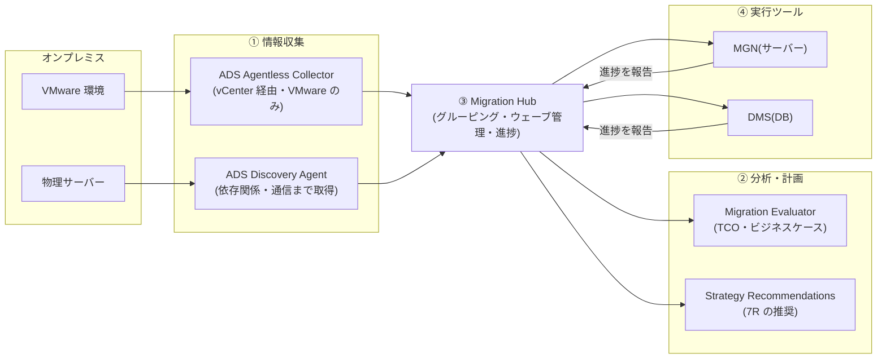

# 4.1 移行可能なワークロードの選定と評価

## このテーマの背景 — 移行の失敗は「知らないまま運ぶ」ことから始まる

データセンターの移行プロジェクトが炎上する原因は、技術力不足よりも**現状把握の不足**であることがほとんどです。10年動いてきた DC には、ドキュメントのないサーバー、作った本人が退職したバッチ、どこから呼ばれているか誰も知らないアプリが必ずあります。これを知らないまま移行すると、「移した瞬間に、把握していなかった依存先との通信が切れて障害」という事故が起きます。

だから移行は必ず「**評価 (Assess) → 動員 (Mobilize) → 移行 (Migrate)**」の3フェーズで進めます(AWS の移行方法論)。このノートが扱う評価フェーズの成果物は3つです: ①**インベントリ**(何が・どんなスペックで・どれだけ使われて動いているか)、②**依存関係マップ**(どのサーバーとどのサーバーが通信しているか — 一緒に移すべきものの発見)、③**ビジネスケース**(移行で TCO がどう変わるかの経営向け説明)。AWS はこの3成果物それぞれに専用ツールを用意しており、SAP は「どの成果物が欲しいときに、どのツールか」を問います。

さらに評価には技術以外の面もあります。組織のスキル・体制・ガバナンスが移行に耐えるかを測る **MRA (Migration Readiness Assessment)** と、その観点を整理した **CAF (Cloud Adoption Framework)** です。「技術の評価」と「組織の評価」の区別も出題ポイントです。

## 関連する Well-Architected の柱

- **運用上の優秀性**: 「運用をコードとして実行する」— 評価データに基づく計画は、勘に頼る移行の対極。Migration Hub による進捗の一元管理
- **コスト最適化**: 「支出を分析し帰属させる」— TCO 比較は**実測の使用率に基づくライトサイジング後**の見積りで行う(現状スペックのままの見積りは過大になる)

## 評価ツールチェーン — 3つの成果物と担当ツール

| ツール | 役割 |
|---|---|
| **Application Discovery Service (ADS)** | オンプレサーバーの**インベントリ・使用率・依存関係**の収集 |
| **Migration Evaluator** | 収集データから **TCO 比較・ビジネスケース**を作成(経営層向け) |
| **Migration Hub** | 移行全体の**一元管理**: ADS データの表示、アプリのグルーピング、各移行ツール (MGN/DMS) の進捗集約 |
| Migration Hub Strategy Recommendations | サーバー・アプリを分析し **7R 戦略を推奨** |
| **MRA** | CAF に基づく**組織の移行準備度**評価(技術以外を含む) |

### ADS の2方式 — 「どこまで見えるか」が違う

インベントリ収集の入口である ADS には2つの方式があり、**取れる情報の深さ**が違います。この違いは最頻出です。

- **Agentless Collector**: vCenter に仮想アプライアンスを置き、**VMware の管理情報**からサーバー一覧・スペック・使用率を取る。サーバーに手を入れない(エージェント配布の社内調整が不要)代わりに、**VMware 環境限定**で、**OS の中で何が起きているかは見えない**
- **Discovery Agent**: 各サーバーの **OS にインストール**する。プロセス一覧と**ネットワーク接続(どこと通信しているか)**まで取れるため、**依存関係マッピングができるのはこちらだけ**。物理サーバー・他ハイパーバイザーにも対応

つまり「VMware でエージェントを入れられない」→ Agentless、「**アプリ間の依存関係を知りたい**」→ Agent、と要件から一意に決まります。「Agentless で依存関係マップを作る」という選択肢は機能的に成立しない、と切れるようにしてください。

### Migration Evaluator — 経営を説得する数字を作る

技術者が「移行すべき」と思っても、投資判断は経営層が下します。**Migration Evaluator**(旧 TSO Logic)は、収集した構成・使用率データから「現状維持 vs AWS 移行」の **TCO 比較とビジネスケース**を作成します。ポイントは、実測使用率に基づく**ライトサイジング後**の AWS 費用で比較すること — オンプレのサーバーは平均使用率が低い(10〜20% が普通)ので、同スペック換算ではなく適正サイズ換算にすることで、現実的かつ説得力のある数字になります。「経営層向けの費用対効果資料」というキーワードで Evaluator を選びます。

### Migration Hub — 移行の「管制塔」

数百台の移行は、サーバー移行 (MGN)・DB 移行 (DMS) など複数ツールが並行稼働します。**Migration Hub** はそれらの進捗を1画面に集約し、サーバーを**アプリケーション単位にグルーピング**して「このアプリの移行は何%完了」を追跡する管制塔です。依存関係の可視化(ネットワーク図)もここで見られます。Strategy Recommendations は、この蓄積データから各アプリに適した 7R 戦略(4-2)を推奨してくれます。

### MRA / CAF — 技術ではなく組織を測る

**CAF** は移行を6つの視点(ビジネス・人材・ガバナンス・プラットフォーム・セキュリティ・オペレーション)で整理したフレームワーク、**MRA** はそれに基づく準備度診断です。「移行スキルを持つ人材がいるか」「クラウドのガバナンス体制があるか」といった**技術以外の問い**が特徴で、「大規模移行の開始前に、組織としての準備状況を評価したい」という設問はこちらを指します(ADS/Evaluator は技術・コストの評価なので不正解)。

## 移行対象の優先順位付け — ウェーブ設計

評価データが揃ったら、移行の順番(ウェーブ)を決めます。原則は2つです。

1. **最初のウェーブは「依存が少なく・リスクの低い」ワークロード**: 早い成功で組織が学習し、ランディングゾーンや運用プロセスの問題を低リスクに洗い出せる(クイックウィン)
2. **依存の密なアプリ群は同一ウェーブでまとめて**: 片方だけ移すと、オンプレ⇔AWS 間の通信レイテンシーが挟まって性能劣化する。依存関係マップ(Agent 版 ADS の成果物)がこの判断の材料

また、商用ライセンス(Oracle・SQL Server・Windows)は移行方式を制約します(BYOL の条件、物理コア数課金など)。**License Manager** でライセンスの使用を追跡し、要件によっては **Dedicated Host**(ソケット/コア単位のライセンス持ち込み)が必要になる — ライセンスが 7R の選択(そのまま Rehost か、ライセンス脱却の Replatform/Refactor か)に影響する、という繋がりを押さえます。

## ケーススタディ

**シナリオ**: 500 台(VMware 400 台、物理 100 台)の DC を 18 か月で AWS へ移行するプロジェクトが始まる。最初の 3 か月でやるべきことは? 「アプリ間の通信関係を把握して移行グループを作りたい」「経営会議用に TCO 資料が要る」という2つの要求がある。

**解き方**: 通信関係(依存関係)の把握には **Discovery Agent** が必須(Agentless では取れない)— 全台に入れるのが難しければ、少なくとも主要アプリのサーバー群には Agent、残りは Agentless で構成情報のみ、というハイブリッドが現実解。収集データは **Migration Hub** に集約してアプリ単位のグルーピング → ウェーブ案を作成。TCO 資料は **Migration Evaluator** に収集データを食わせてビジネスケースを生成。この3点セット(Agent+Hub+Evaluator)が評価フェーズの標準装備。

## 試験直前の要点(理由つき)

- **依存関係マッピングは Discovery Agent だけ** — OS 内のネットワーク接続情報が必要だから。Agentless(vCenter 経由)では原理的に取れない
- **Agentless Collector は VMware 専用** — vCenter の管理情報を読む方式だから。物理サーバーには Agent
- **「経営層向けの TCO・ビジネスケース」= Migration Evaluator** — Migration Hub(実行管理)との役割の混同を誘う選択肢が定番
- **「複数ツールにまたがる進捗の一元管理」= Migration Hub** — MGN も DMS も進捗を Hub に報告する構造
- **MRA/CAF は組織の準備度** — 技術評価ではない。「スキル・体制・ガバナンス」という語が出たらこちら
- **TCO 見積りはライトサイジング後の数字で** — オンプレの低使用率をそのままスペック換算すると過大見積りになる
- **最初に移すのは低リスク・低依存のワークロード** — 学習と信頼の獲得が目的。「最重要システムから移して効果を最大化」は誤答の型
