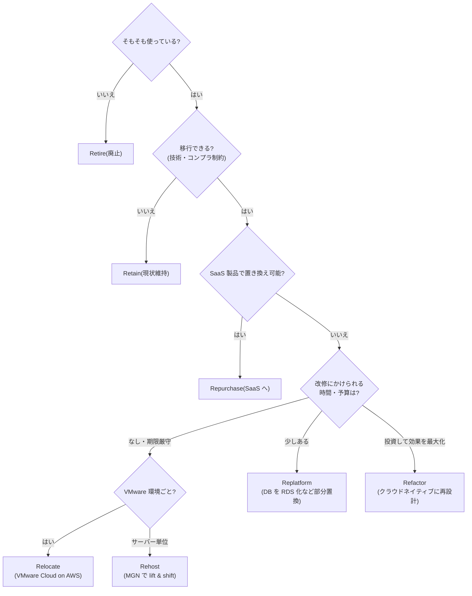
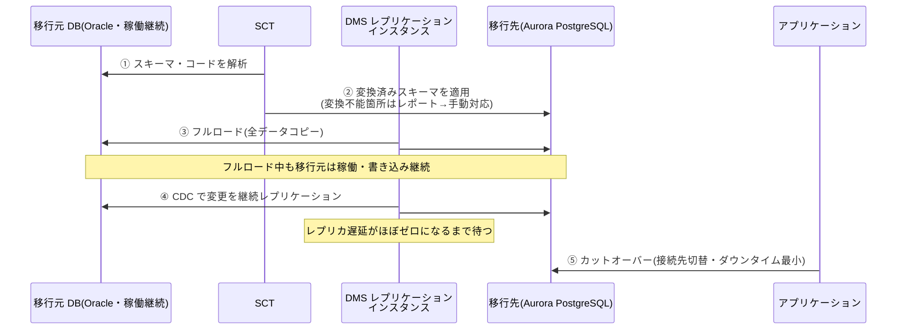
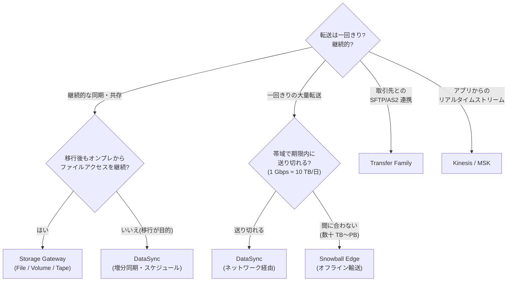

# 4.2 移行方法(7R)と移行サービスの決定

## このテーマの背景 — 「どう運ぶか」は「何を変えるか」の選択

評価(4-1)で現状が見えたら、ワークロードごとに「AWS へどう持っていくか」を決めます。このとき本当に選んでいるのは輸送手段ではなく、「**移行のタイミングでどれだけ手を入れるか**」です。何も変えずに運べば(Rehost)速くて安全だがクラウドの恩恵は薄い。作り直せば(Refactor)恩恵は最大だが時間とリスクがかかる。この投資判断のカタログが **7R** です。

もう一つの軸が**データの物理的な移動**です。ここには軽視できない物理法則があります: **ネットワークの帯域は有限で、データは巨大**。100TB を 100Mbps 回線で送ると理論値でも 90 日以上かかります。期限に間に合わないなら、物理デバイスにコピーしてトラックで運ぶ(Snow Family)方が速い — 「ネットワークで送るか、物理で運ぶか」の損益分岐計算は SAP の定番です。さらに「移行中も本番は動き続けている」という制約から、**継続レプリケーション + 短時間カットオーバー**(MGN、DMS の CDC)という共通パターンが生まれます。ダウンタイムをメンテナンスウィンドウ1回分に押し込む、この仕組みの理解が移行サービス群の核心です。

## 関連する Well-Architected の柱

- **運用上の優秀性**: 「小さく可逆的な変更」— ウェーブ分割・テスト起動・カットオーバーのリハーサル。一発勝負の移行はアンチパターン
- **信頼性**: 移行中の二重稼働期間の設計、切り戻し(ロールバック)手段の確保
- **コスト最適化**: 7R は投資対効果の判断。「全部 Refactor」も「全部 Rehost」も最適ではなく、ワークロードごとに使い分ける

## 7R — キーワードから即答できるように

| 戦略 | 内容 | キーワード |
|---|---|---|
| **Rehost** (lift & shift) | そのまま EC2 へ | 「変更なしで」「期限が迫っている」「大量サーバーを迅速に」→ **MGN** |
| **Replatform** (lift, tinker & shift) | 一部だけマネージドに置換 | 「DB だけ RDS へ」「OS/ミドルはそのまま」 |
| **Repurchase** (drop & shop) | SaaS 製品へ乗り換え | 「CRM を Salesforce に」 |
| **Refactor / Re-architect** | クラウドネイティブに作り直し | 「マイクロサービス化」「サーバーレス化」(コスト大・効果大) |
| **Relocate** | ハイパーバイザーごと移動 | 「**VMware Cloud on AWS**」「変更ゼロ・最速の大量移行」 |
| **Retain** | 移行しない | 「レガシー依存・コンプラ制約で現状維持」 |
| **Retire** | 廃止 | 「使われていないので停止」 |

評価(4-1)で発見された「使われていないサーバー」を **Retire** するのは、移行の最初にやるべき最安の施策です(運ばないものが一番安い)。また実務でも試験でも、「まず Rehost で移してから、AWS 上で段階的にモダナイズ(4-3)」という**二段階戦略**が「DC 閉鎖期限あり」のシナリオの現実解として頻出します。

## サーバー移行 — MGN の仕組み

**AWS Application Migration Service (MGN)** は Rehost の標準ツールです。仕組みを理解すると「なぜダウンタイムが分単位で済むのか」が分かります: 移行元サーバーにエージェントを入れると、**ブロックレベルの継続レプリケーション**が始まり、稼働中のままディスクの変更が AWS 側のステージング領域(低コストの EC2/EBS)に送られ続けます。カットオーバー時は、最新状態のレプリカから本番スペックのインスタンスを起動して DNS を切り替えるだけ — 同期は済んでいるので停止は数分です。さらに**テスト起動**(本番影響なしにレプリカからテスト用インスタンスを起動して動作確認)ができるため、「一発勝負」を避けられます。物理サーバーも対応(P2V)。

- **VM Import/Export**: VM イメージ(OVA 等)を AMI に変換する**オフライン**の道具。継続同期がないため、「イメージファイルが手元にある」「停止できる」場合に限る
- **VMware Cloud on AWS**: Relocate の実装。vSphere 環境ごと AWS 内へ移り、運用ツールも変えない

## データベース移行 — DMS と SCT の分業

DB 移行の鉄板コンビの役割分担を正確に: **SCT (Schema Conversion Tool) は「器」の変換、DMS (Database Migration Service) は「中身」の移送**です。

異種移行(Oracle → Aurora PostgreSQL 等)では、まず SCT がスキーマ・ストアドプロシージャ・関数を変換し、自動変換できない箇所をレポートします(手動対応の見積りにもなる)。次に DMS が**フルロード**(全データのコピー)を行い、その間の本番の変更は **CDC (Change Data Capture)** で追いかけて適用し続けます。レプリカ遅延がほぼゼロになったところでアプリの接続先を切り替える — MGN と同じ「継続レプリケーション + 短時間カットオーバー」の構図です。

- **DMS はスキーマ変換をしない**(同種移行ならそもそも不要、異種なら SCT が担当)— この分業を混ぜた選択肢が定番のひっかけ
- 超大容量の初期ロードが帯域的に無理なら、**SCT + Snowball Edge で初期データを物理輸送**し、到着後の差分を DMS CDC で追いつかせる合わせ技
- DMS は移行後も使える: 継続レプリケーションによる読み取りオフロード、S3 への継続エクスポート(データレイク連携)

## ファイル・オブジェクトデータの移送 — 使い分けの4象限

データ移送サービスは「**継続的か一回か**」「**ネットワークか物理か**」で整理できます。

| サービス | 用途 | 特徴 |
|---|---|---|
| **DataSync** | NFS/SMB/HDFS/オブジェクト → S3/EFS/FSx | **ネットワーク経由・増分同期・検証付き・帯域制御**。スケジュール実行可。「オンラインのファイル移行」の既定解 |
| **Snowball Edge** | 数十 TB〜PB 級の**オフライン**転送 | 帯域不足・期限あり案件。Compute Optimized はエッジ処理も可 |
| **Transfer Family** | SFTP/FTPS/FTP/AS2 のマネージドエンドポイント | 「**取引先との既存 SFTP 連携を変えずに** S3/EFS へ」— プロトコルの継続が本質 |
| **Storage Gateway** | 移行ではなく**ハイブリッド共存** | File(NFS/SMB→S3+キャッシュ)/ Volume(iSCSI)/ Tape(VTL) |
| S3 Transfer Acceleration | アプリからの遠隔アップロード高速化 | エッジ経由で S3 へ |

**転送日数の概算**は電卓なしでできるように: **1 Gbps ≈ 10 TB/日**(実効を理論値の8割とすると ≈ 8.6TB/日、ざっくり10)。「100TB を 100Mbps(=0.1Gbps ≈ 1TB/日)で2週間」→ 100 日かかるので不可能 → **Snowball Edge**。この暗算1つで選択肢が半分消えます。

**DataSync と Storage Gateway の違い**は目的です: DataSync は「移す」(転送が完了したら役目が終わる)、Storage Gateway は「共存する」(移行後もオンプレからのアクセス窓口として恒久的に居続ける)。「全データを AWS に移し、オンプレの NAS は廃棄する」→ DataSync。「データは S3 に置くが、オンプレの既存アプリからは今までどおりファイル共有として見せたい」→ File Gateway。Tape Gateway は「バックアップソフトのテープ運用を仮想テープ (VTL) に置き換える」専用の文脈で登場します。

## 大規模移行の全体運営

- ランディングゾーン(Control Tower、1-4)とハイブリッドネットワーク(DX/VPN + DNS 統合、1-1)を**移行開始前に**整備する — 移行ウェーブが始まってから土台を作るのは手戻りの元
- ウェーブ管理は Migration Hub(4-1)。依存の密なアプリ群は同一ウェーブで
- カットオーバーは Route 53 の**加重ルーティングで段階切替**(+事前に TTL を短縮しておく)。問題があれば加重を戻す

## ケーススタディ

**シナリオ**: DC の賃貸契約が 10 か月後に切れるため、350 台のサーバーと 40 の Oracle DB を AWS へ移す。アプリ改修の余裕はない。ただし経営層は Oracle ライセンス費の削減を強く要望している。方針は?

**解き方**: 期限 10 か月・改修余地なし → サーバーは **Rehost (MGN)** で機械的に運ぶ(ウェーブ分割で並行処理)。Oracle は矛盾する2要求(改修なし vs ライセンス削減)の調停が必要 — 全 DB の Refactor は期間的に無理なので、**SCT でアセスメントし、変換難易度の低い DB だけ Aurora PostgreSQL へ(SCT + DMS)、難しいものはいったん RDS for Oracle か EC2 へ Rehost し、DC 退去後に段階的に変換**する二段階戦略が現実解。「期限がある移行では、モダナイズを移行と切り離す」という判断パターンを問うている。

**シナリオ**: 研究機関が 800TB の観測データアーカイブを S3 に移したい。拠点の回線は 500Mbps で業務にも使用中。3 か月以内に完了したい。

**解き方**: 概算 — 500Mbps ≈ 5TB/日、業務と共用なら実効はさらに半分以下 → 800TB は 300 日超で不可能。**Snowball Edge**(80TB 級を複数台・並行)で物理輸送が正解。「Direct Connect を敷く」は開通リードタイム(数週間〜数か月)と月額から3か月案件の単発転送には不適、「DataSync で帯域制御」は期限を満たせない、と消去できる。

## 試験直前の要点(理由つき)

- **MGN はサーバー(OS ごと)、DataSync はファイル、DMS は DB** — 「何を運ぶか」でツールが決まる。混ぜた選択肢は即切り
- **DMS はスキーマ変換しない** — 異種移行は SCT とのセットが必須。「DMS だけで Oracle→Aurora」は不成立
- **ダウンタイム最小の鍵は継続レプリケーション + カットオーバー** — MGN(ブロックレベル)も DMS(CDC)も同じ構図。「ダンプ&リストア」「停止してコピー」はダウンタイム大で劣後
- **転送日数の暗算: 1 Gbps ≈ 10 TB/日** — 間に合わなければ Snowball。DX 新設は単発移行のリードタイムに合わない
- **DataSync = 移す、Storage Gateway = 共存する** — 移行完了が目的なら DataSync。オンプレからの継続アクセスが要件なら File Gateway
- **既存 SFTP 連携の維持は Transfer Family** — 取引先側の設定を変えさせない、がこのサービスの存在意義
- **Relocate = VMware Cloud on AWS** — 「vSphere の運用をそのまま」「最小の変更で最速」のキーワードで
- **テスト起動・段階カットオーバーを含む選択肢は強い** — 「小さく可逆的な変更」の原則。一発切替の計画は W-A 的に弱い
