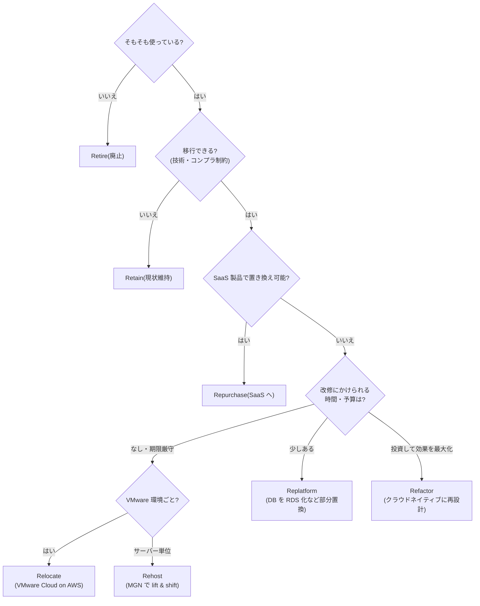
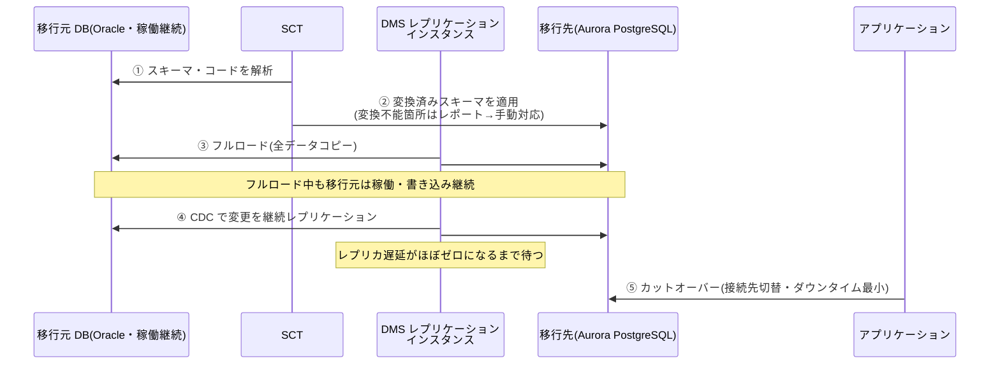
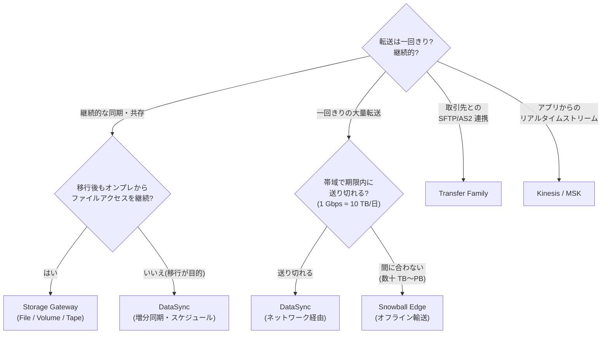

# 4.2 移行方法(7R)と移行サービスの決定

## 7R 戦略(キーワードで即答できるように)

| 戦略 | 内容 | キーワード |
|---|---|---|
| **Rehost** (lift & shift) | そのまま EC2 へ | 「変更なしで」「期限が迫っている」「大量サーバーを迅速に」→ **MGN** |
| **Replatform** (lift, tinker & shift) | 一部だけマネージドに置換 | 「DB だけ RDS へ」「OS/ミドルはそのまま」 |
| **Repurchase** (drop & shop) | SaaS 製品へ乗り換え | 「CRM を Salesforce に」 |
| **Refactor / Re-architect** | クラウドネイティブに作り直し | 「マイクロサービス化」「サーバーレス化」(コスト大・効果大) |
| **Relocate** | ハイパーバイザーごと移動 | 「**VMware Cloud on AWS**」「変更ゼロ・最速の大量移行」 |
| **Retain** | 移行しない | 「レガシー依存・コンプラ制約で現状維持」 |
| **Retire** | 廃止 | 「使われていないので停止」 |

## サーバー移行

- **AWS Application Migration Service (MGN)**: Rehost の標準ツール。**ブロックレベルの継続レプリケーション**(エージェント型)→ カットオーバーは分単位。テスト起動も可能。旧 SMS/CloudEndure Migration の後継
- **VM Import/Export**: VM イメージ(OVA 等)を AMI 化(オフライン・一括。継続同期なし)
- **VMware Cloud on AWS**: Relocate(vSphere 環境ごと)
- オンプレの物理サーバーも MGN でOK(P2V)

**判断基準**: 「最小のダウンタイムで数百台を EC2 へ」→ MGN。「vSphere をそのまま・運用も変えない」→ VMware Cloud on AWS。「イメージファイルだけある」→ VM Import。

## データベース移行

- **DMS (Database Migration Service)**: 同種・異種 DB の移行。**CDC (Change Data Capture) で継続レプリケーション**→ ダウンタイム最小のカットオーバー。移行元は稼働継続可
- **SCT (Schema Conversion Tool)**: **異種移行時のスキーマ・コード変換**(Oracle → Aurora PostgreSQL 等)。変換不能箇所をレポート。**DMS とセットで使う**
- 大容量の初期ロード: SCT + **Snowball Edge** 経由 → その後 DMS CDC で追いつき
- 定番シナリオ: 「Oracle から Aurora へ、ダウンタイム最小・ライセンス費削減」→ **SCT(スキーマ変換)+ DMS(フルロード + CDC)**

## ファイル・オブジェクトデータ移行

| サービス | 用途 | 特徴 |
|---|---|---|
| **DataSync** | NFS/SMB/HDFS/オブジェクト → S3/EFS/FSx | **ネットワーク経由・増分同期・帯域制御・検証付き**。定期スケジュール可。「オンライン・大量ファイル移行」の既定解 |
| **Snowball Edge** | 数十 TB〜PB 級のオフライン転送 | **帯域が細い/転送に数週間以上かかる場合**。Compute Optimized はエッジ処理も |
| **Snowmobile** | 10 PB〜EB 級(トラック) | 超大規模(提供終了に向かっているが試験知識として) |
| **Transfer Family** | SFTP/FTPS/FTP/AS2 のマネージドエンドポイント | 「**既存の SFTP 連携先を変えずに** S3/EFS へ」— 頻出 |
| **Storage Gateway** | ハイブリッド継続利用(移行ではなく共存) | File(NFS/SMB→S3, ローカルキャッシュ)/ Volume(iSCSI, Cached/Stored)/ Tape(VTL, バックアップソフトのテープ置換) |
| S3 Transfer Acceleration | 遠隔地からの S3 アップロード高速化 | アプリからの直接転送 |

**転送日数の概算**(頻出): `日数 = データ量(TB) × 8 / 帯域(Gbps) / 86400 × 1000`。ざっくり **1 Gbps ≈ 10 TB/日**。「100 TB・100 Mbps・期限2週間」→ ネットワークでは約100日 → **Snowball**。

**判断基準**:
- 継続的な増分同期・オンライン → **DataSync**
- 帯域不足・期限内に送り切れない → **Snowball Edge**
- 移行後もオンプレからファイルアクセスを継続 → **Storage Gateway**(File Gateway)
- 取引先との SFTP を維持 → **Transfer Family**
- テープバックアップの置き換え → **Tape Gateway**

## 大規模移行の進め方

- Migration Hub でウェーブ管理、ランディングゾーン(Control Tower)を先に整備
- ハイブリッド期間のネットワーク(DX/VPN、DNS 統合)を先行構築 — [1-1](../01-organizational-complexity/1-1-network-connectivity.md)
- カットオーバー: Route 53 の加重ルーティングで段階切替、TTL を事前に短縮

## 頻出のひっかけポイント

- MGN と DataSync の混同: **MGN はサーバー(OS ごと)**、DataSync は**ファイル/オブジェクトデータ**
- DMS は**スキーマ変換をしない**(異種移行は SCT が必須)
- 「ダウンタイムほぼゼロの DB 移行」→ DMS の **フルロード + CDC**(ダンプ&リストアは不正解)
- Storage Gateway は「移行完了」目的ではなく「**ハイブリッド共存**」目的(全部移すなら DataSync)
- File Gateway のキャッシュは「よく使うデータのみローカル」。全データローカル保持は Volume Gateway (Stored)
- Snowball Edge には S3 互換ストレージ・Lambda 実行(エッジコンピューティング)機能もある(切断環境での処理)
