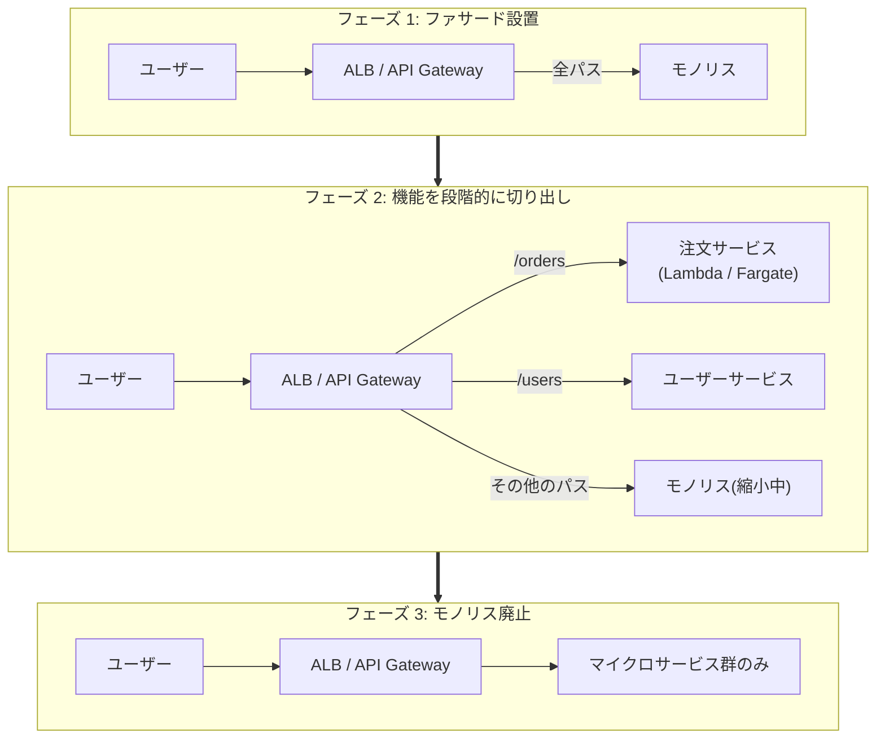
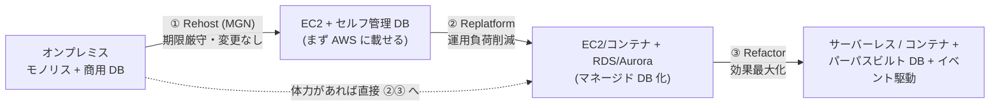

# 4.3 新しいアーキテクチャ・モダナイゼーション機会の決定

## このテーマの背景 — 移行のゴールは「引っ越し」ではない

Rehost で AWS に移しただけのシステムは、動く場所が変わっただけで、体質は変わっていません。パッチ適用もキャパシティ管理も相変わらず人の仕事で、モノリスは相変わらず月1回しかリリースできない。クラウドの本当の恩恵 — 運用の自動化、従量課金、弾力的なスケール、デプロイ頻度の向上 — は、**マネージド化・コンテナ化・サーバーレス化・疎結合化**といったモダナイゼーションによって初めて手に入ります。W-A の言葉なら「差別化につながらない重労働への支出をやめる」の実践です。

ただし、モダナイズには正しい進め方があります。動いている巨大なモノリスを一括で書き換える「ビッグバンリライト」は、長期間成果が出ず、最後に巨大なリスクが爆発する古典的な失敗パターンです。代わりに使うのが **Strangler Fig パターン** — ファサード(ALB/API Gateway)の背後で、機能を少しずつ新実装に差し替えていく段階的置換です(絞め殺しの木がホストの木を徐々に覆う様子から命名)。「小さく可逆的な変更を頻繁に」という運用上の優秀性の原則を、アーキテクチャ変革に適用したものと言えます。

このノートは、モダナイズの主要な道筋 — コンテナ化、サーバーレス化、DB のパーパスビルト化、分析基盤の近代化 — と、その段階的な進め方を扱います。

## 関連する Well-Architected の柱

- **運用上の優秀性**: 「小さく可逆的な変更」— Strangler Fig。「運用をコードとして実行する」— コンテナ・サーバーレスは運用自動化の器
- **コスト最適化**: 「差別化につながらない重労働をやめる」— セルフ管理 → マネージドへの移行そのもの。「消費モデル」— サーバーレス化
- **パフォーマンス効率**: 「サーバーレスアーキテクチャを使用する」「高度なテクノロジーを民主化する」— パーパスビルト DB・マネージド分析基盤
- **持続可能性**: マネージドサービスへの集約は使用率の高いインフラへの相乗りであり、環境負荷も下がる

## コンテナ化 — 「どこまで自分で運用するか」で選ぶ

コンテナ化の第一の価値は**可搬性と密度**(1台に複数ワークロードを詰めて使用率を上げる)、第二の価値は**デプロイの標準化**(イメージ=不変の成果物)です。AWS のコンテナ実行環境は「自分で運用する範囲」の広さで並べると選びやすくなります。

| サービス | 使いどころ |
|---|---|
| **App2Container (A2C)** | 既存の **Java/.NET アプリを、コード変更なしで自動コンテナ化**(解析 → Dockerfile 生成 → ECS/EKS 用成果物まで) |
| **App Runner** | Web アプリ/API を最小の設定でデプロイ(インフラの概念がほぼ不要) |
| **ECS + Fargate** | AWS ネイティブのオーケストレーション + サーバーレス実行。**運用負荷最小の既定解** |
| **EKS** | **Kubernetes 資産・エコシステムが前提**にあるとき(Helm、operator、社内標準が K8s 等) |
| ECS/EKS Anywhere | オンプレで同じオーケストレーションを使う(段階移行・データ主権) |

選定の軸は明快です: K8s を使う積極的理由(既存資産・マルチクラウド標準)がなければ **ECS+Fargate**(K8s の学習・運用コストを払わない)。「レガシー .NET/Java をとにかくコンテナに」なら手作業の Dockerfile 起こしより **App2Container**。この「運用負荷最小」の方向感が W-A 的な正解の匂いです。

## サーバーレス化 — 「常駐」をイベント駆動に置き換える

Rehost された EC2 群をよく見ると、多くは「たまにしか働かないのに常駐している」ものです。これらをイベント駆動の部品に置き換える定石の対応表:

| 移行前(EC2 上の常駐) | 移行後(マネージド/サーバーレス) |
|---|---|
| cron ジョブ専用サーバー | **EventBridge Scheduler + Lambda**(15分超・大容量は Fargate タスク / Batch) |
| 常駐 API サーバー | **API Gateway + Lambda**(または ALB + Fargate) |
| ファイル到着を監視するポーリング処理 | **S3 イベント → Lambda / EventBridge**(ポーリング自体を廃止) |
| DB テーブル製の自作ジョブキュー | **SQS** + ワーカー(Lambda/Fargate) |
| 多段バッチのリトライ・フロー制御の自作 | **Step Functions** |
| メール送信サーバー (Postfix) | SES |
| セッションを抱えたステートフルアプリ | セッションを ElastiCache/DynamoDB へ外出し → ステートレス化(3-4 と同じ手筋) |

このテーブルの各行は「自作・常駐・ポーリング」を「マネージド・イベント駆動」へ置き換えるという同じ変換の適用例です。Lambda の制約(15分・ペイロード・一時領域)に触れる記述があれば Fargate/Batch 側に倒す、という調整だけ覚えれば応用が利きます。

## Strangler Fig — モノリスを安全に解体する

進め方は3フェーズです。①モノリスの前に**ファサード(ALB のパスベースルーティング / API Gateway)**を立てる(この時点では全トラフィックがモノリスへ)。②切り出しやすい機能から新実装(Lambda/Fargate のマイクロサービス)を作り、**そのパスだけ**新実装へルーティングする。失敗したらルーティングを戻すだけ(可逆)。③これを繰り返し、モノリスが空になったら廃止する。

切り出しの単位はビジネス機能(注文、在庫、認証)で、切り出したサービス間の連携は同期 API 直呼びではなく **SNS/EventBridge によるイベント駆動**にする(2-4 の疎結合)— さもないと「分散したモノリス」という最悪の形になります。試験では「一括書き換え」「全面停止しての移行」を提案する選択肢が対抗馬として置かれ、Strangler Fig 側が正解になるのが定型です。

## データベースのモダナイゼーション — 脱・何でも RDBMS

移行してきたシステムの DB には、「本来 RDBMS でなくてよいもの」が同居しています。パーパスビルト化(2-5)の適用です。

- 商用 DB (Oracle/SQL Server) → **Aurora**: ライセンス費の脱却。移行は SCT+DMS(4-2)。**SQL Server アプリをほぼ無改修で**移したいなら **Babelfish for Aurora PostgreSQL**(T-SQL/TDS プロトコルを Aurora が解釈)という近道がある
- 単純なキー参照しかしないテーブル → **DynamoDB**
- セッション・一時データのテーブル → **ElastiCache**
- `LIKE '%…%'` だらけの検索 → **OpenSearch**
- 履歴の追記と集計だけのテーブル → S3 + Athena(そもそも DB でなくてよい)

## 分析基盤・データレイクの近代化

オンプレの Hadoop クラスタや DWH アプライアンスは、維持そのものが「差別化につながらない重労働」の典型です。近代化の型:

- **データレイクの標準構成**: **S3(ストレージ)+ Glue(カタログ・ETL)+ Athena(クエリ)+ QuickSight(可視化)**。計算と保存を分離し、保存は S3 の単価で、計算は使った分だけ
- 権限管理が複雑化したら **Lake Formation**(行・列レベルのアクセス制御、クロスアカウント共有)
- オンプレ Hadoop → **EMR**(または Glue ETL へ)。DWH → **Redshift**(+Spectrum で S3 直接クエリ)
- リアルタイム化 → Kinesis Data Streams / **Firehose**(S3 へのニアリアルタイム配信)/ MSK
- メインフレーム → **AWS Mainframe Modernization**(リプラットフォーム/自動リファクタリングの専用サービス)

## モダナイゼーションの道筋 — 全部を一度にやらない

どこまで進むかはワークロードの価値で決めます。頻繁に変更される中核ビジネスアプリは Refactor の投資が回収できる。年に数回しか触らない社内ツールは Replatform 止まりで十分。**全ワークロードに同じ深さのモダナイズを適用するのは過剰投資** — この「使い分け」の感覚が、Domain 4 の上位問題の判定基準です。

## ケーススタディ

**シナリオ**: EC2 に Rehost 済みの .NET モノリス(IIS)+ SQL Server。経営方針は「ライセンス費の削減と、リリース頻度の向上」。開発チームは小規模で、K8s の経験はない。段階的な計画は?

**解き方**: ライセンスは2つある(Windows/IIS と SQL Server)。DB は **Babelfish for Aurora PostgreSQL** で T-SQL 互換のまま脱ライセンス(SCT+DMS で移行、アプリ改修最小)。アプリは **App2Container** でコンテナ化し(コード変更なし)、**ECS + Fargate** へ(K8s 経験がないので EKS を選ばない)。リリース頻度向上は、コンテナ化 + CodePipeline の CI/CD で実現し、大きな機能は Strangler Fig で順次 .NET Core / Linux コンテナ化してWindows ライセンスからも脱却 — という多段計画。1ステップで全部を解決する選択肢(「EKS で全面マイクロサービス化」)は、チーム規模・経験と釣り合わず過剰
。

**シナリオ**: 夜間に EC2 常駐の cron が 200 本のバッチを順に実行しており、1本の失敗が後続全部を止める。改善は?

**解き方**: 「常駐 cron の SPOF」+「逐次実行の脆さ」の複合。スケジュールは **EventBridge Scheduler** へ、実行は **Step Functions**(依存関係を Map/並列で表現、ステップごとにリトライ・Catch)+ Fargate/Lambda へ。「cron サーバーを2台に」は重複実行、「大きな EC2 に」は根本(密結合な逐次実行)を残す。ワークフローのマネージド化が正解の型。

## 試験直前の要点(理由つき)

- **「コード変更なしでコンテナ化」= App2Container** — 手動 Dockerfile 作成との比較で。Java/.NET が対象という条件も確認
- **K8s の積極的理由がなければ ECS+Fargate** — EKS は「既存 K8s 資産・エコシステム」のキーワードがあるときだけ。運用負荷最小の原則
- **「SQL Server 互換のまま Aurora へ」= Babelfish** — T-SQL/TDS を Aurora PostgreSQL が受ける。SCT でのフル変換より改修が小さい
- **Strangler Fig = ファサード + パス単位の段階置換** — ビッグバンリライトの対抗選択肢として置かれたら Strangler 側が正解の定型
- **Lambda の制約に触れたら Fargate/Batch** — 15分・ペイロード・一時領域。制約を知って土俵を変える
- **データレイクの標準形は S3 + Glue + Athena(+Lake Formation)** — 「行・列レベルの権限」が出たら Lake Formation
- **モダナイズの深さはワークロードの価値で使い分け** — 全部 Refactor は過剰投資、全部 Rehost は恩恵なし。「二段階(移してから直す)」が期限付き案件の現実解
- **切り出したマイクロサービス間はイベント駆動で** — 同期直呼びの連鎖にすると「分散モノリス」になり、疎結合(2-4)の意味が失われる
