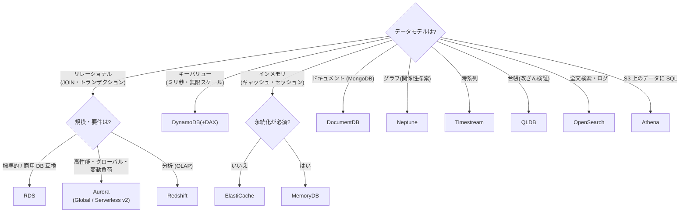

# チートシート: データベース

## RDS

- **Multi-AZ = 可用性**(同期スタンバイ・DNS フェイルオーバー 60〜120秒・読み取り不可)/ Multi-AZ DB クラスタ(リーダー2台・読み取り可)
- **リードレプリカ = 読み取りスケール**(非同期・最大15・クロスリージョン可・昇格可)
- 自動バックアップ最大 **35日**(それ以上は AWS Backup/スナップショット)
- 暗号化は作成時のみ(既存は snapshot → encrypted copy → restore)
- **RDS Proxy**: 接続プーリング(Lambda 定番)+ フェイルオーバー短縮
- **Performance Insights**: 待機イベント・トップ SQL 分析
- **Blue/Green Deployments**: 安全なバージョンアップ・スキーマ変更(MySQL/PostgreSQL/MariaDB)
- Oracle/SQL Server: ライセンス込み or BYOL。RDS Custom(OS アクセスが必要な商用 DB)

## Aurora

- ストレージ 6重化(3AZ)・最大 128TB 自動拡張・レプリカ最大15(**同一ストレージ参照でラグ極小**)
- エンドポイント: クラスター(書き込み)/ **リーダー**(読み取り LB)/ カスタム
- **Global Database**: RPO 1秒・RTO <1分・最大5セカンダリリージョン・**write forwarding**
- **Aurora Serverless v2**: 秒単位スケール(変動・断続負荷)
- Backtrack (MySQL): 巻き戻し(リストア不要)
- **Babelfish**: SQL Server 互換(T-SQL/TDS)で Aurora PostgreSQL へ
- zero-ETL to Redshift(分析オフロード)

## DynamoDB

- パーティションキー設計が性能の要(ホットキー回避)。項目 **400KB 上限**
- 容量: **On-Demand**(予測不能)/ プロビジョンド + Auto Scaling(定常)
- **DAX**: マイクロ秒キャッシュ(API 互換・コード変更最小)
- **Global Tables**: マルチリージョン・マルチライター(結果整合・競合は last writer wins)
- **DynamoDB Streams**: 変更イベント → Lambda(CDC・イベント駆動)
- TTL(自動削除・無料)、S3 エクスポート、PITR(35日)
- トランザクション対応。強い整合性読み取りは GSI 不可
- 「ミリ秒・無限スケール・キーアクセス」のキーワードで選ぶ

## ElastiCache

- **Redis**: レプリケーション・永続化・Sorted Set(ランキング)・Pub/Sub・**Global Datastore**(クロスリージョン)・クラスタモード(シャーディング)
- **Memcached**: マルチスレッド・シンプル・永続化なし
- 戦略: Lazy Loading(stale リスク)/ Write-Through(常に新鮮)+ TTL
- **MemoryDB**: Redis 互換の**永続プライマリ DB**(マルチ AZ トランザクションログ)

## Redshift

- カラムナ DWH。RA3 ノード(ストレージ分離)/ **Redshift Serverless**
- **Spectrum**: S3 を直接クエリ(Glue Catalog)
- **Concurrency Scaling**(同時実行スパイク)・結果キャッシュ・マテリアライズドビュー
- クロスリージョンスナップショット。**Multi-AZ 対応**
- Federated Query(RDS/Aurora へ)・データ共有(クラスタ間)

## その他パーパスビルト DB

| DB | 用途キーワード |
|---|---|
| **Neptune** | グラフ(SNS 関係性・レコメンド・不正検知) |
| **DocumentDB** | MongoDB 互換 |
| **Keyspaces** | Cassandra 互換 |
| **Timestream** | 時系列(IoT メトリクス) |
| **QLDB** | 台帳(暗号学的検証可能な変更履歴) |
| OpenSearch | 全文検索・ログ分析(+ UltraWarm 階層) |
| Athena | S3 への SQL(サーバーレス・スキャン課金) |

## 決定木: DB 選択(ワークロード特性)

## 定番シナリオ即答

- 「RDBMS のクロスリージョン DR、RPO 秒・RTO 分」→ **Aurora Global Database**
- 「Lambda から RDS で接続枯渇」→ **RDS Proxy**
- 「読み取りだけ遅い RDS」→ リードレプリカ / ElastiCache
- 「グローバルで低レイテンシー読み書き KVS」→ DynamoDB Global Tables
- 「Oracle をライセンス費削減しつつ移行」→ SCT + DMS → Aurora PostgreSQL
- 「予測不能な負荷の RDBMS」→ Aurora Serverless v2
