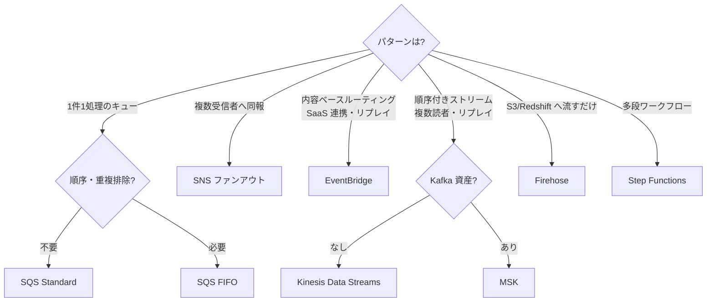

# チートシート: アプリケーション統合・分析

## SQS

- **Standard**: 無制限スループット・at-least-once・順序ベストエフォート
- **FIFO**: 順序保証・exactly-once(重複排除)・**300 TPS(バッチで 3,000、高スループットモードでさらに向上)**
- メッセージ最大 **256KB**(超える場合は S3 参照パターン)・保持最大 14日
- **可視性タイムアウト**(処理時間より長く)/ **DLQ**(maxReceiveCount 超過で退避・redrive 可)
- ロングポーリング(空受信削減)。遅延キュー・メッセージタイマー
- ASG のスケーリング指標: **キュー深度 ÷ インスタンス数**(backlog per instance)

## SNS

- Pub/Sub。**SQS ファンアウト**が定番(+フィルターポリシーで振り分け)
- 配信先: SQS/Lambda/HTTP/Email/SMS/モバイル Push/Firehose
- **FIFO トピック**(SQS FIFO とセット)。DLQ 対応。メッセージ 256KB

## EventBridge

- イベントバス(AWS サービス/SaaS/カスタム)。**スキーマレジストリ**
- **コンテンツベースのルールでルーティング**(SNS より高度なフィルタ)
- **アーカイブ&リプレイ**(再処理)— SNS にはない
- **Scheduler**: cron の置き換え(タイムゾーン・ワンタイム対応)
- クロスアカウント・クロスリージョンのイベント配信(組織のイベント集約)
- Pipes: ポイントツーポイント統合(フィルタ・エンリッチ付き)

## Step Functions

- **Standard**: 最長1年・exactly-once・監査可能(高頻度短時間には割高)
- **Express**: 5分以内・大量高頻度・at-least-once・安価
- リトライ/キャッチ/並列/Map(動的並列・**分散モードで S3 大量処理**)
- **コールバックパターン (task token)**: 人間の承認・外部システム待ち
- サービス統合: SDK 統合で 200+ サービス直接呼び出し(Lambda 不要のケース)

## API Gateway

- REST(機能豊富: API キー・使用量プラン・キャッシュ・リクエスト検証)/ HTTP API(安価・低レイテンシー・JWT)/ WebSocket
- 認可: **Cognito オーソライザー / Lambda オーソライザー / IAM**
- スロットリング(バースト/レート)・**カナリアリリース**・プライベート API(VPC エンドポイント経由)
- VPC 内バックエンドへは **VPC リンク**(NLB 経由)
- タイムアウト 29秒(既定)— 長時間処理は非同期化(SQS/Step Functions)

## AppSync

- マネージド **GraphQL**(リアルタイムサブスクリプション・オフライン同期)
- 「モバイル/Web で複数データソースを1クエリで」「リアルタイム更新」で選ぶ

## Kinesis

- **Data Streams**: シャード単位(書き込み 1MB/s・読み取り 2MB/s /シャード)・**リプレイ可・複数コンシューマー**・保持 24h〜365日・**拡張ファンアウト**(コンシューマーごと 2MB/s)。オンデマンドモードあり
- **Data Firehose**: **配信サービス**(S3/Redshift/OpenSearch/HTTP)。ニアリアルタイム(バッファリング)・変換(Lambda)・**運用ゼロ**。「S3 に流し込むだけ」なら Firehose
- Managed Service for Apache Flink(旧 KDA): ストリーム SQL/Flink 処理
- **MSK**: Kafka 互換(既存 Kafka 資産・エコシステム)。MSK Serverless あり

## SQS vs Kinesis vs SNS vs EventBridge(最頻出)

| 要件 | 選択 |
|---|---|
| ジョブキュー(1メッセージ1処理) | SQS |
| 複数システムへ同報 | SNS(ファンアウト) |
| ストリームの順序処理・リプレイ・複数読者 | Kinesis Data Streams |
| S3/Redshift への取り込みだけ | Firehose |
| SaaS/AWS イベントのルーティング・リプレイ | EventBridge |
| 既存 Kafka | MSK |

## 分析系ひとこと

- **Athena**: S3 に SQL。**Parquet+パーティションでコスト減**。Federated Query
- **Glue**: サーバーレス ETL + **Data Catalog**(クローラー)。Glue DataBrew(ノーコード)
- **EMR**: Hadoop/Spark(既存資産・細かい制御)。EMR Serverless あり
- **QuickSight**: BI ダッシュボード(SPICE)。組み込み分析
- **Lake Formation**: データレイクの**行/列レベル権限**・クロスアカウント共有
- **OpenSearch**: ログ分析・全文検索(UltraWarm/Cold で階層化)
- AppFlow: SaaS → AWS のデータ連携(Salesforce 等)
