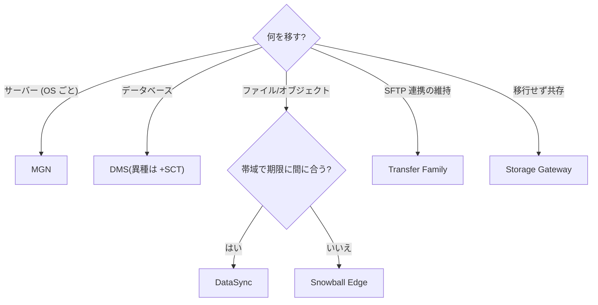

# チートシート: 移行・転送

## 評価フェーズ

| ツール | 一言 |
|---|---|
| **Application Discovery Service** | インベントリ収集。**Agentless(VMware のみ)/ Agent(依存関係マップ可)** |
| **Migration Evaluator** | TCO・ビジネスケース(経営層向け) |
| **Migration Hub** | 移行進捗の一元ダッシュボード・ウェーブ管理 |
| Strategy Recommendations | 7R の自動推奨 |
| **MRA / CAF** | 組織の移行準備度(技術以外含む) |

## 7R 即答表

| キーワード | 戦略 |
|---|---|
| 「変更なし・期限厳守・大量」 | **Rehost (MGN)** |
| 「DB だけ RDS に」 | **Replatform** |
| 「SaaS に乗り換え」 | Repurchase |
| 「マイクロサービス化・サーバーレス化」 | Refactor |
| 「VMware ごと移動」 | **Relocate (VMware Cloud on AWS)** |
| 「コンプラで残す」 | Retain |
| 「使ってないので廃止」 | Retire |

## サーバー移行

- **MGN (Application Migration Service)**: ブロックレベル**継続レプリケーション**・テスト起動・分単位カットオーバー。物理サーバーも可
- **VM Import/Export**: イメージファイル → AMI(継続同期なし)

## DB 移行

- **DMS**: フルロード + **CDC(継続レプリケーション)**でダウンタイム最小。同種・異種対応
- **SCT**: **異種移行のスキーマ/コード変換**(DMS とセット)。変換難易度レポート
- 大容量初期ロード: **SCT + Snowball Edge → DMS CDC で追いつき**
- DMS の用途拡張: 継続レプリケーション(読み取りオフロード、S3 へのエクスポート=データレイク連携)

## データ転送の使い分け(最頻出)

| 要件 | 解 |
|---|---|
| ネットワーク経由・増分同期・NFS/SMB→S3/EFS/FSx | **DataSync**(帯域制御・検証・スケジュール) |
| 帯域不足・数十 TB〜PB・期限あり | **Snowball Edge**(80TB 級/台) |
| 既存 SFTP/FTPS/AS2 連携の維持 | **Transfer Family**(→ S3/EFS) |
| オンプレから S3 API を高速に | S3 Transfer Acceleration |
| 移行後もオンプレからファイルアクセス継続 | **Storage Gateway**(File) |
| テープ運用の置き換え | Tape Gateway |
| アプリのリアルタイムデータ | Kinesis / MSK |

**転送日数概算**: 1 Gbps ≈ 10 TB/日(理論値の約8割で見積る)。期限に間に合わなければ Snow Family。

## Snow Family

- **Snowcone**: 8TB・小型(エッジ・宅配返送)
- **Snowball Edge Storage Optimized**: 〜80TB・移行の主力
- **Snowball Edge Compute Optimized**: エッジ処理(EC2/Lambda 実行・切断環境)
- 転送は暗号化(KMS)・耐タンパー・E Ink ラベル

## その他

- **Mainframe Modernization**: メインフレームのリプラットフォーム/リファクタリング
- **DataSync の対応元**: NFS / SMB / HDFS / オブジェクトストレージ / 他クラウド(S3 API 互換・Azure Blob 等)
- **License Manager**: BYOL ライセンスの追跡・Dedicated Host 管理

## 定番シナリオ即答

- 「100TB を 100Mbps 回線で 2週間以内に」→ 計算すると間に合わない → **Snowball Edge**
- 「毎晩の差分を S3 に同期」→ **DataSync**(スケジュール)
- 「Oracle→Aurora、ダウンタイム最小」→ **SCT + DMS (CDC)**
- 「取引先の SFTP 接続をそのまま維持して S3 へ」→ **Transfer Family**
- 「数百台の VM を 3か月で EC2 へ」→ **MGN**(+Migration Hub でウェーブ管理)
